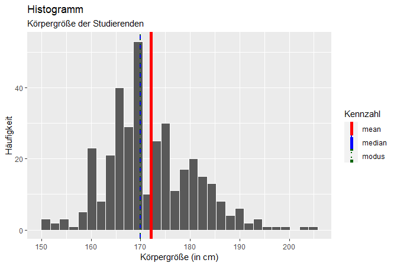
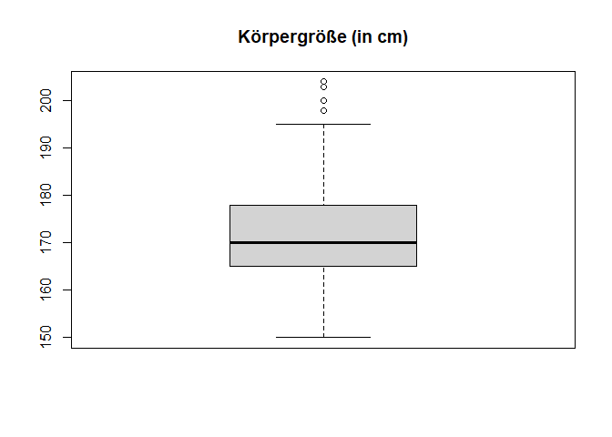
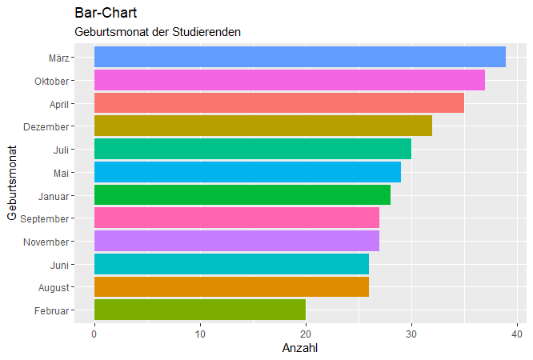

<!-- README.md is generated from README.Rmd. Please edit that file -->

# datascience

<!-- badges: start -->
<!-- badges: end -->

The goal of the package datascience is to support the readers of the
book “Data Science und Statistik mit R” with samples, functions and
tutorials as described in the book.

The function ds.summary() automatically evaluates the main descriptive
statistical figures for a variable and creates a histogram and box-plot
for quantitative variables or a bar-chart for qualitative variables.

## Installation

You can install the package datascience from
[GitHub](https://github.com/) with:

``` r
# install.packages("devtools")
devtools::install_github("bheesen/datascience")
library(datascience)
```

## Tutorials

You can start the tutorials of the package with the following commands:

``` r
# R Grundlagen
ds.tutorial(name = "ds.syntax")
ds.tutorial(name = "ds.datentypen")
ds.tutorial(name = "ds.datenstrukturen")
ds.tutorial(name = "ds.operationen")
ds.tutorial(name = "ds.importexport")
ds.tutorial(name = "ds.transformation")
ds.tutorial(name = "ds.visualisierung")
ds.tutorial(name = "ds.visualisierungdynamisch")
# Statistik
ds.tutorial(name = "ds.deskriptiv")
ds.tutorial(name = "ds.verteilung")
ds.tutorial(name = "ds.visualisierungstatistik")
ds.tutorial(name = "ds.zufallsvariablen")
ds.tutorial(name = "ds.wahrscheinlichkeitsverteilung")
ds.tutorial(name = "ds.bedingtewahrscheinlichkeit")
ds.tutorial(name = "ds.induktiv")
```

## Example

This is an example using some of the functions included in the package:

``` r
library(datascience)
colnames(studierende)[c(5,10,13)] <- c("Größe","Fußball","Attraktivität")            # Spalten umbenennen
ds.summary(studierende$Größe, "Körpergröße der Studierenden","Körpergröße (in cm)")  # Quantitative Variable
```



    #>              [,1]                                                                                       
    #> n            "357"                                                                                      
    #> na           "0"                                                                                        
    #> maxanzahl    "42"                                                                                       
    #> modus        "170"                                                                                      
    #> median       "170"                                                                                      
    #> mean         "172.039215686275"                                                                         
    #> skewness     "0.519968092098753"                                                                        
    #> skewness.txt "Schiefe 0.519968092098753 > 0, Rechte Schiefe: positive Schiefe, linkssteil, rechtsschief"
    #> kurtosis     "0.395699862577392"                                                                        
    #> kurtosis.txt "Exzess Kurtosis 0.395699862577392 > 0, steilgipflig"                                      
    #> spannweite   "54"                                                                                       
    #> min          "150"                                                                                      
    #> max          "204"                                                                                      
    #> var          "82.6613791584049"                                                                         
    #> sd           "9.09183035248706"
    ds.summary(studierende$Geburtsmonat,"Geburtsmonat der Studierenden","Geburtsmonat")  # Qualitative Variable



    #>              [,1]  
    #> n            "357" 
    #> na           "1"   
    #> maxanzahl    "39"  
    #> modus        "März"
    #> median       NA    
    #> mean         NA    
    #> skewness     NA    
    #> skewness.txt NA    
    #> kurtosis     NA    
    #> kurtosis.txt NA    
    #> spannweite   NA    
    #> min          NA    
    #> max          NA    
    #> var          NA    
    #> sd           NA

The `README.Rmd` file was used to create the `README.md` file using the
function `devtools::build_readme()`.
