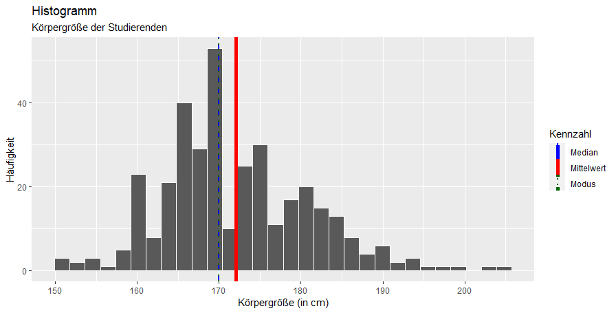
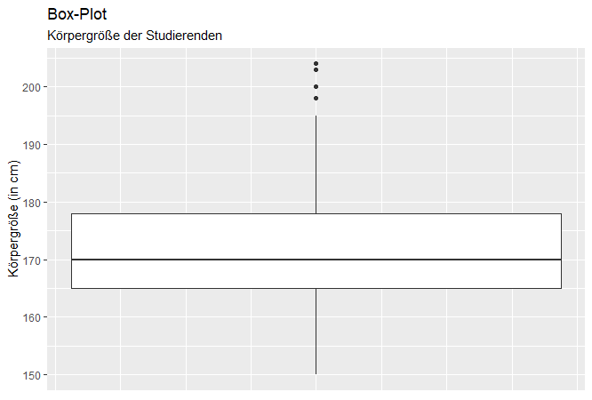

<!-- README.md is generated from README.Rmd. Please edit that file -->

# datascience

<!-- badges: start -->

<!-- badges: end -->

The goal of the package datascience is to support the readers of the
book “Data Science und Statistik mit R” with samples, functions and tutorials
as described in the book.

## Installation

You can install the released version of datascience from
[GitHub](https://github.com/) with:

``` r
# install.packages("devtools")
devtools::install_github("bheesen/datascience")
library(datascience)
```

## Example

What is special about using `README.Rmd` instead of just `README.md`?
You can include R chunks like so:

``` r
ds.summary(studierende$Größe, "Körpergröße (in cm)")
```



    #>                [,1]              
    #> var.n          "357"             
    #> var.na         "0"               
    #> var.maxanzahl  "42"              
    #> var.modus      "170"             
    #> var.median     "170"             
    #> var.mean       "172.039215686275"
    #> var.spannweite "54"              
    #> var.min        "150"             
    #> var.max        "204"             
    #> var.var        "82.6613791584049"
    #> var.sd         "9.09183035248706"

The `README.Rmd` file was used to create this `README.md` file using the
function `devtools::build_readme()`.
