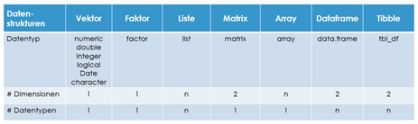
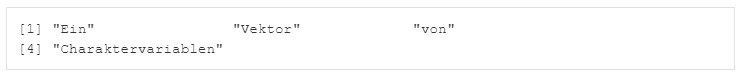
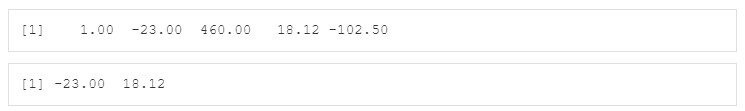
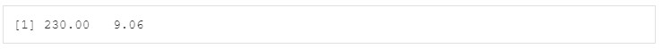

```{r setup, include=FALSE}
library(tidyverse)
library(learnr)
library(forcats)
```


## Willkommen

Dieses Tutorial ergänzt die Inhalte des Buches [_Data Science und Statistik mit R_](https://www.amazon.de/Data-Science-Statistik-mit-Anwendungsl%C3%B6sungen/dp/3658348240/ref=sr_1_1?__mk_de_DE=%C3%85M%C3%85%C5%BD%C3%95%C3%91&dchild=1&keywords=Data+Science+und+Statistik+mit+R&qid=1627898747&sr=8-1).

Das Kapitel 3.3.2 im Buch beschreibt die Datenstrukturen von R. 


### Grundsätzliches

Wird nur ein einzelner Wert in einer Variablen gespeichert, so bezeichnet man diese als „einfache Variable“. Werden mehrere Werte in einer Variablen gespeichert, so bezeichnet man diese als „Vektor“. Es gibt zwei Typen von Vektoren, sogenannte „atomare Vektoren“ (ein Datentyp) und Listen (mehrere Datentypen).

```{r 0_1, exercise=FALSE}
a <- c(12,55,107,3,24)                              # Numerischer Vektor 
b <- c("Ein", "Vektor", "vo", "Charaktervariablen") # Character Vektor
```


```{r 0_2-setup, exercise=FALSE, exercise.setup="0_2", echo=FALSE, include=FALSE}
a <- c(12,55,107,3,24)                              # Numerischer Vektor 
b <- c("Ein", "Vektor", "vo", "Charaktervariablen") # Character Vektor
```

Vorhandene Variablen und Datenstrukturen können mit der Funktion View() angezeigt und mit der Funktion edit() bearbeitet werden.
Editieren Sie den Vektor b, korrigieren Sie die dritte Variable innerhalb des Character-Vektors von "vo" auf "von" ab und speichern Sie die Änderung über Datei/Speichern ab. Danach schließen Sie das Editierfenster. 

Die Anzeige sollte hinterher wie folgt aussehen: 

```{r 0_2, exercise=TRUE, dependson= -1}

```

```{r 0_2-hint}
edit(b)
```

## 1. Vektor

Ein neuer Vektor ohne Inhalt lässt sich mit der Funktion new() erzeugen, z.B. text<-new("character") oder a<-new("numeric"), um einen leeren Vektor vom Typ character oder numeric anzulegen. In einem Vektor können mehrere Werte eines Datentyps gespeichert werden, indem diese mit der Funktion c() zu einem Vektor zusammengefügt werden (c steht für das englische Wort "combine"). Folgende Funktion kann beispielsweise verwendet werden, um einen Vektor anzulegen: a  <- c(1.2, -13, 46, 1880.12, -2.5). Achtung: In R werden die Nachkommastellen wie im Englischen üblich mit einem Punkt getrennt und nicht wie im Deutschen mit einem Komma. In R werden aber Kommas verwendet, um die Argumente einer Funktion voneinander zu unterscheiden.

```{r 1_1, exercise=FALSE}
a <- new("numeric")                           # Vektor ohne Inhalt
str(a)                                        # Ausgabe mit Typ und Länge
a <- c(1.2, -13, 46, 1880.12, -2.5)           # Vektor Typ numerisch
a                                             # Ausgabe 
```

### 1.1 Zugriff auf Vektor mit Index

Auf einzelne Elemente eines Vektors kann durch Indizierung in eckigen Klammern zugegriffen werden, wobei die Indizierung bei 1 startet, z.B. a[2] gibt den zweiten Wert der Vektorvariablen mit dem Namen a aus, hier also -13. Wird in den Klammern kein Index angegeben, so werden alle Elemente ausgegeben. Es können auch mehrere Werte eines Vek-tors ausgegeben werden, z.B. die Elemente 2 bis 4 mit der Anweisung a[2:4]. Um alle außer gewissen Elementen anzuzeigen, kann ein dem Index vorangestelltes Minuszeichen verwendet werden, z.B. a[-2] zeigt alle Elemente außer dem 2. Element an. Eine Liste von Indizes kann mit der Funktion c() angegeben werden, z.B. a[c(1,3:4)] gibt das Element 1 und 3 bis 4 aus.

```{r 1_2, exercise=FALSE, dependson= -1}
a[]                                           # Ausgabe 
str(a)                                        # Ausgabe mit Typ und Länge
a[2]                                          # Ausgabe 2. Element
a[2:4]                                        # Ausgabe 2.-4. Element
a[-2]                                         # Ausgabe ohne 2. Element
a[-2:-4]                                      # Ausgabe ohne 2.-4. Element 
a[c(1,3:4)]                                   # Ausgabe 1. & 3.-4. Element
```

Die Ausgabe einer Reihenfolge von Elementen kann auch beliebig inklusive Wiederholungen einzelner Elemente kombiniert werden, z.B. um die Elemente 1, 3, 3, 1, 1, 5 auszugeben a[c(1,3,3,1,1,5)]. Die Angabe eines ungültigen Indizes bewirkt die Ausgabe NA, z.B. a[3:7] bewirkt für den Index 6 und 7 ein NA

```{r 1_3, exercise=FALSE, dependson= c(-1,-2)}
a[c(1,3,3,1,1,5)]                             # Ausgabe beliebiger Elemente
a[3:7]                                        # Ausgabe ungültiger Indizes 
```

Auch eine Berechnung der Indizes ist möglich. Die Funktion length() gibt die Anzahl der Elemente eines Vektors zurück. Möchte man z.B. auf das vorletzte Element zugreifen, so kann man mit der Anweisung a[length(a)-1] arbeiten.

```{r 1_4, exercise=FALSE, dependson= c(-1,-2,-3)}
length(a)                                     # Anzahl Elemente von Vektor
a[length(a)-1]                                # Ausgabe vorletztes Element
```

### 1.2 Zugriff auf Vektor mit Namen

Vektoren können auch für jedes Element einen Namen enthalten, z.B. b <- c(anna = 1.3, rolf = 2.7, heike = 4.0). Den Inhalt des Vektors kann man wieder durch Eingabe des Namens oder mit der Funktion str() anzeigen lassen. Ein Zugriff auf das Element 2 kann erfolgen durch b[2] oder b[“rolf“].

```{r 1_5, exercise=FALSE}
b <- c(anna = 2.7, rolf = 1.3, heike = 4.0)   # Vektor mit Namen
b                                             # Ausgabe 
str(b)                                        # Ausgabe mit Typ und Länge
b[2]                                          # Ausgabe 2. Element
b["rolf"]                                     # Ausgabe 2. Element```
```

### 1.3 Zugriff auf Vektor mit Logik

Auch ein logisches Indexing ist möglich, indem Bedingungen bestimmen, welche Elemente ausgewählt werden sollen, z.B. b[>2], b[b==1.3 | b>3] oder b[b<3.3 & b>2]. Eine weitere Option ist die Angabe von TRUE (soll ausgegeben werden) oder FALSE (soll nicht ausgegeben werden) für jedes Element, z.B. b[c(FALSE, TRUE, FALSE)], um nur das Element 2 auszugeben.

```{r 1_6, exercise=FALSE, dependson= -1}
b[b>2]                                        # Ausgabe wenn >2
b[b==1.3 | b>3]                               # Ausgabe wenn 1.3 oder >3
b[b<3.3 & b>2]                                # Ausgabe wenn <3.3 und >2
b[c(FALSE, TRUE, FALSE)]                      # Ausgabe 2. Element
```

### 1.4 Operationen mit Vektor

Wenn Sie einen Befehl auf einen Vektor anwenden, dann führt R diesen Befehl für jedes einzelne Element des Vektors aus, z.B. bei der Umwandlung einer Temperatur von Celsius in Fahrenheit. Dies erfordert keine Schleifenprogrammierung wie in vielen anderen Programmiersprachen, was die Anzahl der erforderlichen R-Anweisungen gering hält. Ein Vektor d<-c(20,40,60,80,100) kann für jedes Element des Vektors mit der Anweisung d<-(d-32)*5/9 eine Umrechnung von Grad Fahrenheit in Grad Celsius realisieren.

```{r 1_7, exercise=FALSE}
d<-c(20,40,60,80,100)                         # Vektor Temperaturen Fahrenheit
d                                             # Ausgabe
d<-(d-32)*5/9                                 # Temperaturen Celsius
d                                             # Ausgabe
```

### 1.5 Übung

```{r 1_9-setup, exercise=FALSE, exercise.setup="1_9", echo=FALSE, include=FALSE}
x <- c(1, -23, 460, 18.12, -102.5)            # Vektor Typ numerisch
```

Lassen Sie sich zunächst das Objekt x anzeigen. Lassen Sie sich dann nur das zweite und vierte Element des Vektors x anzeigen.

Die Anzeige sollte hinterher wie folgt aussehen: 

```{r 1_9, exercise=TRUE}

```

```{r 1_9-hint-1}
x
```
```{r 1_9-hint-2}
x[c(2,4)]
```

Teilen Sie für alle Elemente von Objekt x, welche größer als 100 sind, den Wert der Objekte durch 2. Speichern Sie das Ergebnis in dem Objekt y. Lassen Sie sich anschließend das Objekt y anzeigen.

Die Anzeige sollte hinterher wie folgt aussehen: 

```{r 1_10-setup, exercise=FALSE, exercise.setup="1_10", echo=FALSE, include=FALSE}
x <- c(1, -23, 460, 18.12, -102.5)            # Vektor Typ numerisch
```

```{r 1_10, exercise=TRUE}

```

```{r 1_10-hint-1}
y<-x[x>10]/2
```
```{r 1_10-hint-2}
y
```
## 2. Faktorvariable

Eine Faktorvariable ist ein atomarer Vektor vom Datentyp factor, in dem mehrere Werte eines Datentyps gespeichert werden können. Es handelt sich dabei um kategoriale Variablen mit einer vordefinierten Menge an Ausprägungen. Bei kategorialen Variablen wird unterscheiden zwischen nominalen Variablen wie Farbe oder Land (ohne Reihenfolge) und ordinalen Variablen wie Schulnoten (mit Reihenfolge von sehr gut bis ungenügend).

Für jede vorkommende Ausprägung wird ein sogenanntes Label als Kombination des Wertes der Ausprägung und einem Zähler vergeben, so dass jede Ausprägung nur einmalig gespeichert werden muss. Die Labels werden standardmäßig entweder von der kleinsten Zahl zur größten Zahl (numerisch) oder alphabetisch (character) mit einer Integerzahl von 1 bis n durchnummeriert. Dies ist bei einer nominalen Faktorvariable auch in Ordnung. Bei einer ordinalen Faktorvariable dagegen ist es wichtig, dass die einer Ausprägung zugeordnete Integerzahl entsprechend der Reihenfolge entweder aufsteigend oder absteigend vergeben wird, damit die Integerwerte später z.B. für Korrelationsanalysen und Machine Learning verwendet werden können. 
Eine derartige Vergabe der Integerzahlen wird durch die Verwendung der Parameter order und lebels erreicht, z.B. noten.ordinal <- factor(noten, order=TRUE, levels=c("sehr gut","gut","befriedigend","ausreichend","ungenügend")). Mit dem Parameter exclude=NULL werden auch Ausprägungen mit fehlenden Werten (NA) berücksichtigt.

Kommt ein Wert in der Faktorvariablen vor, so wird nicht der Wert selbst, sondern die zugeordnete Integerzahl für das Element hinterlegt. Da Integerzahlen minimalen Speicherplatz benötigen, reduziert sich so der Speicherbedarf für einen Vektor vom Typ factor, wenn Werte wiederholt vorkommen. 

### 2.1 Faktorvariable erzeugen

Eine Faktorvariable lässt sich mit der Funktion factor() erstellen, z.B. für die Nominale Variable torschuetze <- factor(c("Robert", "Timo", "Marco", "Timo", "Robert", "Robert")). 
Alternativ kann auch die Funktion as.factor() aus einem bereits existierenden Vektor eine Faktorvariable erstellen, z.B. aa <- as.factor(a). 
In beiden Fällen hat R den Datentyp nicht automatisch erkennen müssen, sondern die Funktion factor() bzw. as.factor() hat bestimmt, dass eine Faktorvariable erzeugt werden soll. Der Parameter order=TRUE bestimmt, ob die Funktion class() factor oder ordered factor zurückgibt. Für ordinale Variablen sollte der Parameter order=TRUE verwendet werden.

Die gesamte Faktorvariable kann durch Eingabe des Namens oder mit der Funktion str() ausgegeben werden und die Funktion levels() zeigt die Ausprägungen einer Faktorvariablen an.

Wenn eine Faktorvariable als Basis einer arithmetischen Operation verwendet werden soll, so gilt es die kategorialen Werte mit der Funktion as.numeric(Faktorvariable) vorher in einen numerischen Wert zu überführen.

```{r 2, exercise=FALSE}
torschuetze <- factor(c("Robert", "Timo", "Marco", "Timo", "Robert", "Robert"))
torschuetze                                      # Ausgabe Faktorvariable 
str(torschuetze)                                 # Ausgabe mit Typ und Länge
levels(torschuetze)                              # Levels anzeigen
torschuetze.numeric <- as.numeric(torschuetze)   # Konvertierung in numerisch
str(torschuetze.numeric)                         # Werte numerisch
unternehmen <- c("Siemens","Adidas","Prescient")
unternehmen                                      # Ausgabe Charactervariable
str(unternehmen)                                 # Ausgabe mit Typ und Länge
unternehmen <- as.factor(unternehmen)
unternehmen                                      # Ausgabe Faktorvariable
str(unternehmen)                                 # Ausgabe mit Typ und Länge
levels(unternehmen)                              # Levels anzeigen
```

### 2.2 Häufigkeiten

Wenn Sie eine Faktorvariable anlegen, in der Sie die Wochentage festhalten, an denen Sie diesen Monat Sport getrieben haben, so können Sie dies mit der Anweisung tag <- factor(c("Mittwoch", "Montag", "Mittwoch", "Dienstag", "Mittwoch")) erledigen. Alternativ können Sie auch zunächst eine Charactervariable anlegen und diese dann in eine Faktorvariable konvertieren.

Mit der Funktion table() kann man sich die Häufigkeiten der vorkommenden Werte in einem Vektor anzeigen zu lassen, in diesem Falle mit table(tag). Die Reihenfolge bei der Auflistung der Häufigkeiten erfolgt in der Reihenfolge, in welcher die Levels in der Faktorvariablen vorkommen (bei numerischen Inhalten aufsteigend, bei Zeichenketten alphabetisch sortiert).

```{r 2_1, exercise=FALSE}
tag <- c("Mittwoch", "Montag", "Mittwoch", "Dienstag", "Mittwoch") # Vektor
table(tag)                                    # Häufigkeit
tag1 <- factor(tag)                           # Faktorisierter Vektor
levels(tag1)                                  # Levels
table(tag1)                                   # Häufigkeit
```

### 2.3 Nominale und Ordinale Faktorvariablen

Der Parameter order=TRUE bestimmt, ob die Funktion class() factor oder ordered factor zurückgibt. Für ordinale Variablen sollte der Parameter order=TRUE verwendet werden.

```{r 2_2, exercise=FALSE}
noten<-c("sehr gut",NA,"ungenügend","ausreichend","gut","gut",NA) #Vektor
noten                                         # Ausgabe Charactervektor
#-Konvertierung in Nominale Faktorvariable---------------------------------
noten.nominal1 <- factor(noten)               # Nominale Variable
str(noten.nominal1)                           # Ausgabe mit Typ und Länge      
table(noten.nominal1) 
#-Konvertierung in Ordinale Faktorvariable nicht ordered-------------------
noten.nominal2 <- factor(noten,order=FALSE,   # Ordinale Variable
  levels=c("sehr gut","gut","befriedigend","ausreichend","ungenügend"))
str(noten.nominal2)                           # Ausgabe mit Typ und Länge   
table(noten.nominal2)
#-Konvertierung in Ordinale Faktorvariable ordered NAs ignoriert-----------
noten.ordinal <- factor(noten,order=TRUE,     # Ordinale Variable "ordered"
                                              # NAs ignoriert
  levels=c("sehr gut","gut","befriedigend","ausreichend","ungenügend"))
class(noten.ordinal)                          # Datentyp
str(noten.ordinal)                            # Ausgabe mit Typ und Länge      
table(noten.ordinal)
#-Konvertierung in Ordinale Faktorvariable ordered NAs auch codiert--------
noten.ordinal <- factor(noten,order=TRUE,     # Ordinale Variable "ordered"
  exclude = NULL,                             # NAs auch codiert
  levels=c("sehr gut","gut","befriedigend","ausreichend","ungenügend",NA))
class(noten.ordinal)                          # Datentyp
str(noten.ordinal)                            # Ausgabe mit Typ und Länge  
table(noten.ordinal)
```

### 2.4 xxx

Wenn Sie jetzt aber gerne eine spezifische Reihenfolge bevorzugen, z.B. die Abfolge der Wochentage innerhalb einer Woche, dann können Sie die Reihenfolge auch ändern bzw. spezifisch vorgeben. Für diesen Zweck gibt es die Funktionen fct_inorder() (sortiert nach Reihenfolge des Vorkommens), fct_infreq() (sortiert nach Häufigkeit) und fct_inseq() (sortiert numerisch). Die Funktion fct_inseq() setzt voraus, dass die Inhalte numerisch sind, sonst wird eine Fehlermeldung veranlasst. Diese Funktionen sind in dem Paket forcats enthalten.

Die Reihenfolge der Levels kann auch ganz individuell vorgegeben werden, wenn der Parameter levels in der Funktion factor() verwendet wird, z.B. wochentage <- factor(tag, levels = c("Montag","Dienstag","Mittwoch")). Jetzt entspricht die Reihenfolge der Levels der Abfolge innerhalb einer Woche von Montag, Dienstag zu Mittwoch. Eine Ausgabe der Häufigkeiten erfolgt dann entsprechend der Wochentage. Sollen Levels nicht in den Daten vorkommen, so können Sie mit der Funktion droplevels() entfernt werden, z.B. autos <- droplevels(autos).

```{r 2_3, exercise=FALSE}

```

### 2.5 xxx

xxx

```{r 2_4, exercise=FALSE}

```


```{r 2_x, exercise=TRUE}
a <- 12                  # Numerische Variable
e <- TRUE                # Boolsche Variable 

```

```{r 2_x-hint-1}
is.numeric(a)
is.logical(a)
```
```{r 2_x-hint-2}
is.numeric(e)
is.logical(e)
```

## 3. Liste

R hat eine spezielle Art Datums- und Zeitvariablen zu verarbeiten. Der Datentyp der Datumsvariablen ist Date und der von Zeitvariablen ist POSIXct und POSIXlt. Alle Zeitinformationen werden als die Zeit in Tagen, Stunden oder Sekunden gespeichert, die seit dem 1.1.1970 vergangen ist. Für Zeiten vor diesem Datum gibt eine negative Zahl die Tage bzw. Sekunden bis zum 1.1.1970 an. 

Die Funktion Sys.Date() kann verwendet werden, um das aktuelle Datum anzuzeigen. Mit der Anweisung unclass(Sys.Date()) wird Ihnen die interne Darstellung des aktuellen Datums angezeigt und dies ist die Zahl der Tage, die seit dem 1.1.1970 vergangen sind. Mit der Funktion Sys.time() lässt sich auch die aktuelle Uhrzeit anzeigen. Die Anweisung unclass(Sys.time()) zeigt dann die Zahl der Sekunden an, die seit dem 1.1.1970 vergangen sind.

```{r 3, exercise=FALSE}
f <- Sys.Date()          # Datumsvariable
str(f)
unclass(f)
t <- Sys.time()          # Uhrzeitvariable
str(t)
unclass(t)
```

### 3.1 Konvertierung in Datumsvariable

Die Hilfe zu einer Funktion in R kann über ein dem Funktionsnamen vorangestelltes Fragezeichen erfolgen, z.B. ?ggplot, um die Hilfe zu der Funktion ggplot angezeigt zu bekommen. In der Hilfe werden u.a. auch die Parameter einer Funktion vorgestellt.

Lassen Sie sich die Hilfe zu der Funktion as.Date anzeigen, um deren Funktion und Parameter besser zu verstehen. Dies kann in R-Studio oder in einem separaten Browser-Fenster angezeigt werden.

```{r 3_1, exercise=TRUE}

```

```{r 3_1-hint-1}
?as.Date                # Hilfe zu der Funktion as.Date()
```

Gegeben ist die Character-Variable g, die eine Datumsinformation enthält.

```{r 3_2, exercise=FALSE}
g <- "2022-01-01"        # Character Variable
g
class(g)
```

### 3.2 Übung

Konvertieren Sie die Variable g mit Hilfe der Funktion as.Date() in die Datumsvariable h. Lassen Sie sich anschließend den Datentyp und Wert anzeigen. Als Ergebnis sollte Date[1:1], format: "2022-01-01" angezeigt werden.

```{r 3_3-setup, exercise=FALSE, exercise.setup="3_3", echo=FALSE, include=FALSE}
g <- "2022-01-01"        # Character Variable 
```

```{r 3_3, exercise=TRUE, dependson = -1}

```

```{r 3_3-hint-1}
h <- as.Date(g)          # Konvertierung in Datumsvariable
```
```{r 3_3-hint-2}
str(h)
```

### 3.3 Demo

Sie können bei der Funktion as.Date() über den Parameter format auch ein ganz spezifisches Format für die Konvertierung festlegen. Die Konvertierung in eine Datumsvariable ist für beliebige Datumsformate mit dem Parameter format möglich, z.B. as.Date("04.01.2021", format= "%d.%m.%Y").

```{r 3_4, exercise=FALSE}
i <- as.Date("16.10.2021", format= "%d.%m.%Y") # Konvertierung jeden Formates
str(i)
```

### 3.4 Zeitvariable

Die Funktion Sys.time() erlaubt die Abfrage der aktuellen Uhrzeit.

```{r 3_5, exercise=FALSE}
j<-Sys.time()            # Zeitvariable
class(j)
```

Das Paket lubridate bietet viele weitere Funktionen für Datums- und Zeitvariablen wie date(), year(), month(), day(), hour(), minute(), second(), week(), quarter(), am() und pm().

```{r 3_6, exercise=FALSE}
require(lubridate)       # Paket erforderlich
date(j)                  # Datum
year(j)                  # Jahr
month(j)                 # Monat
day(j)                   # Tag
hour(j)                  # Stunde
minute(j)                # Minute
second(j)                # Sekunde
week(j)                  # Woche
quarter(j)               # Quartal
am(j)                    # AM-Uhrzeit TRUE/FALSE
pm(j)                    # PM-Uhrzeit TRUE/FALSE
```

## 4. Matrix und Array

Zeichenketten bzw. Strings werden in einfache ‘ ‘ oder doppelte “ “ Anführungszeichen gesetzt und sind vom Typ character bzw. chr.

```{r 4_1, exercise=FALSE}
i <- 'Erste Zeichenkette'# Character Variable in einfachen Anführungszeichen
str(i)
j <- "Statistik ist toll"# Character Variable in doppelten Anführungszeichen
str(j)
```

### 4.1 Funktionen des Pakets stringr

Werden Variablen vom Typ Character bearbeitet, so bietet das Paket stringr einige Funktionen an, z.B. die Funktion str_detect(), str_locate(), um nach Zeichenketten bzw. Wörtern zu suchen, oder str_count(), um die Häufigkeit einer Zeichenkette zu ermitteln.

```{r 4_2, exercise=FALSE, dependson = -1}
require(stringr)         # Paket erforderlich
str_detect(i,"toll")     # Prüfung, ob String enthalten ist
str_detect(j,"toll")     # Prüfung, ob String enthalten ist
str_locate(j,"toll")     # Start und Endeposition von String
str_count(j,"toll")      # Anzahl des Vorkommens von String
```

### 4.2 Typabfrage und Konvertierung

Die Funktion is.character() kann verwendet werden, um abzufragen, ob eine Variable den Datentyp Character hat. 

```{r 4_3, exercise=FALSE}
k <- "27.62"             # Character Variable
str(k)                   # str() zeigt Datentyp und Inhalt gleichzeitig
l <- is.character(k)     # Logische Frage ob Datentyp == character
str(l)
```

## 5. Dataframe und Tibble

Wenn der Datentyp konvertiert werden soll, so ist dies mit den Funktionen as.numeric(), as.logical(), as.character() und as.Date() möglich. Die Funktion as.numeric() ermöglicht beispielsweise die Konvertierung in eine Variable vom Typ numeric.

```{r 5, exercise=FALSE}
k <- "27.62"             # Character Variable
str(k)                   # str() zeigt Datentyp und Inhalt gleichzeitig
m <- as.numeric(k)       # Konvertierung zu numerisch 
m                        # Wert anzeigen
str(m)                   # Anzeige Typ, Wert, Attribute
```

## 6. Dynamische Datenstrukturen

Variablen können neben dem Wert auch Attribute besitzen. Mit der Funktion attributes() kann man diese anzeigen lassen und mit der Funktion attr() Attribute ändern oder hinzufügen, z.B. wird der Variablen a mit der Anweisung attr(a, "Bedeutung") <- "Stückzahl verkauft" das Attribut Bedeutung hinzugefügt. Die Funktion str() kann verwendet werden, um sowohl den Datentyp, den Wert als auch die Attribute einer Variablen anzuzeigen.

```{r 6, exercise=FALSE}
a <-  12                                       # Numerische Variable
str(a)                                         # Anzeige Typ, Wert, Attribute
attributes(a)                                  # Attribute anzeigen
attr(a, "Bedeutung") <- "Stückzahl verkauft"   # Attribut zuweisen
attributes(a)                                  # Attribute anzeigen
str(a)                                         # Anzeige Typ, Wert, Attribute
```

## 7. Quiz

```{r 7_1, echo = FALSE}
quiz(
  question("Welche der folgenden Aussagen sind korrekt?", allow_retry = TRUE, random_answer_order = TRUE,
    answer("a<-12 erzeugt eine numerische Variable.", correct = TRUE),
    answer("b<-''23,67'' erzeugt eine numerische Variable.", message = "Nein, die Verwendung von Hochkommata erzeugt eine character-Variable."),
    type = "multiple"
  ),
  question("Welche der folgenden Aussagen sind korrekt?", allow_retry = TRUE, random_answer_order = TRUE,
    answer("class(a) gibt den Inhalt der Klasse aus.", message = "Nein, die Funktion class() zeigt den Datentyp an."),
    answer("str(a) zeigt den Wert, die Attribute und den Datentyp von a an.", correct = TRUE),
    answer("System.date() gibt das aktuelle Datum an.", message = "Nein, die Funktion Sys.Date() gibt das aktuelle Datum an."),
    type = "multiple"
  ),
  question("Welche der folgenden Aussagen sind korrekt?", allow_retry = TRUE, random_answer_order = TRUE,
    answer("as.integer() prüft, ob eine Variable vom Typ Integer ist.", message = "Nein, die Funktion konvertiert eine Variable zum Datentyp Integer."),
    answer("Die Anweisung x <- 97,82 erzeugt eine Fehlermeldung", message = "Ja, die Fehlermeldung wird durch das falsche Dezimaltrennzeichen ',' anstatt des korrekten '.' verursacht.", correct = TRUE),
    answer("e<-T erzeugt eine logische Variable mit dem Wert TRUE", correct = TRUE),
    answer("Die Funktionen is.numeric(), is.logical() und is.character() prüfen, ob eine Variable vom Typ numeric, logical oder character ist und geben Yes bzw. No als Wert zurück.", message = "Nein, die Funktionen prüfen den Typ, geben aber TRUE bzw. FALSE zurück.")
  ),
  question("Welche der folgenden Aussagen sind korrekt?", allow_retry = TRUE, random_answer_order = TRUE,
    answer("POSIXct ist der Datentyp für Datums- und Zeitangaben.", correct = TRUE),
    answer("Die Funktion as.Date() konvertiert eine Variable in das Format Date.", correct = TRUE),
    answer("Das Paket lubridate beinhaltet wertvolle Funktionen zur Bearbeitung von Strings/Zeichenketten.", message = "Nein, lubridate enthält Funktionen für Datums- und Zeitvariablen."),
    answer("Charactervariablen können durch die Zuweisung einer Zeichenkette erstellt werden. Dabei darf die Zeichenkette entweder in einfachen oder doppelten Anführungszeichen geschrieben werden.", correct = TRUE)
  ),
  question("Welche der folgenden Aussagen sind korrekt?", allow_retry = TRUE, random_answer_order = TRUE,
    answer("Die Funktion str_locate() prüft, ob eine Zeichenkette in einer Charactervariablen enthalten ist.", message = "Nein, die Funktion str_detect() prüft, ob eine Zeichenkette in einer Charactervariablen enthalten ist. Die Funktion str_locate() gibt die Start- und Endposition zurück."),
    answer("Die Funktion attributes() erlaubt einer Variablen Attribute zuzuordnen", message = "Nein, die Zuordnung von Attributen erfolgt durch die Funktion attr(). Die Funktion attributes() zeigt die Attribute an."),
    answer("Die Funktion str() zeigt neben dem Datentyp und dem Wert einer Variablen auch die Attribute an.", correct = TRUE)
  )
)
```

## Ende 

Gratulation!

Sie haben dieses Tutorial erfolgreich ausgeführt und einen Einblick in die Datenstrukturen der Programmiersprache R erhalten.