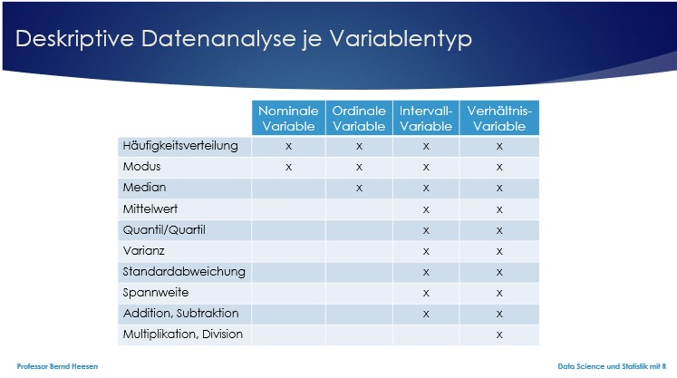
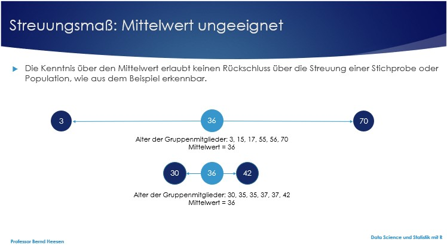

```{r setup, include=FALSE}
library(tidyverse)
library(learnr)
library(gridExtra)
library(datascience)
```


## Willkommen

Dieses Tutorial ergänzt die Inhalte des Buches [_Data Science und Statistik mit R_](https://www.amazon.de/Data-Science-Statistik-mit-Anwendungsl%C3%B6sungen/dp/3658348240/ref=sr_1_1?__mk_de_DE=%C3%85M%C3%85%C5%BD%C3%95%C3%91&dchild=1&keywords=Data+Science+und+Statistik+mit+R&qid=1627898747&sr=8-1).

Das Kapitel 4.1 im Buch behandelt die Deskriptive Statistik. Nachfolgend wird vorgestellt, wie die Deskriptive Statistik von R unterstützt wird.

## 1. Statistik

In der Statistik werden in der Regel quantitative und qualitative Daten analysiert, um neues Wissen zu erlangen. Mit Hilfe der Statistik versucht man Fragen zu beantworten wie z.B. was ist der günstigste Preis für ein Produkt, um einen maximalen Profit zu erzielen. Um eine solche Frage zu beantworten, benötigt man zunächst Daten. Diese Daten liegen entweder bereits vollständig vor oder man versucht diese selbst zu erheben, z.B. durch Beobachtungen, Umfragen, Experimente oder andere Methoden.

Leider ist es oft schwer oder unmöglich alle relevanten Daten zu einer vollständigen Population, der gesamten Gruppe aller betrachteten Objekte, zu sammeln. Einerseits ist es sehr zeitaufwändig und andererseits zu teuer oder schlicht unmöglich z.B. als Einkäufer den besten Preis für ein Produkt zu finden, da es sehr viele Webseiten gibt und darüber hinaus viele Geschäfte weltweit, wo das Produkt gekauft werden kann. Es ist oft unmöglich alle Daten zusammenzutragen, denn während man gerade noch Daten erfasst, ändern sich die Preise andernorts bereits wieder bei dem einen oder anderen Händler, dessen Daten man bereits erfasst hat. 

Insofern ist man als Forscher oft gezwungen mit einer Stichprobe oder Teilmenge der Population zu arbeiten. Wichtig ist dabei, dass eine Stichprobe möglichst repräsentativ für die Population ist, will man doch oft von den Erkenntnissen der Stichprobe auf die Population schließen können. Das Ziel Daten einer Stichprobe zu untersuchen ist in der Regel, dass man aus diesen Daten auf die Population schließen möchte. Dies bezeichnet man auch als Inferenz und wird im Rahmen der Inferenzstatistik oder induktiven Statistik behandelt.

Die deskriptive Statistik und Wissen über die Daten einer Stichprobe bilden die Grundlage für die induktive Statistik. Die Daten zu beschreiben ist Aufgabe der deskriptiven Statistik.


## 2. Deskriptive Statistik

Die deskriptive Statistik unterscheidet bei den Daten zwischen sogenannten Lagemaßen (Maßzahlen der zentralen Tendenz) und Streuungsmaßen (Maßzahlen der Verteilung) (siehe Abb. 4-2 im Buch). Lagemaße sind u.a. der Modus, Median und Mittelwert. Streuungsmaße sind u.a. Spannweite, Abweichung, Varianz und Standardabweichung.

Nicht alle Lagemaße und Streuungsmaße lassen sich für jede Variable ermitteln. Daher ist es von Bedeutung zunächst die unterschiedlichen Variablentypen zu differenzieren: Kategoriale oder auch qualitative Variablen und kardinale, metrische, numerische oder quantitative Variablen (siehe Abb. 4-3 im Buch).

Die qualitativen Variablen lassen sich in nominale Variablen ohne Rangordnung (binäre Variable: Sonderfall mit zwei Ausprägungen) und ordinale Variablen mit Rangordnung unterscheiden. Beispiele für qualitative Variablen sind:

1. Nominal: Familienstatus (verheiratet, geschieden, Single),	Zahlungsmodus (Bar, Überweisung, Kreditkarte), Logik (wahr, falsch),	Geschlecht (Mann, Frau).

2. Ordinal: Einkommen (niedrig, mittel, hoch),	Zufriedenheit (sehr gut, gut, mittel, schlecht, sehr schlecht),	Zustimmungsgrad (stimme stark zu, stimme zu, neutral, stimme nicht zu, stimme gar nicht zu), Wahrnehmung (sehr kalt, kalt, normal, heiß, sehr heiß).

Die quantitativen Variablen lassen sich unterscheiden in Intervallvariablen, die keinen natürlichen Nullpunkt besitzen und daher auch keine Verhältnisaussagen ermöglichen und Verhältnisvariablen, die einen natürlichen Nullpunkt besitzen und daher Verhältnisaussagen ermöglichen. Beispiele für quantitative Variablen sind:

1. Intervall: Temperatur in Grad Celsius, Jahr.

2. Verhältnis:	Preis, Alter,	Gewicht.

Folgende Auswertungen der deskriptiven Statistik lassen sich auf die unterschiedlichen Variablentypen anwenden.

Statistische Auswertungen je Variablentyp: 

## 3. Lagemaße

Das arithmetische Mittel, auch Mittelwert oder Durchschnitt genannt, ist das wichtigste Maß der zentralen Tendenz.

### 3.1 Mittelwert

Um diesen Wert zu berechnen, summiert man zunächst alle Einzelwerte und teilt diese dann durch die Anzahl der Einzelwerte (siehe Abb. 4-5 im Buch). Der Mittelwert ist eine wertvolle Maßzahl, kann jedoch durch sogenannte Ausreißer, extrem niedrige oder hohe Werte, stark beeinflusst werden. In R kann die Funktion mean() zur Berechnung des Mittelwerts verwendet werden.

```{r 3_1, exercise=FALSE}
head(studierende,3)
sp1 <- as_tibble(studierende[1:15,5])                  # Stichprobe 1 (sp1)
colnames(sp1) <- "Größe"
sp2 <- as_tibble(studierende[70:85,5])                 # Stichprobe 2 (sp2)
colnames(sp2) <- "Größe"
sp1$sp <- "Stichprobe 1"
sp2$sp <- "Stichprobe 2"
sp1und2 <- rbind(sp1,sp2)                              # Daten beider Stichproben
sp1$Größe                                              # Größe anzeigen sp1
mean(sp1$Größe)                                        # Mittelwert sp1
sp2$Größe                                              # Größe anzeigen sp2
sp2.mean <- mean(sp2$Größe)                            # Mittelwert sp2
sp2.mean
```

### 3.2 Median

Extreme Einzelwerte können den Mittelwert signifikant beeinflussen. Daher verwendet man neben dem Mittelwert eine weitere Maßzahl, die durch extreme Werte nicht beeinflusst ist, den Median. Der Median wird bestimmt, indem man alle Einzelwerte zunächst aufsteigend sortiert. Bei einer ungeraden Anzahl von Werten ist der Median der Einzelwert, der in der Mitte liegt. Bei einer geraden Anzahl von Werten berechnet sich der Median aus dem Mittelwert der beiden Einzelwerte in der Mitte. In R lässt sich die Funktion median() nutzen, um den Median zu ermitteln.

```{r 3_2-setup, exercise=FALSE, echo=FALSE, include=FALSE}
sp1 <- as_tibble(studierende[1:15,5])                  # Stichprobe 1 (sp1)
colnames(sp1) <- "Größe"
sp2 <- as_tibble(studierende[70:85,5])                 # Stichprobe 2 (sp2)
colnames(sp2) <- "Größe"
```

```{r 3_2, exercise=FALSE}
sort(sp1$Größe)                                        # Größe sortiert sp1
median(sp1$Größe)                                      # Median sp1
sort(sp2$Größe)                                        # Größe sortiert sp2
sp2.median <- median(sp2$Größe)                        # Median sp2
sp2.median
```

### 3.3 Modus

Eine weiteres Lagemaß ist der Modus, der Wert, der am häufigsten vorkommt. Man kann den Modus ermitteln, indem man zählt, wie häufig jeder der Werte vorkommt. Der Wert, der am häufigsten vorkommt, ist der Modus. Ein Nachteil des Modus als Lagemaß der zentralen Tendenz ist, dass er nicht in der Mitte der Werte liegen muss. 

Daher betrachtet man in der Regel den Mittelwert, den Median und den Modus gemeinsam, um eine Vorstellung über die Verteilung einer Variablen zu erhalten. In R existiert keine spezielle Funktion für die Berechnung des Modus. Die Funktion table() kann aber hilfreich sein, denn sie gibt die Häufigkeit des Vorkommens der Werte in tabellarischer Form an. Für numerische Variablen kann alternativ auch die Funktion stem() verwendet werden, die ein sogenanntes Stem-and-leaf-Plot anzeigt. Ein Stem-and-leaf-Plot organisiert numerische Daten entsprechend ihren Dezimalwerten. Die linke Spalte zeigt den sogenannten Stamm an, also alle Ziffern der Dezimalzahl außer der letzten Ziffer. Die sogenannten Blätter in der rechten Spalte repräsentieren die letzte Ziffer der Dezimalzahl und jede Zahl dort repräsentiert einen Datensatz.

```{r 3_3-setup, exercise=FALSE, echo=FALSE, include=FALSE}
sp1 <- as_tibble(studierende[1:15,5])                  # Stichprobe 1 (sp1)
colnames(sp1) <- "Größe"
```

```{r 3_3, exercise=FALSE}
table(sp1$Größe)                                       # Verteilung sp1
stem(sp1$Größe)                                        # Stem-Plot sp1
g <- as.data.frame(table(sp1$Größe))                   # table() -> Dataframe
filter(g, Freq == max(g$Freq))$Var1                    # Modus sp1
```

### 3.4 Übung

```{r 3_4-setup, exercise.setup="3_4", exercise=FALSE, echo=FALSE, include=FALSE}
sp3 <- studierende[1:15,"Note"]                        # Stichprobe 3 (sp3)
```

Der Vektor sp3 enthält 15 Noten. Lassen Sie sich die 15 Noten anzeigen und berechnen Sie den Mittelwert, den Median und den Modus für die Noten.

Die Anzeige sollte hinterher wie folgt aussehen: 

```{r 3_4, exercise=TRUE}

```

```{r 3_4-hint-1}
sp3
mean(sp3)
```
```{r 3_4-hint-2}
median(sp3)
```
```{r 3_4-hint-3}
verteilung <- as.data.frame(table(sp3))                # table() -> Dataframe
filter(verteilung, Freq == max(verteilung$Freq))$sp3   # Modus sp3
```

## 4. Streuungsmaße

Während Lagemaße die mittleren Werte einer Datenmenge beschreiben, beschreiben Streuungsmaße wie weit die Werte verteilt bzw. gestreut sind und wie weit sie von den mittleren Werten entfernt sind. Nur Lagemaße zu betrachten ist oft nicht ausreichend, da Stichproben mit dem gleichen Mittelwert oder Median eine sehr unterschiedliche Streuung haben können.



Nur Streuungsmaße zu betrachten ist ebenso wenig ausreichend, um ein Verständnis der Daten zu erlangen.

Um die Streuung besser zu verstehen, dienen u.a. die Maßgrößen der Spannweite und des Interquartilsabstands. 

### 4.1 Spannweite

Die Spannweite beschreibt die Distanz zwischen dem größten und dem kleinsten Wert. Im Beispiel von Abb. 4-7 im Buch beträgt die Spannweite 351 – 12 = 339. In R gibt es keine Standardfunktion für die Berechnung der Spannweite. Die Funktion range() ist aber hilfreich, da sie den kleinsten und größten Wert anzeigt. Die Spannweite für die Variable x kann dann mit der Anweisung max(range(x, na.rm = TRUE)) - min(range(x, na.rm = TRUE)) ermittelt werden. Noch geschickter ist die Anweisung max(x) – min(x).

```{r 4_1-setup, exercise=FALSE, echo=FALSE, include=FALSE}
sp2 <- as_tibble(studierende[70:85,5])                 # Stichprobe 2 (sp2)
colnames(sp2) <- "Größe"
h <- as.data.frame(table(sp2$Größe))                   # table() -> Dataframe
sp2.modus <- filter(h, Freq == max(h$Freq))$Var1       # Modus sp2
sp2.modus <- as.numeric(as.character(sp2.modus))       # Konvertierung numerisch
```

```{r 4_1, exercise=FALSE}
plot(sp2$Größe,rep(1,nrow(sp2)),ylab="Stichprobe 2",main="Scatterplot", # Plot sp2
     yaxt="n",xlab="Körpergröße in cm",xlim=c(150,210))
abline(v=min(sp2$Größe),col="red",lwd=2)               # Minimun: rot
abline(v=max(sp2$Größe),col="red",lwd=2)               # Maximum: rot
abline(v=mean(sp2$Größe), col="blue", lwd=4)           # Mittelwert: blau
abline(v=median(sp2$Größe), col="dark green", lwd=1)   # Median: grün
abline(v=sp2.modus, col="orange", lwd=1)               # Modus: orange          
range(sp2$Größe, na.rm = TRUE)                         # Range sp2
max(sp2$Größe)                                         # Maximum sp2
min(sp2$Größe)                                         # Minimum sp2
max(sp2$Größe)- min(sp2$Größe)                         # Spannweite sp2
```

### 4.2 Quantile, Quartile und Interquartilsabstand

Den Median stellt den Wert dar, der in der Mitte liegt. Der Median wird auch das 2. Quartil bzw. das 50% Quantil genannt. Quantilswerte sind Lagemaße und geben die Höhe des Wertes an, für den gilt, dass ein gewisser Prozentsatz aller Werte niedriger ist. Das 50%-Quantil gibt den Wert an, für den gilt, dass 50% aller Werte kleiner als dieser sind. Insofern stellt das 0%-Quantil den kleinsten Wert, das 100%-Quantil den größten Wert dar. Das 25%-Quantil wird auch als 1. Quartil (Quartil, da die Menge in vier Teilbereiche mit je 25% aufgeteilt wird) bezeichnet, das 50%-Quantil als 2. Quartil oder Median und das 75%-Quantil als 3. Quartil. Die Funktion quantile() berechnet in R die Quartile und das Minimum und Maximum. Es existieren unterschiedliche Formeln für die Berechnung der Quantile in R. Die auch von SPSS und Minitab verwendete Formel kann in R über den Parameter type=6 verwendet werden, z.B. quantile(anzahl,type=6). Wenn der Parameter nicht angegeben wird, so verwendet R als Standard type=7 als Berechnungsgrundlage. Details zu den unterschiedlichen Berechnungsformeln ist in der Hilfe zur Funktion nachlesbar, die mit der Anweisung ?quantile aufgerufen werden kann.

Der Abstand zwischen dem 1. und dem 3. Quartil wird auch als Interquartilsabstand (englisch: Interquartilerange, IQR) bezeichnet und gibt neben der Spannweite die Streuung der mittleren 50% aller Werte an. Um den IQR zu ermitteln, kann in R die Funktion IQR() ebenfalls mit dem Parameter type=6 verwendet werden.

Angenommen es existiert ein Vektor mit dem Namen anzahl, der die folgenden Werte 351, 120, 12, 30, 121, 63, 57, 91, 97, 100, 102 beinhaltet. Um herausfinden, wie groß die Zahl in dem Vektor anzahl sein muss, wenn 70% aller Werte kleiner sein sollen bzw. die Zahl zu den größten 30% gehören soll, kann folgende Anweisung quantile(anzahl, probs=0.70) verwendet werden und ergibt als Ergebnis den Wert 109,2.

Eine Zusammenfassung wesentlicher Maßzahlen liefert auch die Funktion summary(). Sie verwendet den type=7 für die Berechnung und gibt Minimum, Maximum, 1. bis 3. Quartil, Mittelwert und ggfs. die Anzahl fehlender Werte aus.

```{r 4_2, exercise=FALSE}
anzahl <- c(351,120,12,30,121,63,57,91,97,100,102)     # Numerische Variable
quantile(anzahl,type=6)                                # Quantile
quantile(anzahl,type=6, probs=0.25)                    # 25%-Quantil, 1. Quartil
quantile(anzahl,type=6, probs=0.70)                    # 70%-Quantil
quantile(anzahl,type=7, probs=0.70)                    # 70%-Quantil
IQR(anzahl,type=6)                                     # Interquartilsabstand
quantile(anzahl)                                       # Quantile
summary(anzahl)                                        # Zusammenfassung
quantile(sp2$Größe,type=6)                             # Quantile Größe
```

### 4.3 Box-Plot

Die Quartile und der Interquartilsabstand werden besonders gut in einem Box-Plot sichtbar, denn in einem Box-Plot werden folgende Werte abgebildet: Minimum, Erstes Quartil (Q1), Median (Q2), Drittes Quartil (Q3) und Maximum. Ein Box-Plot stellt eine Box dar und Antennen (Whiskers) oben und unten. Die Höhe der Box stellt den Interquartilsabstand dar, der untere Rand der Box das Erste Quartil (Q1) und der obere Rand der Box das Dritte Quartil (Q3). Umso größer die Box ist, umso größer ist die Streuung, welche durch den Interquartilsabstand gemessen wird. Die sogenannten Antennen (Whiskers) oder gestrichelten Linien unterhalb und oberhalb der Box ergänzt um die Ausreißer (Outliers), die als Kreise dargestellt werden, beschreiben die niedrigsten 25% und höchsten 25% aller Werte. Um einen Box-Plot anzuzeigen existiert die Funktion boxplot(), die im Standard die Antennen mit einer Länge von 1,5 * IQR (Interquartilsabstand) darstellt. Werte, die mehr als 1,5 * IQR von dem Q1 nach unten oder von dem Q3 nach oben abweichen, werden als Ausreißer dargestellt. Möchte man Ausreißer nicht angezeigt bekommen und stattdessen die Antennen von Q1 bis Minimum und von Q3 bis Maximum angezeigt bekommen, so ist dies mit dem Parameter range=0 möglich.

```{r 4_3, exercise=FALSE}
boxplot(Größe~sp,data=sp1und2,main="Boxplot",xlab="",  # Boxplot mit Ausreißern
        ylab="Körpergröße in cm")
boxplot(Größe~sp,data=sp1und2,main="Boxplot",xlab="",  # Boxplot ohne Ausreißer
        ylab="Körpergröße in cm",range=0)
```

### 4.4 Summe der Abweichungsquadrate

Eine weitere bedeutende Maßgröße für die Streuung ist die Varianz. Mathematisch berechnet sich die Varianz als der Durchschnitt der Abweichungsquadrate (Quadrat der Abweichungen aller Werte vom Mittelwert (siehe Abb. 4-8 im Buch). 

Die einfache Summierung aller Abweichungen vom Mittelwert ist ungenügend, da die Abweichungen positive und negative Werte annehmen können, die sich gegenseitig ausgleichen, auch wenn die Abweichungen groß sind. Ein kleiner Wert dieser Summe wäre daher nicht aussagekräftig. Auch die Summe der Quadrate der Abweichungen (Sum of Squared Errors, SS) wäre keine gute Maßgröße der Abweichung, denn bei zunehmender Anzahl an Werten würde die Maßzahl zunehmen, obwohl die durchschnittliche Abweichung nicht höher ausfällt. Für eine Population wird die Varianz 𝜎2 (Sigma Quadrat) daher berechnet als die Summe der Abweichungsquadrate (SS) geteilt durch die Anzahl der Beobachtungen (N = Größe der Population, wenn die gesamte Population beobachtet wurde). Die Stichprobenvarianz s² dagegen ergibt sich als Summe der Abweichungsquadrate (SS) geteilt durch die Anzahl der Freiheitsgrade (Freiheitsgrad = n – 1, n = Anzahl der Beobachtungen der Stichprobe).

```{r 4_4-setup, exercise=FALSE, echo=FALSE, include=FALSE}
sp1 <- as_tibble(studierende[1:15,5])                  # Stichprobe 1 (sp1)
colnames(sp1) <- "Größe"
sp2 <- as_tibble(studierende[70:85,5])                 # Stichprobe 2 (sp2)
colnames(sp2) <- "Größe"
```

```{r 4_4, exercise=FALSE}
sp1 <- arrange(sp1, sp1$Größe)                         # Tibble sp1 sortieren
sp1meanGröße <- mean(sp1$Größe)                        # Mittelwert sp1
sp1$no <- rep(1:nrow(sp1))                             # Spalte für Nummer
sp1 <- mutate(sp1, diffGröße = Größe - sp1meanGröße)   # Spalte für Differenz
sp2 <- arrange(sp2, sp2$Größe)                         # Tibble sp2 sortieren
sp2meanGröße <- mean(sp2$Größe)                        # Mittelwert sp2
sp2$no <- rep(1:nrow(sp2))                             # Spalte für Nummer
sp2 <- mutate(sp2, diffGröße = Größe - sp2meanGröße)   # Spalte für Differenz
p1 <- ggplot(sp1, aes(no, Größe)) +                    # Verteilung sp1
  geom_abline(intercept = sp1meanGröße, slope = 0, colour = "red") +
  geom_point(colour = "blue") +
  geom_linerange(aes(ymin = sp1meanGröße, ymax = Größe), colour = "grey40") +
  ylim(150,210) + labs(title="Stichprobe 1", x="",y="Körpergröße in cm")
p2 <- ggplot(sp2, aes(no, Größe)) +                    # Verteilung sp2
  geom_abline(intercept = sp2meanGröße, slope = 0, colour = "red") +
  geom_point(colour = "dark green") +
  geom_linerange(aes(ymin = sp2meanGröße, ymax = Größe), colour = "grey40") +
  ylim(150,210) + labs(title="Stichprobe 2", x="",y="Körpergröße in cm")
grid.arrange(p1, p2, ncol = 2)                         # Grafik p1+p2 ausgeben
tab <- select(sp1, Größe, diffGröße)                   # Tibble tab anlegen
colnames(tab) <- c("Größe","Abweichung")               # Spaltennamen festlegen
tab$AbwQuadrat <- tab$Abweichung^2                     # Abweichungsquadrat
tab                                                    # Ausgabe
round(sum(tab$Abweichung),2)                           # Summe der Abweichungen
round(sum(tab$AbwQuadrat),2)                           # Summe Abweichungsquadrate
```

### 4.5 Varianz

In R dient die Funktion var() zur Berechnung der Varianz und diese berechnet im Standard die Stichprobenvarianz s², teilt also durch n-1. Zur Berechnung der Varianz der Population 𝜎2 (Sigma Quadrat) kann bei Bedarf die folgende Funktion definiert werden: sigmaquadrat <- function(x) {n=length(x); var(x, na.rm=T) * (n-1)/n}.

```{r 4_5-setup, exercise=FALSE, echo=FALSE, include=FALSE}
sp1 <- as_tibble(studierende[1:15,5])                  # Stichprobe 1 (sp1)
colnames(sp1) <- "Größe"
sp1 <- arrange(sp1, sp1$Größe)                         # Tibble sp1 sortieren
sp1meanGröße <- mean(sp1$Größe)                        # Mittelwert sp1
sp1$no <- rep(1:nrow(sp1))                             # Spalte für Nummer
sp1 <- mutate(sp1, diffGröße = Größe - sp1meanGröße)   # Spalte für Differenz
tab <- select(sp1, Größe, diffGröße)                   # Tibble tab anlegen
colnames(tab) <- c("Größe","Abweichung")               # Spaltennamen festlegen
```

```{r 4_5, exercise=FALSE}
var(tab$Größe)                          # Stichprobenvarianz
```

### 4.6 Standardabweichung

Die Varianz hat den Nachteil, dass sie auf den quadrierten Abweichungen basiert und damit unrealistisch erhöht ist. Daher zieht man die Wurzel aus der Varianz, um die Standardabweichung der Population 𝜎 (Sigma) bzw. die Standardabweichung der Stichprobe s zu ermitteln. In R kann die Funktion sd() (Standard Deviation) verwendet werden, um die Standardabweichung der Stichprobe s zu berechnen. Zur Berechnung der Standardabweichung der Population 𝜎 (Sigma) kann bei Bedarf die folgende Funktion definiert werden: sigma <- function(x) {n=length(x); sqrt(var(x, na.rm=T) * (n-1)/n)}.

Die Standardabweichung ist eine sehr aussagekräftige Maßgröße der Statistik.

```{r 4_6-setup, exercise=FALSE, echo=FALSE, include=FALSE}
sp1 <- as_tibble(studierende[1:15,5])                  # Stichprobe 1 (sp1)
colnames(sp1) <- "Größe"
```

```{r 4_6, exercise=FALSE}
sd(sp1$Größe)                                    # Standardabweichung Stichprobe 1
```

### 4.7 Übung

```{r 4_7-setup, exercise.setup="4_7", exercise=FALSE, echo=FALSE, include=FALSE}
sp3 <- studierende[1:15,"Note"]                        # Stichprobe 3 (sp3)
```

Der Vektor sp3 enthält 15 Noten. Lassen Sie sich die 15 Noten anzeigen und berechnen Sie die Spannweite, das 15%-Quantil, den Interquartilsabstand, alle Quartile, die Varianz und die Standardabweichung für die Noten.

Die Anzeige sollte hinterher wie folgt aussehen: 

```{r 4_7, exercise=TRUE}

```

```{r 4_7-hint-1}
sp3
max(sp3)- min(sp3)           # Spannweite sp3
```
```{r 4_7-hint-2}
quantile(sp3, probs=0.15)    # 15%-Quantil
IQR(sp3)                     # Interquartilsabstand
quantile(sp3)                # Quantile
```
```{r 4_7-hint-3}
var(sp3)                     # Stichprobenvarianz
sd(sp3)                      # Standardabweichung der Stichprobe
```

```{r 4_8-setup, exercise.setup="4_8", exercise=FALSE, echo=FALSE, include=FALSE}
sp3 <- studierende[1:15,"Note"]                        # Stichprobe 3 (sp3)
```

Lassen Sie sich auch den Box-Plot inkl. möglicher Ausreißer für den Vektor sp3 anzeigen, um zu validieren, dass die Box vom 1. bis zum 3. Quartil geht und der Interquartilsabstand zuvor auch korrekt mit 2 berechnet wurde.

Die Anzeige sollte hinterher wie folgt aussehen: 

```{r 4_8, exercise=TRUE}

```

```{r 4_8-hint-1}
boxplot(sp3,main="Boxplot",xlab="",ylab="Note")
```

## 5. Quiz

```{r 5_1, echo = FALSE}
quiz(
  question("Welche der folgenden Aussagen sind korrekt?", allow_retry = TRUE, random_answer_order = TRUE,
    answer("In der Statistik werden in der Regel quantitative und qualitative Daten analysiert, um neues Wissen zu erlangen.", correct = TRUE),
    answer("Die deskriptive Statistik und Wissen über die Daten einer Stichprobe bilden die Grundlage für die induktive Statistik.", correct = TRUE),
    type = "multiple"
  ),
  question("Welche der folgenden Aussagen sind korrekt?", allow_retry = TRUE, random_answer_order = TRUE,
    answer("Modus, Mittelwert und Spannweite sind Lagemaße.", message = "Nein, Spannweite ist ein Streuungsmaß."),
    answer("Varianz, Interquartilsabstand und Standardabweichung sind Streuungsmaße.", correct = TRUE),
    answer("Nicht alle Lagemaße und Streuungsmaße lassen sich für jede Variable ermitteln. Für alle Variablen lässt sich jedoch wenigstens der Mittelwert berechnen.", message = "Nein, ein Mittelwert lässt sich nur für quantitative Variablen (Intervall- und Verhältnis-Variablen) berechnen."),
    type = "multiple"
  ),
  question("Welche der folgenden Aussagen sind korrekt?", allow_retry = TRUE, random_answer_order = TRUE,
    answer("Familienstatus mit den Ausprägungen verheiratet, geschieden und single ist eine Ordinalvariable.", message = "Nein, Familienstatus ist eine Nominalvariable, denn es gibt keine Rangfolge der unterschiedlichen Ausprägungen."),
    answer("Zufriedenheit mit den Ausprägungen sehr gut, gut, mittel, schlecht, sehr schlecht ist eine Nominalvariable.", message = "Nein, Zufriedenheit ist eine Ordinalvariable, da eine Rangfolge der unterschiedlichen Ausprägungen existiert."),
    answer("Preis in Euro, Alter in Jahren und	Gewicht in kg sind Verhältnisvariablen.", correct = TRUE),
    type = "multiple"
  ),
  question("Welche der folgenden Aussagen sind korrekt?", allow_retry = TRUE, random_answer_order = TRUE,
    answer("Die Funktion mean() berechnet den Median.", message = "Nein, die Funktion mean() berechnet den Mittelwert."),
    answer("Die Funktion modus() berechnet den Modus.", message = "Nein, Im Standardfunktionsumfang von R existiert keine Funktion zur Berechnung des Modus."),
    answer("Die Anweisung max(sp2$Größe)- min(sp2$Größe) berechnet die Spannweite von sp2$Größe.", correct = TRUE),
    answer("Die Anweisung quantile(sp2$Größe, probs=0.70) ermittelt den Wert aus sp2$Größe, für den gilt, dass nur 30% der Werte größer sind als dieser Wert.", correct = TRUE),
    answer("Die Funktion box.plot() gibt einen Box-Plot aus.", message = "Nein, die Funktion boxplot() gibt einen Box-Plot aus."),
    answer("Zur Berechnung der Standardabweichung verwendet man die Funktion sd().", correct = TRUE),
    type = "multiple"
  ),
  question("Welche der folgenden Aussagen sind korrekt?", allow_retry = TRUE, random_answer_order = TRUE,
    answer("Der Modus des folgenden Vektors (1,2,3,1,2,3,1) ist 3.", message = "Nein, der Modus ist 1."),
    answer("Der Mittelwert des folgenden Vektors (1,2,3,1,2,3) ist 2.", correct = TRUE),
    answer("Der Median des folgenden Vektors (1,2,3,1,2,3,1) ist 3.", message = "Nein, der Median ist 2."),
    answer("Der Median des folgenden Vektors (1,2,3,1,3,3) ist 2,5.", correct = TRUE),
    type = "multiple"
  )
)
```

## Ende 

Gratulation!

Sie haben dieses Tutorial erfolgreich ausgeführt und einen Einblick in die Deskriptive Statistik und insbesondere die wesentlichen Lage- und Streuungsmaße erhalten.