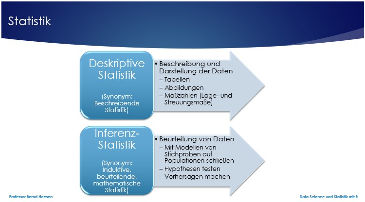

```{r setup, include=FALSE}
library(tidyverse)
library(learnr)
library(forcats)
library(gridExtra)
```


## Willkommen

Dieses Tutorial ergänzt die Inhalte des Buches [_Data Science und Statistik mit R_](https://www.amazon.de/Data-Science-Statistik-mit-Anwendungsl%C3%B6sungen/dp/3658348240/ref=sr_1_1?__mk_de_DE=%C3%85M%C3%85%C5%BD%C3%95%C3%91&dchild=1&keywords=Data+Science+und+Statistik+mit+R&qid=1627898747&sr=8-1).

Das Kapitel 4.1 im Buch behandelt die Deskriptive Statistik. Nachfolgend wird vorgestellt, wie die Deskriptive Statistik von R unterstützt wird.

```{r x_y-setup, exercise.setup="x_y", exercise=FALSE, echo=FALSE, include=FALSE}

```

Berechnen Sie ....

Die Anzeige sollte hinterher wie folgt aussehen: 

```{r x_y, exercise=TRUE}

```

```{r x_y-hint-1}

```
```{r x_y-hint-2}

```

## 1. Statistik

In der Statistik werden in der Regel quantitative und qualitative Daten analysiert, um neues Wissen zu erlangen. Mit Hilfe der Statistik versucht man Fragen zu beantworten wie z.B. was ist der günstigste Preis für ein Produkt, um einen maximalen Profit zu erzielen. Um eine solche Frage zu beantworten, benötigt man zunächst Daten. Diese Daten liegen entweder bereits vollständig vor oder man versucht diese selbst zu erheben, z.B. durch Beobachtungen, Umfragen, Experimente oder andere Methoden.

Leider ist es oft schwer oder unmöglich alle relevanten Daten zu einer vollständigen Population, der gesamten Gruppe aller betrachteten Objekte, zu sammeln. Einerseits ist es sehr zeitaufwändig und andererseits zu teuer oder schlicht unmöglich z.B. als Einkäufer den besten Preis für ein Produkt zu finden, da es sehr viele Webseiten gibt und darüber hinaus viele Geschäfte weltweit, wo das Produkt gekauft werden kann. Es ist oft unmöglich alle Daten zusammenzutragen, denn während man gerade noch Daten erfasst, ändern sich die Preise andernorts bereits wieder bei dem einen oder anderen Händler, dessen Daten man bereits erfasst hat. 

Insofern ist man als Forscher oft gezwungen mit einer Stichprobe oder Teilmenge der Population zu arbeiten. Wichtig ist dabei, dass eine Stichprobe möglichst repräsentativ für die Population ist, will man doch oft von den Erkenntnissen der Stichprobe auf die Population schließen können. Das Ziel Daten einer Stichprobe zu untersuchen ist in der Regel, dass man aus diesen Daten auf die Population schließen möchte. Dies bezeichnet man auch als Inferenz und wird im Rahmen der Inferenzstatistik oder induktiven Statistik behandelt.

Die deskriptive Statistik und Wissen über die Daten einer Stichprobe bilden die Grundlage für die induktive Statistik. Die Daten zu beschreiben ist Aufgabe der deskriptiven Statistik.

Statistik: 

### 1.1 Deskriptive Statistik

Die deskriptive Statistik unterscheidet bei den Daten zwischen sogenannten Lagemaßen (Maßzahlen der zentralen Tendenz) und Streuungsmaßen (Maßzahlen der Verteilung) (siehe Abb. 4-2 im Buch). Lagemaße sind u.a. der Modus, Median und Mittelwert. Streuungsmaße sind u.a. Spannweite, Abweichung, Varianz und Standardabweichung.

Nicht alle Lagemaße und Streuungsmaße lassen sich für jede Variable ermitteln. Daher ist es von Bedeutung zunächst die unterschiedlichen Variablentypen zu differenzieren: Kategoriale oder auch qualitative Variablen und kardinale, metrische, numerische oder quantitative Variablen (siehe Abb. 4-3 im Buch).

Die qualitativen Variablen lassen sich in nominale Variablen ohne Rangordnung (binäre Variable: Sonderfall mit zwei Ausprägungen) und ordinale Variablen mit Rangordnung unterscheiden. Beispiele für qualitative Variablen sind:

Nominal
•	Familienstatus: Verheiratet, geschieden, Single
•	Zahlungsmodus: Bar, Überweisung, Kreditkarte
•	Logik: Wahr, falsch
•	Geschlecht: Mann, Frau

Ordinal
•	Einkommen: Niedrig, mittel, hoch
•	Zufriedenheit: Sehr gut, gut, mittel, schlecht, sehr schlecht
•	Zustimmungsgrad: Stimme stark zu, stimme zu, neutral, stimme nicht zu, stimme gar nicht zu
•	Wahrnehmung: Sehr kalt, kalt, normal, heiß, sehr heiß

Die quantitativen Variablen lassen sich unterscheiden in Intervallvariablen, die keinen natürlichen Nullpunkt besitzen und daher auch keine Verhältnisaussagen ermöglichen und Verhältnisvariablen, die einen natürlichen Nullpunkt besitzen und daher Verhältnisaussagen ermöglichen. Beispiele für quantitative Variablen sind:

Intervall
•	Temperatur in Grad Celsius
•	Jahr

Verhältnis
•	Preis
•	Alter
•	Gewicht

Folgende Auswertungen der deskriptiven Statistik lassen sich auf die unterschiedlichen Variablentypen anwenden.

Statistische Auswertungen je Variablentyp: 

### 1.2 Lagemaße

Das arithmetische Mittel, auch Mittelwert oder Durchschnitt genannt, ist das wichtigste Maß der zentralen Tendenz. Um diesen Wert zu berechnen, summiert man zunächst alle Einzelwerte und teilt diese dann durch die Anzahl der Einzelwerte (siehe Abb. 4-5 im Buch). Der Mittelwert ist eine wertvolle Maßzahl, kann jedoch durch sogenannte Ausreißer, extrem niedrige oder hohe Werte, stark beeinflusst werden. In R kann die Funktion mean() zur Berechnung des Mittelwerts verwendet werden.

Extreme Einzelwerte können den Mittelwert signifikant beeinflussen. Daher verwendet man neben dem Mittelwert eine weitere Maßzahl, die durch extreme Werte nicht beeinflusst ist, den Median. Der Median wird bestimmt, indem man alle Einzelwerte zunächst aufsteigend sortiert. Bei einer ungeraden Anzahl von Werten ist der Median der Einzelwert, der in der Mitte liegt. Bei einer geraden Anzahl von Werten berechnet sich der Median aus dem Mittelwert der beiden Einzelwerte in der Mitte. In R lässt sich die Funktion median() nutzen, um den Median zu ermitteln.

Eine weiteres Lagemaß ist der Modus, der Wert, der am häufigsten vorkommt. Man kann den Modus ermitteln, indem man zählt, wie häufig jeder der Werte vorkommt. Der Wert, der am häufigsten vorkommt, ist der Modus. Ein Nachteil des Modus als Lagemaß der zentralen Tendenz ist, dass er nicht in der Mitte der Werte liegen muss. Daher betrachtet man in der Regel den Mittelwert, den Median und den Modus gemeinsam, um eine Vorstellung über die Verteilung einer Variablen zu erhalten. In R existiert keine spezielle Funktion für die Berechnung des Modus. Die Funktion table() kann aber hilfreich sein, denn sie gibt die Häufigkeit des Vorkommens der Werte in tabellarischer Form an. Für numerische Variablen kann alternativ auch die Funktion stem() verwendet werden, die ein sogenanntes Stem-and-leaf-Plot anzeigt. Ein Stem-and-leaf-Plot organisiert numerische Daten entsprechend ihren Dezimalwerten. Die linke Spalte zeigt den sogenannten Stamm an, also alle Ziffern der Dezimalzahl außer der letzten Ziffer. Die sogenannten Blätter in der rechten Spalte repräsentieren die letzte Ziffer der Dezimalzahl und jede Zahl dort repräsentiert einen Datensatz.

```{r 1_1, exercise=FALSE}
head(studierende,3)
sp1 <- as_tibble(studierende[1:15,5])                  # Stichprobe 1 (sp1)
colnames(sp1) <- "Größe"
sp2 <- as_tibble(studierende[70:85,5])                 # Stichprobe 2 (sp2)
colnames(sp2) <- "Größe"
sp1$sp <- "Stichprobe 1"
sp2$sp <- "Stichprobe 2"
sp1und2 <- rbind(sp1,sp2)                              # Daten beider Stichproben
#- Lagemaß: Mittelwert------------------------------------------------------------
sp1$Größe                                              # Größe anzeigen sp1
mean(sp1$Größe)                                        # Mittelwert sp1
sp2$Größe                                              # Größe anzeigen sp2
sp2.mean <- mean(sp2$Größe)                            # Mittelwert sp2
sp2.mean
#- Lagemaß: Median----------------------------------------------------------------
sort(sp1$Größe)                                        # Größe sortiert sp1
median(sp1$Größe)                                      # Median sp1
sort(sp2$Größe)                                        # Größe sortiert sp2
sp2.median <- median(sp2$Größe)                        # Median sp2
sp2.median
#- Lagemaß: Modus-----------------------------------------------------------------
table(sp1$Größe)                                       # Verteilung sp1
stem(sp1$Größe)                                        # Stem-Plot sp1
g <- as.data.frame(table(sp1$Größe))                   # table() -> Dataframe
filter(g, Freq == max(g$Freq))$Var1                    # Modus sp1
table(sp2$Größe)                                       # Verteilung sp2
stem(sp2$Größe)                                        # Stem-Plot sp2
h <- as.data.frame(table(sp2$Größe))                   # table() -> Dataframe
sp2.modus <- filter(h, Freq == max(h$Freq))$Var1       # Modus sp2
sp2.modus <- as.numeric(as.character(sp2.modus))       # Konvertierung numerisch
sp2.modus                                              # Ausgabe
```

### 1.3 Streuungsmaße

Während Lagemaße die mittleren Werte einer Datenmenge beschreiben, beschreiben Streuungsmaße wie weit die Werte verteilt bzw. gestreut sind und wie weit sie von den mittleren Werten entfernt sind. Nur Lagemaße zu betrachten ist oft nicht ausreichend, da Stichproben mit dem gleichen Mittelwert oder Median eine sehr unterschiedliche Streuung haben können.

Mittelwert ungeeignet als Streuungsmaß: 

Nur Streuungsmaße zu betrachten ist ebenso wenig ausreichend, um ein Verständnis der Daten zu erlangen.

Um die Streuung besser zu verstehen, dienen u.a. die Maßgrößen der Spannweite und des Interquartilsabstands. Die Spannweite beschreibt die Distanz zwischen dem größten und dem kleinsten Wert. Im Beispiel von Abb. 4-7 im Buch beträgt die Spannweite 351 – 12 = 339. In R gibt es keine Standardfunktion für die Berechnung der Spannweite. Die Funktion range() ist aber hilfreich, da sie den kleinsten und größten Wert anzeigt. Die Spannweite für die Variable x kann dann mit der Anweisung max(range(x, na.rm = TRUE)) - min(range(x, na.rm = TRUE)) ermittelt werden. Noch geschickter ist die Anweisung max(x) – min(x).

```{r 1_2, exercise=FALSE}
plot(sp2$Größe,rep(1,nrow(sp2)),ylab="Stichprobe 2",main="Scatterplot", # Plot sp2
     yaxt="n",xlab="Körpergröße in cm",xlim=c(150,210))
abline(v=min(sp2$Größe),col="red",lwd=2)               # Minimun: rot
abline(v=max(sp2$Größe),col="red",lwd=2)               # Maximum: rot
abline(v=mean(sp2$Größe), col="blue", lwd=4)           # Mittelwert: blau
abline(v=median(sp2$Größe), col="dark green", lwd=1)   # Median: grün
abline(v=modus, col="orange", lwd=1)                   # Modus: orange          
range(sp2$Größe, na.rm = TRUE)                         # Range sp2
max(sp2$Größe)                                         # Maximum sp2
min(sp2$Größe)                                         # Minimum sp2
max(sp2$Größe)- min(sp2$Größe)                         # Spannweite sp2
```

### 1.3.1 Quantile, Quartile und Interquartilsabstand

Den Median stellt den Wert dar, der in der Mitte liegt. Der Median wird auch das 2. Quartil bzw. das 50% Quantil genannt. Quantilswerte sind Lagemaße und geben die Höhe des Wertes an, für den gilt, dass ein gewisser Prozentsatz aller Werte niedriger ist. Das 50%-Quantil gibt den Wert an, für den gilt, dass 50% aller Werte kleiner als dieser sind. Insofern stellt das 0%-Quantil den kleinsten Wert, das 100%-Quantil den größten Wert dar. Das 25%-Quantil wird auch als 1. Quartil (Quartil, da die Menge in vier Teilbereiche mit je 25% aufgeteilt wird) bezeichnet, das 50%-Quantil als 2. Quartil oder Median und das 75%-Quantil als 3. Quartil. Die Funktion quantile() berechnet in R die Quartile und das Minimum und Maximum. Es existieren unterschiedliche Formeln für die Berechnung der Quantile in R. Die auch von SPSS und Minitab verwendete Formel kann in R über den Parameter type=6 verwendet werden, z.B. quantile(anzahl,type=6). Wenn der Parameter nicht angegeben wird, so verwendet R als Standard type=7 als Berechnungsgrundlage. Details zu den unterschiedlichen Berechnungsformeln ist in der Hilfe zur Funktion nachlesbar, die mit der Anweisung ?quantile aufgerufen werden kann.

Der Abstand zwischen dem 1. und dem 3. Quartil wird auch als Interquartilsabstand (englisch: Interquartilerange, IQR) bezeichnet und gibt neben der Spannweite die Streuung der mittleren 50% aller Werte an. Um den IQR zu ermitteln, kann in R die Funktion IQR() ebenfalls mit dem Parameter type=6 verwendet werden.

Angenommen es existiert ein Vektor mit dem Namen anzahl, der die folgenden Werte 351, 120, 12, 30, 121, 63, 57, 91, 97, 100, 102 beinhaltet. Um herausfinden, wie groß die Zahl in dem Vektor anzahl sein muss, wenn 70% aller Werte kleiner sein sollen bzw. die Zahl zu den größten 30% gehören soll, kann folgende Anweisung quantile(anzahl, probs=0.70) verwendet werden und ergibt als Ergebnis den Wert 109,2.

Eine Zusammenfassung wesentlicher Maßzahlen liefert auch die Funktion summary(). Sie verwendet den type=7 für die Berechnung und gibt Minimum, Maximum, 1. bis 3. Quartil, Mittelwert und ggfs. die Anzahl fehlender Werte aus.

```{r 1_3, exercise=FALSE}
anzahl <- c(351,120,12,30,121,63,57,91,97,100,102)     # Numerische Variable
quantile(anzahl,type=6)                                # Quantile
quantile(anzahl,type=6, probs=0.25)                    # 25%-Quantil, 1. Quartil
quantile(anzahl,type=6, probs=0.70)                    # 70%-Quantil
quantile(anzahl,type=7, probs=0.70)                    # 70%-Quantil
IQR(anzahl,type=6)                                     # Interquartilsabstand
quantile(anzahl)                                       # Quantile
summary(anzahl)                                        # Zusammenfassung
quantile(sp2$Größe,type=6)                             # Quantile Größe
```

### 1.3.2 Box-Plot

Die Quartile und der Interquartilsabstand werden besonders gut in einem Box-Plot sichtbar, denn in einem Box-Plot werden folgende Werte abgebildet: Minimum, Erstes Quartil (Q1), Median (Q2), Drittes Quartil (Q3) und Maximum. Ein Box-Plot stellt eine Box dar und Antennen (Whiskers) oben und unten. Die Höhe der Box stellt den Interquartilsabstand dar, der untere Rand der Box das Erste Quartil (Q1) und der obere Rand der Box das Dritte Quartil (Q3). Umso größer die Box ist, umso größer ist die Streuung, welche durch den Interquartilsabstand gemessen wird. Die sogenannten Antennen (Whiskers) oder gestrichelten Linien unterhalb und oberhalb der Box ergänzt um die Ausreißer (Outliers), die als Kreise dargestellt werden, beschreiben die niedrigsten 25% und höchsten 25% aller Werte. Um einen Box-Plot anzuzeigen existiert die Funktion boxplot(), die im Standard die Antennen mit einer Länge von 1,5 * IQR (Interquartilsabstand) darstellt. Werte, die mehr als 1,5 * IQR von dem Q1 nach unten oder von dem Q3 nach oben abweichen, werden als Ausreißer dargestellt. Möchte man Ausreißer nicht angezeigt bekommen und stattdessen die Antennen von Q1 bis Minimum und von Q3 bis Maximum angezeigt bekommen, so ist dies mit dem Parameter range=0 möglich.

```{r 1_4, exercise=FALSE}
boxplot(Größe~sp,data=sp1und2,main="Boxplot",xlab="",  # Boxplot mit Ausreißern
        ylab="Körpergröße in cm")
boxplot(Größe~sp,data=sp1und2,main="Boxplot",xlab="",  # Boxplot ohne Ausreißer
        ylab="Körpergröße in cm",range=0)
```

### 1.3.3 Summe der Abweichungsquadrate, Varianz und Standardabweichung

Eine weitere bedeutende Maßgröße für die Streuung ist die Varianz. Mathematisch berechnet sich die Varianz als der Durchschnitt der Abweichungsquadrate (Quadrat der Abweichungen aller Werte vom Mittelwert (siehe Abb. 4-8 im Buch). 

Die einfache Summierung aller Abweichungen vom Mittelwert ist ungenügend, da die Abweichungen positive und negative Werte annehmen können, die sich gegenseitig ausgleichen, auch wenn die Abweichungen groß sind. Ein kleiner Wert dieser Summe wäre daher nicht aussagekräftig. Auch die Summe der Quadrate der Abweichungen (Sum of Squared Errors, SS) wäre keine gute Maßgröße der Abweichung, denn bei zunehmender Anzahl an Werten würde die Maßzahl zunehmen, obwohl die durchschnittliche Abweichung nicht höher ausfällt. Für eine Population wird die Varianz 𝜎2 (Sigma Quadrat) daher berechnet als die Summe der Abweichungsquadrate (SS) geteilt durch die Anzahl der Beobachtungen (N = Größe der Population, wenn die gesamte Population beobachtet wurde). Die Stichprobenvarianz s² dagegen ergibt sich als Summe der Abweichungsquadrate (SS) geteilt durch die Anzahl der Freiheitsgrade (Freiheitsgrad = n – 1, n = Anzahl der Beobachtungen der Stichprobe).

```{r 1_5, exercise=FALSE}
sp1 <- arrange(sp1, sp1$Größe)                         # Tibble sp1 sortieren
sp1meanGröße <- mean(sp1$Größe)                        # Mittelwert sp1
sp1$no <- rep(1:nrow(sp1))                             # Spalte für Nummer
sp1 <- mutate(sp1, diffGröße = Größe - sp1meanGröße)   # Spalte für Differenz
sp2 <- arrange(sp2, sp2$Größe)                         # Tibble sp2 sortieren
sp2meanGröße <- mean(sp2$Größe)                        # Mittelwert sp2
sp2$no <- rep(1:nrow(sp2))                             # Spalte für Nummer
sp2 <- mutate(sp2, diffGröße = Größe - sp2meanGröße)   # Spalte für Differenz
p1 <- ggplot(sp1, aes(no, Größe)) +                    # Verteilung sp1
  geom_abline(intercept = sp1meanGröße, slope = 0, colour = "red") +
  geom_point(colour = "blue") +
  geom_linerange(aes(ymin = sp1meanGröße, ymax = Größe), colour = "grey40") +
  ylim(150,210) + labs(title="Stichprobe 1", x="",y="Körpergröße in cm")
p2 <- ggplot(sp2, aes(no, Größe)) +                    # Verteilung sp2
  geom_abline(intercept = sp2meanGröße, slope = 0, colour = "red") +
  geom_point(colour = "dark green") +
  geom_linerange(aes(ymin = sp2meanGröße, ymax = Größe), colour = "grey40") +
  ylim(150,210) + labs(title="Stichprobe 2", x="",y="Körpergröße in cm")
grid.arrange(p1, p2, ncol = 2)                         # Grafik p1+p2 ausgeben
tab <- select(sp1, Größe, diffGröße)                   # Tibble tab anlegen
colnames(tab) <- c("Größe","Abweichung")               # Spaltennamen festlegen
tab$AbwQuadrat <- tab$Abweichung^2                     # Abweichungsquadrat
tab                                                    # Ausgabe
round(sum(tab$Abweichung),2)                           # Summe der Abweichungen
round(sum(tab$AbwQuadrat),2)                           # Summe Abweichungsquadrate
```

In R dient die Funktion var() zur Berechnung der Varianz und diese berechnet im Standard die Stichprobenvarianz s², teilt also durch n-1. Zur Berechnung der Varianz der Population 𝜎2 (Sigma Quadrat) kann bei Bedarf die folgende Funktion definiert werden: sigmaquadrat <- function(x) {n=length(x); var(x, na.rm=T) * (n-1)/n}.

```{r 1_6, exercise=FALSE}
round(sum(tab$AbwQuadrat)/(nrow(tab)-1),2)       # Stichprobenvarianz
round(sum(tab$AbwQuadrat)/(nrow(tab)),2)         # Varianz der Population
round(var(tab$Größe),2)                          # Stichprobenvarianz
sigmaquadrat <- function(x)                      # Funktion für die Berechnung
  {n=length(x); var(x, na.rm=T) * (n-1)/n}       # der Varianz der Population
round(sigmaquadrat(tab$Größe),2)                 # Varianz der Population
```

Die Varianz hat den Nachteil, dass sie auf den quadrierten Abweichungen basiert und damit unrealistisch erhöht ist. Daher zieht man die Wurzel aus der Varianz, um die Standardabweichung der Population 𝜎 (Sigma) bzw. die Standardabweichung der Stichprobe s zu ermitteln. In R kann die Funktion sd() (Standard Deviation) verwendet werden, um die Standardabweichung der Stichprobe s zu berechnen. Zur Berechnung der Standardabweichung der Population 𝜎 (Sigma) kann bei Bedarf die folgende Funktion definiert werden: sigma <- function(x) {n=length(x); sqrt(var(x, na.rm=T) * (n-1)/n)}.

Die Standardabweichung ist eine sehr aussagekräftige Maßgröße der Statistik.

```{r 1_7, exercise=FALSE}
round(sqrt(sum(tab$AbwQuadrat)/(nrow(tab)-1)),2) # Standardabweichung Stichprobe
round(sd(tab$Größe),2)                           # Standardabweichung Stichprobe
sigma <- function(x)                             # Funktion für die Berechnung
  {n=length(x); sqrt(var(x, na.rm=T) * (n-1)/n)} # der Standardabw. der Population
round(sigma(tab$Größe),2)                        # Standardabweichung Population
sd(sp1$Größe)                                    # Standardabweichung Stichprobe 1
sd(sp2$Größe)                                    # Standardabweichung Stichprobe 2
```

### 1.4 Übung

```{r 1_8-setup, exercise.setup="1_8", exercise=FALSE, echo=FALSE, include=FALSE}

```

Der Vektor i wurde durch die Anweisung c(3, -10, -20, 40) und der Dataframe df mit der Anweisung data.frame(x= c(53,2,100), y=c(299,20,30)) angelegt. Erstellen Sie eine logische Operation auf den Vektor i, welche prüft, ob für die Elemente gilt, dass der Inhalt des Elements multipliziert mit 5 ein Ergebnis produziert, welches größer als 20 ist. Erstellen Sie darüber hinaus eine logische Operation die prüft, ob y-x aus dem Dataframe df eine positive Zahl ergibt.

Die Anzeige sollte hinterher wie folgt aussehen: 

```{r 1_8, exercise=TRUE}

```

```{r 1_8-hint-1}
i*5>20
```
```{r 1_8-hint-2}
with(df,y-x>0)   # ODER
df$y-df$x>0
```


## 2. Logische Operationen

Auch logische Operationen lassen sich auf verschiedene Objekte anwenden.
Logische Operationen: 

Neben einer einfachen logischen Operation lässt sich auch ein logisches ODER (Symbol für Disjunktion in R: |), logisches UND (Symbol für Konjunktion in R: &) und die logische NEGATION (Symbol für Negation in R: !) in Bedingungen einsetzen.

### 2.1 Einfache logische Operationen

```{r 2_1, exercise=FALSE}
a <- 48                               # numerische Variable
a                                     # Ausgabe
a == 48                               # Operator == mit Ergebnis TRUE
a == 84                               # Operator == mit Ergebnis FALSE
a != 84                               # Operator != mit Ergebnis TRUE
a < 84                                # Operator < mit Ergebnis TRUE
a <= 84                               # Operator <= mit Ergebnis TRUE
a > 84                                # Operator > mit Ergebnis FALSE
a >= 84                               # Operator >= mit Ergebnis FALSE
class(a)                              # Datentyp
is.numeric(a)                         # Datentyp is.numeric TRUE
! is.numeric(a)                       # Datentyp ! is.numeric FALSE
is.numeric(a) & a > 84                # Datentyp is.numeric AND a>84 FALSE
is.numeric(a) | a > 84                # Datentyp is.numeric OR a>84 TRUE
```

### 2.2 Logische Operationen auf Vektoren

```{r 2_2-setup, exercise.setup="2_2", exercise=FALSE, echo=FALSE, include=FALSE}
i <- c(3, -10, -20, 40)               # vektor numerisch Länge 4
df <- data.frame(x= c(53,2,100), y=c(299,20,30)) # Dataframe
```

Wenn R eine logische Operation auf einem Vektor ausführt, so wird diese für jedes Element des Vektors einzeln ausgeführt und ein Ergebnis produziert, das so viele logische Werte erzeugt, wie Elemente in dem Vektor existieren. Die einzelnen Werte stellen bei TRUE dar, dass ein Element die Bedingung erfüllt und bei FALSE, dass die Bedingung für dieses Element nicht erfüllt ist.

```{r 2_2, exercise=TRUE}
i                                     # Ausgabe
truefalse1 <- i > 0                   # Operator > auf Vektor
truefalse1                            # Ausgabe
df                                    # Ausgabe
truefalse2 <- df > 50                 # Operator > auf Dataframe
truefalse2                            # Ausgabe
```

### 2.3 Übung

```{r 2_3-setup, exercise.setup="2_3", exercise=FALSE, echo=FALSE, include=FALSE}
i <- c(3, -10, -20, 40)                          # vektor numerisch Länge 4
df <- data.frame(x= c(53,2,100), y=c(299,20,30)) # Dataframe
```

Der Vektor i wurde durch die Anweisung c(3, -10, -20, 40) und der Dataframe df mit der Anweisung data.frame(x= c(53,2,100), y=c(299,20,30)) angelegt. Erstellen Sie eine logische Operation auf den Vektor i, welche prüft, ob für die Elemente gilt, dass der Inhalt des Elements multipliziert mit 5 ein Ergebnis produziert, welches größer als 20 ist. Erstellen Sie darüber hinaus eine logische Operation die prüft, ob y-x aus dem Dataframe df eine positive Zahl ergibt.

Die Anzeige sollte hinterher wie folgt aussehen: 

```{r 2_3, exercise=TRUE}

```

```{r 2_3-hint-1}
i*5>20
```
```{r 2_3-hint-2}
with(df,y-x>0)   # ODER
df$y-df$x>0
```

## 3. Selektive Operationen

Mit Hilfe selektiver Operationen ist es möglich Elemente aus Vektoren, Dataframes und anderen Datenstrukturen auszuwählen.

### 3.1 Einfache Selektive Operationen

Der Vektor mit dem Alter der Teammitglieder, der mit der Anweisung alter <- sample(c(floor(runif(16, min=0, max=100)), rep(NA, 4))) angelegt werden kann, enthält offensichtlich 20 numerische Elemente mit positiven Zahlen zwischen 0 und 100 Jahren oder der Angabe NA für einen fehlenden Wert, wenn die befragte Person ihr Alter nicht angegeben hat. Die Funktion rep() erzeugt wiederholt ein Element (1. Parameter) n Mal (2. Parameter). Ebenso kann ein logischer Vektor truefalse mit 20 Elementen durch die Anweisung truefalse <- rep(c(TRUE, FALSE),10) erzeugt werden, der abwechselnd ein TRUE und FALSE enthält.

Die Funktion alter[truefalse] zeigt dann nur die Elemente an, bei denen im Vektor truefalse der Wert TRUE steht. So kann mit Hilfe von TRUE und FALSE eine Selektion erfolgen.

```{r 3_1, exercise=FALSE}
alter <- sample(c(floor(runif(16,min=0,max=100)),rep(NA,4))) # Vektor numerisch
alter                                         # Ausgabe
truefalse <- rep(c(TRUE, FALSE),10)           # Vektor logisch Länge 20
truefalse                                     # Ausgabe
alter[truefalse]                              # Ausgabe wo TRUE
```

### 3.2 Selektive Operationen inkl. der Funktion is.na()

Die Funktion is.na() gibt für den in Klammern stehenden Parameter (Vektor) TRUE zurück, wenn das Element NICHT NA (NA = not available = fehlender Wert) ist und FALSE, wenn das Element NA ist. Die Funktion liefert als Ergebnis einen Vektor in der gleichen Länge wie der Parametervektor und zeigt für jedes Element die Position (Index) mit TRUE an, wo in einem Vektor NA steht. Sie dient dazu NA-Werte und deren Position zu identifizieren. Um z.B. alle Werte des Vektors alter anzuzeigen, die nicht NA sind, kann man die Funktion alter[!is.na(alter)] verwenden. Zur Erinnerung: Das ! bedeutet die Verneinung einer logischen Bedingung.
Wenn man aus diesem Vektor nur die Elemente angezeigt bekommen möchte, die ein Alter zwischen 5 und 15 Jahren haben, kann man in eckigen Klammern hinter dem Vektornamen die logische Bedingung angeben, z.B. alter[!is.na(alter) & alter>= 5 & alter<= 15].

Um zukünftige Analysen nur auf die Elemente zu beschränken, die nicht NA sind, kann man mit der Funktion alter2 <- alter[!is.na(alter)] einen neuen Vektor alter2 erstellen. Dann lässt sich anschließend die Anzeige der Personen mit Alter zwischen 5 und 15 Jahren mit der Funktion alter2[alter2>=5 & alter2<=15] erreichen. Die Erwachsenen aus dieser Gruppe lassen sich mit der Anweisung alter2[alter2 > 17] anzeigen.

```{r 3_2, exercise=FALSE}
alter <- sample(c(floor(runif(16,min=0,max=100)),rep(NA,4))) # Vektor numerisch
alter                                         # Ausgabe
is.na(alter)                                  # Ausgabe logisch Länge 20 
alter[is.na(alter)]                           # Ausgabe wo TRUE
alter[!is.na(alter)]                          # Ausgabe wo FALSE
alter2 <- alter[!is.na(alter)]                # Vektor wo FALSE
alter2                                        # Anzeige
alter[!is.na(alter) & alter>=5 & alter<=15]   # Ausgabe wo FALSE & >=5 & <=15
alter2[alter2>=5 & alter2<=15]                # Ausgabe wo FALSE & >=5 & <=15
alter2[alter2 > 17]                           # Ausgabe wo FALSE & >17
```

### 3.3 Übung

```{r 3_3-setup, exercise.setup="3_3", exercise=FALSE, echo=FALSE, include=FALSE}
alter <- c(75, 67, NA, 50, NA, 99, 88, 81, 80, 57, 5) 
```

Der Vektor alter wurde durch die Anweisung alter <- c(75, 67, NA, 50, NA, 99, 88, 81, 80, 57, 5) angelegt. Erstellen Sie eine selektive Operation auf den Vektor alter, welche nur die Werte anzeigt, die NA sind. Erstellen Sie eine zweite Operation, welche nur die Werte anzeigt, die nicht NA sind. Erstellen Sie eine dritte Operation, die unter den vorhandenen Werten nur die Werte anzeigt, deren Wert größer als 50 ist.

Die Anzeige sollte hinterher wie folgt aussehen: 

```{r 3_3, exercise=TRUE}

```

```{r 3_3-hint-1}
alter[is.na(alter)]
```
```{r 3_3-hint-2}
alter[!is.na(alter)]
```
```{r 3_3-hint-3}
alter[alter>50 & !is.na(alter)]
```

## 4. Textoperationen

Mit Variablen vom Typ character lassen sich viele Funktionen ausführen, u.a. erlaubt die Funktion paste() mehrere einzelne Wörter zu verbinden. Mit der Anweisung satz <- paste("Ich", "teste", "die", "paste()-Funktion") wird eine neue Variable mit dem Namen satz angelegt.

### 4.1 Funktion paste(), str_detect(), str_locate(), str_extract(), str_replace() und str_count()

Sie können mit der Funktion paste() auch Kombinationen von Zeichenketten erzeugen, wenn das Ergebnis aus mehrere Elementen verschiedenen Typs besteht, z.B. namen <- paste("Name",3:7,collapse=", ",sep="-"). Der Parameter collapse gibt an, wie die neu erzeugten Zeichenketten voneinander getrennt werden sollen und der Parameter sep gibt an, wenn anstatt eines Leerzeichens ein anderes Zeichen zur Trennung verwendet werden soll, um den ersten Parameter (hier: Name) und den zweiten Parameter (hier: 3 bis 7) zu verbinden. 

```{r 4_1, exercise=FALSE}
satz <- paste("Ich","teste","die","paste()-Funktion.") # Vektor character(Länge 1)
satz                                                   # Ausgabe
str(satz)                                              # Ausgabe mit Typ und Länge
namen <- paste("Name",3:7,collapse=", ",sep="-")       # Vektor character(Länge 1)
namen                                                  # Ausgabe
str(namen)                                             # Ausgabe mit Typ und Länge
```

Weitere Funktionen für die Textanalyse sind die Funktionen str_detect() zur Erkennung von Zeichenketten in einer Textvariablen, str_locate() zur Erkennung der Position, an welcher sich eine Zeichenkette in einer Textvariablen befindet, die Funktion str_extract() und str_extract_all(), um Zeichenketten eines spezifischen Formats aus einer Textvariablen zu extrahieren. Die Funktion str_replace_all() ersetzt eine Zeichenfolge in einer Textvariablen durch eine andere Zeichenkette.

Eine weitere wertvolle Funktion ist die Funktion str_count(), welche die Anzahl der Worte zählt, wenn der Parameter boundary("word") verwendet wird. Im Folgenden wird dies am Beispiel der Analyse eines Tweets vorgestellt.

```{r 4_2, exercise=FALSE}
tweet<-"Trotz #Corona-Beschränkungen sind für den morgigen #1Mai zahlreiche rechte \n                und/oder verachwörungsideologische Demos in #Sachsen geplant. Ein Übersichtsthread\n                mit den Top10 von @johannesgrunert: https://t.co/POtZkJRpJQ"
str_detect(tweet, "[:digit:]")                # Frage, ob Ziffer enthalten ist
str_locate(tweet, "[:digit:]")                # Frage, an welcher Position Ziffer
str_extract(tweet, "[:digit:]")               # Ziffer extrahieren
str_extract_all(tweet, "[:digit:]")           # Ziffern extrahieren
str_extract_all(tweet, "[:digit:]{2}")        # Ziffern extrahieren mit Länge 2
hashtag<-str_extract_all(tweet, "#[:alnum:]+")# Hashtags # mit nachfolgenden alpha
hashtags<-unlist(hashtag)                     # Hashtags in einfachen Vektor
hashtags<-as_tibble(table(hashtags))          # Hashtags in Tibble
hashtags
str_extract_all(tweet, "@[:alnum:]+")         # User @ mit nachfolgenden alpha
str_extract_all(tweet, "https?://[:graph:]+") # URLs extrahieren
str_count(tweet, boundary("word"))            # Anzahl Tokens (Wörter) zählen 
str_extract_all(tweet, "[:alpha:]+")          # Alle Tokens mit wenigstens einem Buchstaben
str_replace_all(tweet, "[^[:alpha:]+]", "")   # Alle Leerzeichen entfernen
```

### 4.2 Übung

```{r 4_3-setup, exercise.setup="4_3", exercise=FALSE, echo=FALSE, include=FALSE}
text<-"R ist einfach eine beliebte Programmiersprache und daher lerne ich diese Programmiersprache auch besonders gerne. Mehr Details unter https://cran.r-project.org/index.html"
```

Der Vektor text enthält folgenden Inhalt: "R ist einfach eine beliebte Programmiersprache und daher lerne ich diese Programmiersprache auch besonders gerne. Mehr Details unter https://cran.r-project.org/index.html". 

Zählen Sie, wie häufig das Wort "Programmiersprache" und das Wort "ist" im Vektor vorkommt. Verwenden Sie anschließend auch eine Funktion, um alle URLs in dem Vektor anzuzeigen.

Die Anzeige sollte hinterher wie folgt aussehen: 

```{r 4_3, exercise=TRUE}

```

```{r 4_3-hint-1}
str_count(text, c("Programmiersprache","ist"))  # Anzahl des Vorkommens zählen 
```
```{r 4_3-hint-2}
str_extract_all(text, "https?://[:graph:]+")    # URLs extrahieren
```

## 5. Datumsoperationen

Das Datumsformat unterscheidet sich je Region und auch die Zeitzone variiert regional. Mit der Funktion Sys.getlocale(“LC_ALL“) kann man sich die Systemeinstellungen anzeigen lassen und mit Sys.setlocale(“LC_TIME“) die Region festlegen. Die Zeitzone lässt sich mit der Funktion Sys.timezone() abfragen. 

```{r 5_1, exercise=FALSE}
Sys.getlocale("LC_ALL")                       # Systemeinstellungen ALL anzeigen
Sys.setlocale("LC_TIME", "C")                 # Windows Betriebssystem, Zeit=US
Sys.setlocale("LC_TIME", "German")            # Windows Betriebssystem, Zeit=D
Sys.getlocale("LC_TIME")                      # Systemeinstellungen TIME anzeigen
Sys.timezone()                                # Aktuelle Zeitzone
```

### 5.1 Einfache Datumsoperationen

Es gibt spezielle Funktionen, die auf Datumsvariablen anwendbar sind. Der Datentyp der Datumsvariablen ist Date und der von Zeitvariablen ist POSIXct und POSIXlt. Alle Zeitinformationen werden als die Zeit in Tagen, Stunden oder Sekunden gespeichert, die seit dem 1.1.1970 vergangen ist. Für Zeiten vor diesem Datum gibt eine negative Zahl die Tage bzw. Sekunden bis zum 1.1.1970 an. 

Die Funktion Sys.Date() kann verwendet werden, um das aktuelle Datum anzuzeigen und die Funktion Sys.time(), um die aktuelle Zeit und das aktuelle Datum anzuzeigen. Mit der Anweisung unclass(Sys.Date()) bzw. unclass(Sys.time()) wird Ihnen die interne Darstellung des aktuellen Datums bzw. der aktuellen Zeit angezeigt und dies ist die Zahl der Tage bzw. Sekunden, die seit dem 1.1.1970 vergangen sind.

```{r 5_2, exercise=FALSE}
heute <- Sys.Date()                           # Aktuelles Datum
heute                                         # Anzeige
str(heute)                                    # Anzeige Typ
zeit <- Sys.time()                            # Aktuelle Zeit
zeit                                          # Anzeige
str(zeit)                                     # Anzeige Typ
unclass.heute <- unclass(heute)               # Tage seit dem 1.1.1970
unclass.heute                                 # Anzeige
str(unclass.heute)                            # Anzeige Typ
unclass.zeit <- unclass(zeit)                 # Sekunden seit dem 1.1.1970
unclass.zeit                                  # Anzeige
str(unclass.zeit)                             # Anzeige Typ
```

### 5.2 Datumsoperationen für Datentyp Date

Möchte man sich den Wochentag eines Datums anzeigen lassen, so geht dies mit der Funktion weekdays(). Die Anzeige des Monats kann mit der Funktion months() erreicht werden. Eine umfassendere Möglichkeit ist jedoch die Konvertierung von Datum und Uhrzeit in das Format POSIXlt mit der Funktion as.POSIXlt(). Wenn man das Ergebnis anschließend mit der Funktion unclass() konvertiert, so kann man auf die Variablen wday, mday, mon, year, zone, hour, min und sec zugreifen.

```{r 5_3, exercise=FALSE}
heute <- Sys.Date()                           # Aktuelles Datum
heute.konv <- as.POSIXlt(heute)               # Konvertiert in Typ POSIXlt
str(heute.konv)                               # Anzeige Typ
unclass.heute.konv <- unclass(heute.konv)     # Konvertiert mit unclass()                     
unclass.heute.konv                            # Anzeige
unclass.heute.konv$wday                       # Wochentag
unclass.heute.konv$mday                       # Tag im Monat
1+unclass.heute.konv$mon                      # Monat (mon vorbei + 1)
1900 + unclass.heute.konv$year                # Jahr  (year + 1900)
weekdays(heute)                               # Wochentag
months(heute)                                 # Monat
```

### 5.3 Datumsoperationen für Datentyp POSIXct

Datumsoperationen für Datum und Zeit.

```{r 5_4, exercise=FALSE}
zeit <- Sys.time()                            # Aktuelle Zeit
zeit.konv <- as.POSIXlt(zeit)                 # Konvertiert in Typ POSIXlt 
str(zeit.konv)                                # Anzeige Typ
unclass.zeit.konv <- unclass(zeit.konv)       # Konvertiert mit unclass()                     
unclass.zeit.konv                             # Anzeige
unclass.zeit.konv$wday                        # Wochentag
unclass.zeit.konv$mday                        # Tag im Monat
1+unclass.zeit.konv$mon                       # Monat (mon vorbei + 1)
1900 + unclass.zeit.konv$year                 # Jahr  (year + 1900)
unclass.zeit.konv$zone                        # Zeitzone CET=Central European Time
unclass.zeit.konv$hour                        # Stunde
unclass.zeit.konv$min                         # Minute
unclass.zeit.konv$sec                         # Sekunde
weekdays(zeit)                                # Wochentag
months(zeit)                                  # Monat
```

### 5.4 Nützliche Konvertierungen

Manchmal gilt es auch einen Text in eine Variable vom Typ POSIXlt zu konvertieren. Die Funktion strptime() unterstützt dies, z.B. strptime("März 09, 1964 14:23","%B %d, %Y %H:%M").

Die geschickteste Art, die Details zu Datum und Uhrzeit zu erhalten, ist jedoch, nachdem man eine Variable mit der Funktion as.POSIXct() in das POSIXct-Format konvertiert hat und anschließend die Funktion format() verwendet, um sich Tag, Monat, Jahr, Stunde, Minute und Sekunde anzeigen zu lassen, z.B. mit der Anweisung format(Variable, format="%d.%m.%Y, %H:%M:%S").

```{r 5_5, exercise=FALSE}
a <- strptime("März 09, 1964 14:23","%B %d, %Y %H:%M") # Konvertiert Text in Zeit
a                                             # Anzeige CET=Central European Time
str(a)                                        # Anzeige Typ
b <- as.POSIXct("2020-03-09 11:12:54")        # Konvertiert Text in Zeit
b                                             # Anzeige CET=Central European Time
str(b)                                        # Anzeige Typ
format(b, format="%d")                        # Tag
format(b, format="%m")                        # Monat
format(b, format="%Y")                        # Jahr
format(b, format="%H")                        # Stunde
format(b, format="%M")                        # Minute
format(b, format="%S")                        # Sekunde
format(b, format="%d.%m.%Y, %H:%M:%S")        # Tag, Monat, Jahr, Stunde, Min, Sek
c <- as.POSIXct("11.04.2019, 14:52:31", format="%d.%m.%Y, %H:%M:%S") #Konv T->Zeit
format(c, format="%d")                        # Tag
format(c, format="%m")                        # Monat
format(c, format="%Y")                        # Jahr
format(c, format="%H")                        # Stunde
format(c, format="%M")                        # Minute
format(c, format="%S")                        # Sekunde
format(c, format="%d.%m.%Y, %H:%M:%S")        # Tag, Monat, Jahr, Stunde, Min, Sek
```

### 5.5 Vergleiche, Addition, Subtraktion und die Berechnung von Differenzen

Es gibt auch nützliche Berechnungsfunktionen (+, -) und Vergleiche, die mit Datums- und Zeitvariablen arbeiten. Die Funktion difftime(Zeit-1, Zeit-2, units = 'secs') gestattet die Differenz der Zeitvariablen Zeit-1 und Zeit-2 zu ermitteln. Über den Parameter units kann angegeben werden, in welcher Einheit die Differenz berechnet werden soll (Wochen=weeks, Tage=days, Stunden=hours, Minuten=mins, Sekunden=secs).

Das Paket lubridate erlaubt viele weitere essenzielle Operationen mit Datums- und Zeitvariablen. 

```{r 5_6-setup, exercise.setup="5_6", exercise=FALSE, echo=FALSE, include=FALSE}
heute <- Sys.Date()                           # Aktuelles Datum
```

```{r 5_6, exercise=TRUE}
heute                                         # Ausgabe
weekdays(heute)                               # Wochentag
übermorgen <- heute+2                         # Datumsberechnung mit +
übermorgen                                    # Ausgabe
weekdays(übermorgen)                          # Wochentag
vorgestern <- heute-2                         # Datumsberechnung mit - 
vorgestern                                    # Ausgabe
weekdays(vorgestern)                          # Wochentag
übermorgen - vorgestern                       # Berechnung Zeitdifferenz in Tagen
d <- as.POSIXct("11.04.2021, 14:52:31", format="%d.%m.%Y, %H:%M:%S") #Konv T->Zeit
d                                             # Ausgabe
e <- as.POSIXct("11.04.2021, 15:54:31", format="%d.%m.%Y, %H:%M:%S") #Konv T->Zeit
e                                             # Ausgabe
difftime(e,d,units="weeks")                   # Zeitdifferenz in Wochen
difftime(e,d,units="days")                    # Zeitdifferenz in Tagen
difftime(e,d,units="hours")                   # Zeitdifferenz in Stunden
difftime(e,d,units="mins")                    # Zeitdifferenz in Minuten
difftime(e,d,units="secs")                    # Zeitdifferenz in Sekunden
```

### 5.6 Übung

```{r 5_7-setup, exercise.setup="5_7", exercise=FALSE, echo=FALSE, include=FALSE}
heute <- Sys.Date()                           # Aktuelles Datum
```

Geben Sie die Variable heute und den Wochentag von heute aus. Geben Sie anschließend auch den Wochentag von morgen aus, wenn in der Variablen heute das aktuelle Datum steht.
Berechnen Sie die in einem weiteren Schritt die Anzahl der Tage bis zum kommenden Heiligen Abend, dem 24. Dezember diesen Jahres.

Die Anzeige sollte hinterher ähnlich wie folgt aussehen, wobei der Wochentag und die Anzahl der Tage bis Heiligabend davon abhängt, an welchem Tag Sie diese Übung ausführen: 

```{r 5_7, exercise=TRUE}

```

```{r 5_7-hint-1}
heute
weekdays(heute)                                # Wochentag heute
weekdays(heute+1)                              # Wochentag morgen
```
```{r 5_7-hint-2}
heute.konv<-as.POSIXlt(heute)                  # Datumsformat konvertieren
heute.unclass<-unclass(heute.konv)             # Unclass
heute.jahr<-heute.unclass$year+1900            # Jahr aktuell
heute.jahr
heiligabend<-paste(heute.jahr,"-12-24",sep="") # Datum von Heilig Abend
heiligabend
difftime(heiligabend,heute,units="days")       # Differenz in Tagen
```

## 6. Tabellenjoins

Oft besteht das Interesse Daten für eine Analyse miteinander zu verbinden, wenn nicht alle relevanten Informationen in einer Tabelle vorliegen bzw. sogar bewusst entsprechend dem Entity-Relationship-Modell für eine effektivere, redundanzfreie Datenträgernutzung normalisiert in unterschiedlichen Datenbanktabellen abgelegt sind. 

Für diesen Zweck kann man Tabellen x und y mit der Funktion merge() zusammenführen. Die Parameter by.x und by.y geben die Spaltennamen an, über welche der Join erfolgen soll. Das Ergebnis ist eine Tabelle, welche die Inhalte der Tabelle x und die Inhalte der Tabelle y zusammenführt, wenn für den Schlüssel, der mit by.x angegeben wurde, ein identischer Eintrag mit dem Schlüssel by.y in der Tabelle y existiert. Wenn der Parameter all.x=TRUE verwendet wird und kein Eintrag für den Schlüssel by.x in by.y existiert, dann werden die sonst mit den Werten der Tabelle y befüllten Spalten mit NA gefüllt (Outer Join, Partial Match). Wird der Parameter all.x=TRUE nicht verwendet und es existiert kein Eintrag für den Schlüssel by.x in by.y, so wird der Datensatz mit by.x nicht in die Ergebnistabelle aufgenommen (Inner Join, Full Match).


### 6.1 Join von Tabellen

Nachfolgend werden die Tabellen (Dataframes) regisseur und film gejoint.

```{r 6_1, exercise=FALSE}
regisseur <- data.frame(                      # Regisseure
    name = c("Spielberg","Scorsese","Hitchcock","Schlöndorff","Polanski"),
    nationalität = c("USA","USA","GB","Deutschland","Polen"),
    stringsAsFactors=FALSE)
film <- data.frame(                           # Filme
    nachname = c("Spielberg","Scorsese","Hitchcock","Hitchcock",
           	"Spielberg","Schlöndorff","Polanski"),
    titel = c("Der Weiße Hai","The Irishman","Psycho","Die Vögel",
    		    "Catch Me If You Can","Die Blechtrommel","Chinatown"),
    stringsAsFactors=FALSE)
m1 <- merge(regisseur,film,                   # Inner Join
            by.x="name",by.y="nachname")
m1                                            # ->Join Regisseur mit Film
dim(m1)
regisseur.neu <-  c("deJenlis","Frankreich")  # Neuer Regisseur
regisseur <- rbind(regisseur,regisseur.neu)
m2 <- merge(regisseur,film,                   # Inner Join
            by.x="name",by.y="nachname")
m2                                            # ->Keine Zeile für neuen Regisseur
dim(m2)
m3 <- merge(regisseur,film,                   # Outer Join
            by.x="name",by.y="nachname",
            all.x = TRUE)
m3                                            # ->Extra Zeile Regisseur ohne Film
dim(m3)                                            
regisseur.neu <-  c("Polanski","Frankreich")  # Neuer Regisseur - Name doppelt
regisseur <- rbind(regisseur,regisseur.neu)
m4 <- merge(regisseur,film,                   # Inner Join
            by.x="name",by.y="nachname")
m4                                            # ->Zwei Zeilen Polanski-Film
dim(m4)
m5 <- merge(regisseur,film,                   # Outer Join
            by.x="name",by.y="nachname",
            all.x = TRUE)
m5                                            # ->Extra Zeile Regisseur ohne Film
dim(m5)
```

### 6.2 Übung

```{r 6_2-setup, exercise.setup="6_2", exercise=FALSE, echo=FALSE, include=FALSE}
airlines <- data.frame(                      # Fluggesellschaften
    carrier = c("LH","DL","US","AF","FR"),
    name = c("Lufthansa","Delta Airlines","US Airlines","Air France","Ryan Air"),
    stringsAsFactors=FALSE)
flights <- data.frame(                       # Flüge
    carrier = c("LH","AF","LH","FR","DL","LH","AF","FR"),
    number  = c("130","98","12","8854","64","78","999","2"),
    dest    = c("Munich","Paris","Ansbach","Faro","Atlanta","Cancun","Phuket","Bremen"),
    stringsAsFactors=FALSE)
```

Lassen Sie sich zunächst die Inhalte der Dataframes airlines und flights anzeigen.

```{r 6_2, exercise=TRUE}
airlines
flights
```

```{r 6_3-setup, exercise.setup="6_3", exercise=FALSE, echo=FALSE, include=FALSE}
airlines <- data.frame(                      # Fluggesellschaften
    carrier = c("LH","DL","US","AF","FR"),
    name = c("Lufthansa","Delta Airlines","US Airlines","Air France","Ryan Air"),
    stringsAsFactors=FALSE)
flights <- data.frame(                       # Flüge
    carrier = c("LH","AF","LH","FR","DL","LH","AF","FR"),
    number  = c("130","98","12","8854","64","78","999","2"),
    dest    = c("Munich","Paris","Ansbach","Faro","Atlanta","Cancun","Phuket","Bremen"),
    stringsAsFactors=FALSE)
```

Führen Sie zuerst einen Inner Join und anschließend einen Outer Join über die beiden Tabellen (Dataframes) airlines und flights aus, wobei diese über die Schlüsselfelder carrier verknüpft werden und speichern das Ergebnis in dem Dataframe flug ab. Geben Sie jeweils anschließend die Inhalte des Dataframe flug aus.

Die Anzeige sollte hinterher wie folgt aussehen: 

```{r 6_3, exercise=TRUE}

```

```{r 6_3-hint-1}
flug <- merge(airlines,flights,                # Inner Join
            by.x="carrier",by.y="carrier")
flug
```
```{r 6_3-hint-2}
flug <- merge(airlines,flights,                # Outer Join
            by.x="carrier",by.y="carrier",
            all.x = TRUE)
flug
```

## 7. Quiz

```{r 7_1, echo = FALSE}
quiz(
  question("Welche der folgenden Aussagen sind korrekt?", allow_retry = TRUE, random_answer_order = TRUE,
    answer("Die Funktion round(b,2) rundet den Inhalt der numerischen Variable b auf zwei Nachkommastellen.", correct = TRUE),
    answer("Wenn R zwei Vektoren mit unterschiedlicher Länge bei arithmetischen Operationen verwendet, werden die jeweiligen Operationen (`+`, `-`, `*`, etc.) Element für Element abgearbeitet, wobei der kürzere Vektor so lange wiederverwendet wird, bis alle Berechnungen geleistet wurden.", correct = TRUE),
    type = "multiple"
  ),
  question("Welche der folgenden Aussagen sind korrekt?", allow_retry = TRUE, random_answer_order = TRUE,
    answer("Das Symbol für die logische NEGATION in R ist das Ausrufungszeichen '!'.", correct = TRUE),
    answer("Wenn die Anweisung a <- c('250') ausgeführt wurde, dann liefert die Anweisung is.numeric(a) & a > 84 das Ergebnis TRUE", message = "Nein, TRUE ist nicht korrekt, da a eine Character-Variable (nicht numerisch wegen der Anführungszeichen) ist und damit die Funktion is.numeric(a) ein FALSE zurückgibt."),
    answer("Die Anweisung liste <- a[!is.na(a)] selektiert nur die Werte aus dem Vektor a, welche NA sind, und speichert diese in dem Vektor liste ab.", message = "Nein, das Ausrufungszeichen vor dem is.na gibt an, dass nur die Werte, welche NICHT NA sind in dem Vektor a in dem Vektor liste gespeichert werden."),
    type = "multiple"
  ),
  question("Welche der folgenden Aussagen sind korrekt?", allow_retry = TRUE, random_answer_order = TRUE,
    answer('namen <- paste("Raum",4:6,collapse=", ",sep="-") speichert die folgenden drei Zeichenketten in dem Vektor namen ab: "Raum-4", "Raum-5", "Raum-6".', correct = TRUE),
    answer("sys.date() gibt das aktuelle Datum aus.", message = "Nein, Sys.Date() leistet dies. Groß- und Kleinschreibung wird in R unterschieden."),
    answer("Die Funktion merge() erlaubt Dataframes miteinander zu joinen, wobei die Parameter by.x und by.y die Namen der Spalten angeben, über deren Inhalte (Schlüssel) die Verknüpfung erfolgem soll", correct = TRUE),
    type = "multiple"
  )
)
```

## Ende 

Gratulation!

Sie haben dieses Tutorial erfolgreich ausgeführt und einen Einblick in wesentliche Operationen der Programmiersprache R erhalten.