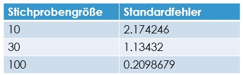
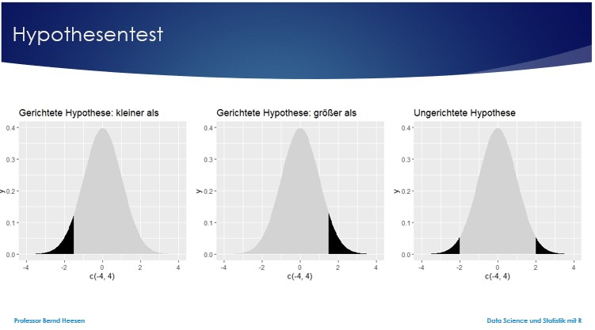
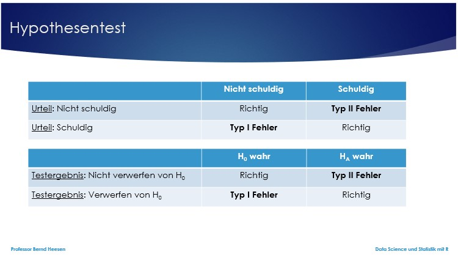

```{r setup, include=FALSE}
library(datascience)
colnames(studierende)[5]<-"Größe"
colnames(studierende)[10]<-"Fußball"
colnames(studierende)[13]<-"Attraktivität"
library(tidyverse)
library(learnr)
library(moderndive)
library(infer)
library(stats)
library(cluster)
library(titanic)
library(corrr)
```

## Willkommen

Dieses Tutorial ergänzt die Inhalte des Buches [_Data Science und Statistik mit R_](https://www.amazon.de/Data-Science-Statistik-mit-Anwendungsl%C3%B6sungen/dp/3658348240/ref=sr_1_1?__mk_de_DE=%C3%85M%C3%85%C5%BD%C3%95%C3%91&dchild=1&keywords=Data+Science+und+Statistik+mit+R&qid=1627898747&sr=8-1).

Das Kapitel 4.3 behandelt die Induktive Statistik, Stichprobenbildung, Konfidenzintervalle, Hypothesentests ebenso wie die Regressions und das Clustering und wie dies von R unterstützt wird.

## 1. Induktive Statistik

In der deskriptiven Statistik liegen Daten vor, die mit Hilfe von statistischen Kennzahlen und Abbildungen beschrieben werden. Diese vorliegenden Informationen können quasi als eine Totalerhebung bezüglich der betrachteten Grundgesamtheit betrachtet werden, z.B. der 18 Mannschaften der Fußballbundesliga in der Saison 2020/21, der befragten 357 Erstsemesterstudierenden einer Vorlesung. Die deskriptive Statistik erlaubt diese Daten mit statistischen Mitteln zu beschreiben. Die Wahrscheinlichkeitsrechnung erlaubt darüber hinaus auch Aussagen darüber, mit welcher Wahrscheinlichkeit eine ausgewählte Person der befragten Erstsemesterstudierenden männlich oder weiblich ist oder mit welcher Wahrscheinlichkeit ein ausgewählter männlicher Studierender dieser Gruppe größer als 1,80m groß ist (bedingte Wahrscheinlichkeit, wenn Geschlecht männlich). Diese Aussagen sind hilfreich, beschränken sich aber ausschließlich auf die Personen oder Objekte, zu welchen Daten erhoben wurden, die sogenannte Grundgesamtheit. Die deskriptive Statistik erlaubt nicht, dass daraus geschlossen wird, dass dies auch für alle anderen Studierenden oder alle Bürger etc. Gültigkeit besitzt.

Genau da setzt die induktive Statistik an. Ihr Ziel ist es Aussagen zu machen, die weitreichender sind und für mehr als nur die Personen oder Objekte gelten, zu welchen Daten vorliegen. So kann es z.B. darum gehen abzuschätzen, wie hoch ein Risiko einer Erkrankung ist oder eine Vorhersage zu machen, wieviel Prozent der Bevölkerung eine Partei zu wählen beabsichtigen oder wie sich die Nachfrage nach einem Produkt verändert, wenn der Preis erhöht wird. Wettervorhersagen, Schätzungen der Ankunftszeit durch das Navigationssystem und viele weitere Funktionen sind Anwendungen der induktiven Statistik.

Natürlich sind Aussagen über die Zukunft mit Unsicherheit behaftet und gleiches gilt bei Aussagen über Grundgesamtheiten wie alle Studierenden, alle Bürger oder alle Fertigprodukte, da diese Aussagen auf unvollständigen Informationen beruhen. Unvollständig sind die Informationen u.a., wenn sie sich auf die Zukunft beziehen, weil die Daten ja überhaupt nicht vorliegen können. Unvollständig sind die Informationen auch, wenn sie sich auf eine Grundgesamtheit beziehen, weil es in der Realität oft unpraktikabel, zu aufwendig oder zu teuer ist eine Totalerhebung der Grundgesamtheit durchzuführen. In vielen Fällen ist es sogar unmöglich die vollständige Information über eine Grundgesamtheit zu erheben. Eine aktuelle Befragung aller Wahlberechtigten eines Wahlbezirks zu einem Stichtag würde bereits daran scheitern, dass einige Mitglieder dieser Personengruppe nicht erreichbar sind, z.B. im Urlaub, im Krankenhaus, kein Telefon besitzen oder keine Telekommunikationsverbindung haben.

Insofern begnügt man sich bei der induktiven Statistik mit unvollständigen Informationen. Die Ergebnisse der induktiven Statistik sind daher auch immer ungenau. Das Schöne ist jedoch, dass man das Risiko quantifizieren kann und dadurch auch in der Lage ist, Ergebnisse der induktiven Statistik korrekt zu interpretieren und bei selbst angewandten Verfahren der induktiven Statistik festzulegen, welche Höhe des Risikos akzeptiert und toleriert wird.

Die Höhe des Risikos hängt davon ab, wie eine Stichprobe gezogen wird, dem sogenannten Ziehungsverfahren. Wenn dies nicht korrekt gewählt wurde, dann sind auch die mit statistischen Werkzeugen und Methoden ermittelten Ergebnisse oft ungeeignet, um die angestrebten Antworten auf Fragen zu finden. Die einfache Verfügbarkeit von Daten  ist hier oft verführerisch. Achten Sie bei der Interpretation von Ergebnissen oder der eigenen Anwendung der induktiven Statistik daher immer genau auf den Ursprung und die Erhebungsmethode der Stichproben.

### 1.1 Stichproben

Stichproben stellen eine unvollständige Auswahl von Beobachtungen aus der Grundgesamtheit dar. 

Oft wird angenommen, dass eine große Stichprobe besser sei als eine kleinere. 

Es geht jedoch neben der Größe auch um die Repräsentativität einer Stichprobe. Eine Wahlprognose basierend auf einer Befragung einer großen Anzahl an Personen, die zwischen 10 und 11 Uhr an einem Wochentag in einem Einkaufszentrum stattgefunden hat, ist ein Beispiel für eine nichtrepräsentative Stichprobe. Es werden in dieser Zeit wahrscheinlich weniger Berufstätige im Einkaufszentrum sein und damit ist die Stichprobe nicht repräsentativ für die Population der Wahlberechtigten. Diese Stichprobe wäre verzerrt, was im englischsprachigen als biased bezeichnet wird und zum Ausdruck bringt, dass einige Personen bzw. Entitäten eine erhöhte Chance hatten in die Stichprobe aufgenommen zu werden, während andere Personen bzw. Entitäten eine geringere Chance hatten. Die Ergebnisse wären daher keine adäquate Grundlage für eine Wahlprognose. Eine Stichprobe wird dann als repräsentativ betrachtet, wenn die Verteilung aller untersuchungsrelevanten Merkmale denen der Grundgesamtheit entspricht.

Folgende Auswahlverfahren von Stichproben bestimmen, ob die Methoden der induktiven Statistik angewendet werden dürfen, wenn man beabsichtigt die Stichprobenergebnisse zu generalisieren, also basierend auf den Stichprobenergebnissen Aussagen über die gesamte Population abzuleiten. 


Angenommen Sie wollen den Mittelwert der Population der Studierenden schätzen. Den realen Mittelwert können Sie mit der Funktion mean() ermitteln, wobei dies voraussetzt, dass Sie eine Totalerhebung der Population geleistet hätten. Eine Totalerhebung ist wie bereits erwähnt in der Realität selten möglich. In dem folgenden Beispiel soll der Mittelwert nur dazu dienen, um zu erkennen, wie gut die gewählten Stichproben geeignet sind, den Mittelwert der Stichprobe auf die gesamte Population zu generalisieren. 

Sie können in R die Funktion sample() verwenden, um eine einfache Zufallsauswahl auszuführen. Der Mittelwert der Körpergröße der Population der Studierenden, die von mir im Oktober 2020 erhoben wurde, beträgt 172,04 cm. Bei einer kleinen Zufallsstichprobe von 5 Studierenden ergibt sich z.B. ein Mittelwert der Stichprobe von 176 cm. Würde man, basierend auf dem Mittelwert der Stichprobe auf die Durchschnittsgröße der Population schließen, so würde man um 4,96 cm falsch liegen. Der Fehler beträgt daher in diesem Fall 4,96 cm. Bei einer Stichprobe von 10 und 20 Studierenden kann der Fehler bereits mehr als halbiert werden. Ab einem Stichprobenumfang von 30 ist der Fehler bereits geringer als 0,5cm. Dies zeigt, dass die Stichprobengröße einen wesentlichen Einfluss auf die Ergebnisse der induktiven Statistik hat.

```{r 1_1, exercise=FALSE}
mw.alle<-round(mean(studierende$Größe),2)           # Mittelwert der Population
mw.alle
# Funktion zur Berechnung des Mittelwerts einer Stichprobe 
mw.stichprobe <- function (data,n,mw) { # data=Vektor mit Daten, n=Stichprobengröße
                                        # mw=korrekter Mittelwert
  set.seed(123)                         # Reproduzierbarkeit der Zufallsauswahl
  stichprobe<-sample(data,size=n,replace=FALSE) 
  stichprobe
  mittelwert<-round(mean(stichprobe),2) # Mittelwert der Stichprobe
  mittelwert
  fehler<-round(abs(mw - mittelwert),2) # Fehler bei Schätzung des Mittelwerts
  fehler
  var.gesamt <- paste("Stichprobenumfang:",n,", Mittelwert:",mittelwert,", Fehler:",fehler)
  return(var.gesamt)
}
#- Stichproben von allen Studierenden
mw.stichprobe(studierende$Größe,5,mw.alle)   # Fehler groß
mw.stichprobe(studierende$Größe,10,mw.alle)  # Fehler kleiner als 1.Stichprobe
mw.stichprobe(studierende$Größe,20,mw.alle)  # Fehler kleiner als 1.Stichprobe
mw.stichprobe(studierende$Größe,30,mw.alle)  # Fehler bereits optimal
mw.stichprobe(studierende$Größe,50,mw.alle)  # Fehler bleibt optimal
mw.stichprobe(studierende$Größe,150,mw.alle) # Fehler bleibt optimal
mw.stichprobe(studierende$Größe,300,mw.alle) # Fehler bleibt optimal
```

In dem folgenden Beispiel wird auch gezeigt, dass eine subjektive Auswahl der Stichprobenteilnehmer das Ergebnis verzerrt. In dem nachfolgenden Beispiel wird davon ausgegangen, dass der Auswählende selbst Fußball als Hobby hat und der Einfachheit halber die Stichprobe so bildet, dass er nur Studierende befragt, die er vom Fußball her kennt, die also als Hobby auch Fußball angegeben haben. Aus den 357 Studierenden sind dies 23 Personen. Was dem Auswählenden nicht bekannt ist, ist, dass der Mittelwert dieser 23 Studierenden 179,35 cm beträgt und damit mehr als 7 cm von dem realen Mittelwert der Population abweicht. Wenn nun eine Stichprobe von 5 Studierenden gewählt wird, so ergibt sich ein Mittelwert der Stichprobe von 177,8 cm. Würde man, basierend auf dem Mittelwert der Stichprobe auf die Durchschnittsgröße der Population schließen, so würde man um 5,76 cm falsch liegen. Der Fehler beträgt daher in diesem Fall 5,76 cm. Bei einer Stichprobe von 10 und 20 Studierenden verringert sich der Fehler hier wegen der Verzerrung nicht. Bei einer Vergrößerung des Stichprobenumfangs verfestigt sich der Fehler lediglich. Dies liegt wahrscheinlich darin begründet, dass die Gruppe der Studierenden mit dem Hobby Fußball (74% Männer + 26% Frauen) im Verhältnis zur Gesamtpopulation (30% Männer + 70% Frauen) mehr Männer als Frauen beinhaltet und Männer im Durchschnitt größer sind als Frauen. Dieses Beispiel zeigt auf, weshalb eine bewusste Auswahl selbst in Kombination mit einer Zufallsauswahl einer Stichprobe aus der Gruppe der Ausgewählten im Gegensatz zu einer reinen Wahrscheinlichkeitsauswahl für die induktive Statistik nicht geeignet ist. Der Aspekt der Repräsentativität einer Stichprobe ist bedeutend.

```{r 1_2-setup, exercise=FALSE, echo=FALSE, include=FALSE}
mw.stichprobe <- function (data,n,mw) { # data=Vektor mit Daten, n=Stichprobengröße
                                        # mw=korrekter Mittelwert
  set.seed(123)                         # Reproduzierbarkeit der Zufallsauswahl
  stichprobe<-sample(data,size=n,replace=FALSE) 
  stichprobe
  mittelwert<-round(mean(stichprobe),2) # Mittelwert der Stichprobe
  mittelwert
  fehler<-round(abs(mw - mittelwert),2) # Fehler bei Schätzung des Mittelwerts
  fehler
  var.gesamt <- paste("Stichprobenumfang:",n,", Mittelwert:",mittelwert,", Fehler:",fehler)
  return(var.gesamt)
}
```

```{r 1_2, exercise=FALSE, exercise.setup="1_2-setup"}
#- Mittelwert der Körpergröße für Studierende mit Hobby Fußball
fussball<-filter(studierende,studierende$Hobby      # Studierende Hobby Fußball
             %in% c("Fußball","fußball","fußball","fussball","Fussball"))
mw.fussball<-round(mean(fussball$Größe),2)          # Mittelwert Stud. Hobby Fußb.
mw.fussball
#- Stichproben von Studierenden mit dem Hobby Fußball
mw.stichprobe(fussball$Größe,5,mw.alle)      # Fehler sehr groß
mw.stichprobe(fussball$Größe,10,mw.alle)     # Fehler bleibt sehr groß
mw.stichprobe(fussball$Größe,20,mw.alle)     # Fehler bleibt sehr groß
#- Anteil Frauen/Männer an der Population und der Gruppe mit Hobby Fußball
table(studierende$Geschlecht)                # 30% Männer in Population
table(fussball$Geschlecht)                   # 74% Männer in Gruppe Fußball
#- Durchschnittliche Körpergröße nach Geschlecht
mean(studierende$Größe[studierende$Geschlecht=="Mann"]) # MW Größe von Männern
mean(studierende$Größe[studierende$Geschlecht=="Frau"]) # MW Größe von Frauen
```

### 1.2 Erstellung von Stichproben mit dem Paket moderndive

In der induktiven Statistik wird häufig mit Stichproben gearbeitet und das Paket moderndive bietet hier unterstützende Funktionen an, um Stichproben zu erstellen und mit diesen zu arbeiten. Die Funktion rep_sample_n() erlaubt für einen Dataframe x Stichproben der Größe n zu erstellen, indem der Parameter reps=x (Anzahl der Stichproben) und size=n spezifiziert werden. Die Funktion stichproben.virtuell <- rep_sample_n(studierende, size=50, reps=1000) erstellt 1000 Stichproben mit jeweils 50 Datensätzen aus dem Dataframe studierende und speichert das Ergebnis in dem Dataframe stichproben.virtuell ab. In dem neuen Dataframe wird eine zusätzliche Spalte mit dem Namen replicate eingefügt, welche die Stichprobennummer enthält. Über diese Spalte lässt sich jede Stichprobe dann mit der Funktion group_by() auswerten. 

Die Anweisung stichproben.virtuell.mw <- stichproben.virtuell %>% group_by(replicate) %>% summarize(summe = sum(Größe)) %>% mutate(mittelwert = summe / n) erstellt den neuen Dataframe stichproben.virtuell.mw basierend auf den Inhalten des Dataframes stichproben.virtuell, welcher entsprechend der Stichprobennummer (replicate) gruppiert die Summe der Körpergrößen der Stichprobensätze ermittelt und durch die Stichprobengröße teilt, um so den Stichprobenmittelwert zu berechnen. 

Wie in dem nachfolgenden Beispiel ersichtlich ist, nimmt die Streuung von dem Mittelwert (Mittelwert der Körpergröße bei männlichen Studierenden von 181.63 cm) auch hier mit zunehmender Stichprobengröße ab. Mit der Funktion sd() lässt sich auch die durchschnittliche Abweichung der 1000 Stichproben von dem Mittelwert berechnen.

```{r 1_2_1, exercise=FALSE}
# Funktion zur Berechnung des Mittelwerts von n Stichproben 
mw.stichproben <- function (data,n,w) {     # data=Dataframe mit Daten
                                            # n=Stichprobengröße, w=Wiederholungen
  set.seed(123)                             # Reproduzierbarkeit
  stichproben.virtuell<-rep_sample_n(data,size=n,reps=w)
  stichproben.virtuell.mw <- stichproben.virtuell %>% 
    group_by(replicate) %>% 
    summarize(summe = sum(Größe)) %>% 
    mutate(mittelwert = summe / n)
  sd<-sd(stichproben.virtuell.mw$mittelwert)
  plot<-ggplot(stichproben.virtuell.mw, aes(x = mittelwert)) +
     geom_histogram(binwidth = 0.25, color = "white") +
     scale_x_continuous(limits = c(175,190)) +
     scale_y_continuous(limits = c(0,500)) +
     labs(x="Mittlere Körpergröße in cm",y="Anzahl",
          title=paste("Stichprobenumfang:",n)) +
     geom_vline(aes(xintercept=181.62,colour="Red",alpha=0.5),show.legend=F) +
     geom_vline(aes(xintercept=181.62-sd,colour="Blue",linetype="dotted"),show.legend=F) +
     geom_vline(aes(xintercept=181.62+sd,colour="Blue",linetype="dotted"),show.legend=F)
  var.gesamt<-list(plot=plot,mw=stichproben.virtuell.mw)# Liste aus plot+mw
  return(var.gesamt)
}
studenten<-studierende[studierende$Geschlecht=="Mann",] # Dataframe nur männlich
mittelwert<-mean(studenten$Größe)                       # MW Größe von Männern
mittelwert
anzahl<-1000                                            # Anzahl Wiederholungen
var1<-mw.stichproben(studenten,10,anzahl)               # 1000 Stichproben je 10
var2<-mw.stichproben(studenten,30,anzahl)               # 1000 Stichproben je 30
var3<-mw.stichproben(studenten,100,anzahl)              # 1000 Stichproben je 100
# Ausgabe der Verteilungen der 1000 Stichproben mit den vertikalen Linien in der 
# Mitte der Mittelwert und links und rechts davon der Mittelwert +/- eine 
# Standardabweichung
gridExtra::grid.arrange(var1$plot,var2$plot,var3$plot,ncol=3)
sd(var1$mw$mittelwert)           # Standardabweichung der 1000 Stichproben je 10
sd(var2$mw$mittelwert)           # Standardabweichung der 1000 Stichproben je 30
sd(var3$mw$mittelwert)           # Standardabweichung der 1000 Stichproben je 100
```

Dieser beträgt bei der Stichprobengröße 10 noch mehr als 2 cm, bei einer Stichprobengröße von 30 nur noch 1,13 cm und bei einer Stichprobengröße von 100 nur noch 0,21 cm. Dies bestätigt auch bei 1000 Wiederholungen die Tatsache, dass eine größere Stichprobe zu weniger Variation bei dem Ergebnis beiträgt, den sogenannten Standardfehler reduziert.



Die Berechnung statistischer Kennzahlen, welche auf Stichproben basieren, sind insofern immer nur eine Schätzung der Populationswerte mit einer gewissen Ungenauigkeit oder einem gewissen Standardfehler. Manchmal wird der Schätzwert sehr nahe an dem realen Wert liegen und ein anderes Mal wird er weiter abweichen. Dies liegt dann an der Variation der Stichproben. Trotzdem wird die Schätzung im Durchschnitt um den realen Wert zentriert sein. Den Standardfehler zu ermitteln und möglichst gering zu halten ist bei diesem Vorgang von Bedeutung. Voraussetzung dafür ist eine Zufallsstichprobe und eine möglichst große Stichprobe.

### 1.3 Bootstrap-Stichproben

Mit zunehmender Stichprobengröße wird der Standardfehler kleiner und nähert sich die Verteilung einer Standardverteilung an. Dies besagt auch der sogenannte Zentrale Grenzwertsatz nach Lindeberg-Lévy (englisch: Central Limit Theorem). 

In dem vorangegangenen Beispiel wurden je 1000 Stichproben mit einem Umfang von 10, 30 und 100 genommen, um die durchschnittliche Körpergröße der Population zu schätzen. In der Praxis wäre es zu aufwendig 1000 Stichproben zu nehmen, stattdessen arbeitet man hier in der Regel mit einer möglichst großen Stichprobe. 

In der Praxis wäre auch der exakte, korrekte Mittelwert einer Population unbekannt, denn wenn man alle Daten einer Population zur Verfügung hätte, wie bei dem konstruierten Beispiel mit den Studierenden, dann könnte man sich ja die Mühe ersparen mit Stichproben zu arbeiten. Das Beispiel diente vielmehr dem Verständnis, dass die Genauigkeit einer Schätzung und deren Standardfehler, wenn dies basierend auf einer Stichprobe ermittelt wird, von deren Umfang abhängt.

Wie ermittelt man aber nun den Standardfehler, wenn man nur eine einzige Stichprobe vorliegen hat? Hierfür eignet sich das Bootstrap-Verfahren oder auch Bootstrapping-Verfahren, bei dem wiederholt Statistiken auf der Grundlage lediglich einer einzigen Stichprobe berechnet werden. Dabei werden n Bootstrap-Stichproben mit Zurücklegen aus der gegebenen Stichprobe gezogen. Dies entspricht dem wiederholten zufälligen Ziehen aus einer Menge an Werten, wie dies mit Hilfe der Funktion sample() in R realisiert werden kann.

Um die durchschnittliche Körpergröße der Population der Studierenden zu schätzen, wählt man zunächst per Zufall eine einzelne Stichprobe aus, z.B. mit einer Stichprobengröße von 50 (Stichprobe ohne Zurücklegen). Der Mittelwert beträgt im Beispiel 181,6 cm. 

Grundsätzlich könnte man immer wieder eine neue Stichprobe von 50 erheben. In der Realität ist dies jedoch oft sehr aufwendig, z.B. 50 Personen zu befragen. Da bietet sich das Bootstrap-Verfahren an, in dem aus der Ursprungsstichprobe 50 Werte per Zufall ausgewählt werden, wobei jeder Wert wieder zurückgelegt wird, um bei den nachfolgenden Auswahlen immer aus allen Werten per Zufall auswählen zu können. Würde der Wert bei einer Bootstrap-Stichprobe von 50 aus einer Ursprungsstichprobe von 50 nicht zurückgelegt werden, so würde man ja immer wieder die gleichen 50 Werte erhalten. Durch das Zurücklegen dagegen ergeben sich immer neue Stichprobenkonstellationen. In unserem Beispiel hat die erste Bootstrap-Stichprobe einen Mittelwert von 181,2 cm und liegt um 0,4 cm von der Ursprungsstichprobe entfernt.

Nun wird sich jedoch bei jeder neuen Bootstrap-Stichprobe eine neue Konstellation ergeben. Wenn man z.B. 30 Bootstrap-Stichproben mit einem Stichprobenumfang von 50 bildet, dann kann man schätzen, wie hoch der Standardfehler ist, also wie sehr die Schätzwerte des Mittelwerts variieren. Hierfür kann erneut die Funktion rep_sample_n() angewendet werden. Betrachtet man anschließend die 30 Mittelwerte der Bootstrap-Stichproben in einem Histogramm, so sieht man noch keine Normalverteilung. Eine Annäherung an eine Normalverteilung kann auch hier durch eine höhere Anzahl an Stichproben erreicht werden. Wiederholt man das Bootstrap-Verfahren mit 1000 Stichproben, so ist dies an der Verteilung im Histogramm erkennbar.

Berechnet man den Mittelwert der Mittelwerte von den 1000 Bootstrap-Stichproben, so ergibt sich 181,6003 cm, was fast exakt dem realen Mittelwert der Originalstichprobe von 181,6 entspricht. Dies zeigt, wie gut das Bootstrapping-Verfahren zur Schätzung geeignet ist.

```{r 1_3_1, exercise=FALSE}
#- Basis-Stichprobe --------------------------------------------------------------
set.seed(123)                                                # Reproduzierbarkeit
stichprobe<-sample(studenten$Größe,size=50,replace=FALSE)    # 1 Stichprobe mit 50
stichprobe<-data.frame(Nr=1:50,"Körpergröße"=stichprobe)
stichprobe$Körpergröße
mw.orig<-round(mean(stichprobe$Körpergröße),2)# Mittelwert der Stichprobe
mw.orig
sd.orig<-sd(stichprobe$Körpergröße)           # Standardabweichung der Stichprobe
sd.orig
p1<-ggplot(stichprobe, aes(x=Körpergröße)) +
  geom_histogram(color = "white",boundary=180, binwidth=2)+
  scale_x_continuous(limits = c(160,210))+
  labs(y="Anzahl",title="Verteilung",subtitle="Original-Stichprobe:50") +
  geom_vline(aes(xintercept=mw.orig,colour="Red",alpha=0.5),show.legend=F) +
  geom_vline(aes(xintercept=mw.orig-sd.orig,colour="Blue",linetype="dotted"),
             show.legend=F)+
  geom_vline(aes(xintercept=mw.orig+sd.orig,colour="Blue",linetype="dotted"),
             show.legend=F)
#- Erste Bootstrap-Stichprobe ----------------------------------------------------
set.seed(981)                              # Reproduzierbarkeit
bs<-sample(stichprobe$Körpergröße,size=50,replace=TRUE)   # 1 BS-Stichprobe mit 50
bs<-data.frame(Nr=1:50,"Körpergröße"=bs)
bs$Körpergröße
mw<-round(mean(bs$Körpergröße),2)          # Mittelwert der Bootstrap-Stichprobe
mw
sd<-sd(bs$Körpergröße)                     # Standardabweichung der BS-Stichprobe
sd
p2<-ggplot(bs, aes(x=Körpergröße)) +
  geom_histogram(color = "white", boundary=180, binwidth=2)+
  scale_x_continuous(limits = c(160,210))+
  labs(y="Anzahl",title="Verteilung",subtitle="Bootstrap-Stichprobe:50")+
  geom_vline(aes(xintercept=mw,colour="Red",alpha=0.5),show.legend=F)+
  geom_vline(aes(xintercept=mw-sd,colour="Blue",linetype="dotted"),show.legend=F)+
  geom_vline(aes(xintercept=mw+sd,colour="Blue",linetype="dotted"),show.legend=F)
#- Vergleich von Original-Stichprobe und Bootstrap-Stichprobe --------------------
gridExtra::grid.arrange(p1,p2,ncol=2)
#- Mehrere Bootstrap-Stichproben -------------------------------------------------
set.seed(666)                              # Reproduzierbarkeit
bs.n<-rep_sample_n(stichprobe,size=50,reps=30, replace = TRUE)
bs.n.mw <- bs.n %>% 
  group_by(replicate) %>% 
  summarize(summe = sum(Körpergröße)) %>% 
  mutate(mittelwert = summe/50)
sd<-sd(bs.n.mw$mittelwert)
p1<-ggplot(bs.n.mw, aes(x = mittelwert)) +
 geom_histogram(color = "white", boundary=181, binwidth=0.5) +
 scale_x_continuous(limits = c(178,186)) +
 scale_y_continuous(limits = c(0,9)) +
 labs(x="Mittlere Körpergröße in cm",y="Anzahl",
      title="Bootstrap-Verteilung",subtitle=("30 Bootstrap-Stichproben:50"))
set.seed(666)                              # Reproduzierbarkeit
bs.n<-rep_sample_n(stichprobe,size=50,reps=1000, replace = TRUE)
bs.n.mw <- bs.n %>% 
  group_by(replicate) %>% 
  summarize(summe = sum(Körpergröße)) %>% 
  mutate(mittelwert = summe/50)
sd<-sd(bs.n.mw$mittelwert)
p2<-ggplot(bs.n.mw, aes(x = mittelwert)) +
 geom_histogram(color = "white", boundary=181, binwidth=0.5) +
 scale_x_continuous(limits = c(178,186)) +
 scale_y_continuous(limits = c(0,210)) +
 labs(x="Mittlere Körpergröße in cm",y="Anzahl",
      title="Bootstrap-Verteilung",subtitle=("1000 Bootstrap-Stichproben:50"))
#- Vergleich von 30 mit 1000 Bootstrap-Stichproben -------------------------------
gridExtra::grid.arrange(p1,p2,ncol=2)
#- Mittelwert der Mittelwerte-----------------------------------------------------
mw.mw<-mean(bs.n.mw$mittelwert)
mw.mw                                      # Mittelwert der 1000 BS-Stichproben
mw.orig                                    # Mittelwert der Originalstichprobe 
```

## 2. Konfidenzintervalle

Angenommen man möchte nicht nur den Mittelwert schätzen, sondern auch einen Bereich plausibler Werte, also einen Wertebereich, in dem eine sehr große Anzahl aller Werte zu erwarten ist. In diesem Fall kann man die sogenannte Perzentil-Methode oder die Standardfehler-Methode anwenden, die beide auf der Bootstrap-Methode aufbauen. Für beide Verfahren gilt es auch ein Konfidenzniveau festzulegen, welches üblicherweise bei 95% oder 99% liegt.

### 2.1 Perzentil-Methode

Bei der Perzentil-Methode mit einem Konfidenzniveau von 95% bestimmt man das Intervall, in welches 95% der Werte fallen. Dazu bestimmt man zunächst den Wert des 2,5-Perzentils und des 97,5-Perzentils, die Grenzen des Intervalls. Die Funktionen quantile(variable, probs=0.025) und quantile(variable, probs=0.975) können genutzt werden, um die Unter- und Obergrenze des 95%-Konfidenzintervalls zu bestimmen. In dem Beispiel aus dem vorigen Code fallen 95% aller Werte in das Intervall von 180 cm bis 183 cm.

```{r 2_0, exercise=FALSE}
#- Konfidenzintervalle------------------------------------------------------------
quantile(bs.n.mw$mittelwert, probs=0.025)  # Untergrenze des 95%-Konfidenzinterv.
quantile(bs.n.mw$mittelwert, probs=0.975)  # Obergrenze des 95%-Konfidenzinterv.
```

Der Prozess der Erzeugung von Bootstrapping-Stichproben, die Visualisierung der Verteilung der Mittelwerte und auch die Berechnung eines Konfidenzintervalls sind alternativ auch mit Hilfe der Funktionen des Pakets infer möglich. Die Funktion specify() dient dazu, die zu untersuchenden Variablen zu definieren; die Funktion generate() erzeugt die Bootstrap-Stichproben; die Funktion calculate() bestimmt die Statistikfunktion, z.B. mean, und legt die Ergebnisse in dem Ziel-Dataframe in der Spalte mit dem Namen stat ab; die Funktion visualize() stellt die Verteilung graphisch dar und die Funktion get_confidence_interval() mit dem Parameter type=“percentile“ bestimmt das Konfidenzintervall für das über den Parameter level festgelegte Konfidenzniveau. Die Funktion shade_confidence_interval() bzw. die funktionsgleiche Funktion shade_ci() erlauben in der Verteilungsabbildung auch das Konfidenzintervall abzubilden.

Nachfolgend wird das Konfidenzintervall einmal für ein Konfidenzniveau von 95% und einmal für 99% berechnet und angezeigt.

```{r 2_1, exercise=FALSE}
#- Konfidenzintervalle mit dem Paket infer----------------------------------------
set.seed(666)                              # Reproduzierbarkeit
bs.n.mw.infer <-                           # Ziel-Dataframe
  stichprobe %>%                           # Original-Stichprobe
  specify(response=Körpergröße) %>%        # Variable   
  generate(reps=1000, type="bootstrap") %>%# Bootstrap-Stichproben       
  calculate(stat="mean")                   # Mittelwert berechnen
visualize(bs.n.mw.infer)                   # Verteilung darstellen
## Perzentil-Methode--------------------------------------------------------------
#- Konfidenzintervall ohne das Paket infer
quantile(bs.n.mw.infer$stat, probs=0.025)  # Untergrenze des 95%-Konf.interv.
quantile(bs.n.mw.infer$stat, probs=0.975)  # Obergrenze des 95%-Konf.interv.
#- Konfidenzintervalle mit dem Paket infer
bs.n.ci95<-get_confidence_interval(bs.n.mw.infer, level=0.95, type="percentile")
bs.n.ci95
visualize(bs.n.mw.infer)+
  shade_confidence_interval(endpoints=bs.n.ci95)
bs.n.ci99<-get_confidence_interval(bs.n.mw.infer, level=0.99, type="percentile")
bs.n.ci99
visualize(bs.n.mw.infer)+
  shade_ci(endpoints=bs.n.ci99, color="Blue", fill="Blue")
```

### 2.2 Standardfehler-Methode

Bei der Standardfehler-Methode macht man sich zunutze, dass bei einer Normalverteilung bekannt ist, dass in etwa 95% aller Werte in dem Intervall liegen, welches 2 Standardabweichungen vom Mittelwert entfernt ist. Für das Konfidenzintervall von 95% sind es exakt 1,96 Standardabweichungen. In diesem Beispiel beträgt die durchschnittliche Körpergröße männlicher Studierender 181,6 cm und die Standardabweichung 1,05. Darauf basierend kann das 95% Konfidenzintervall mit Unter- und Obergrenze bestimmt werden als [181,6 - (1,96 * 1,05), 181,6 + (1,96 * 1,05)] = [179,52, 183,67]. Auch hier kann alternativ die im Paket infer beinhaltete Funktion get_confidence_interval() mit dem Parameter type=“se“ verwendet werden, um das Konfidenzintervall für das über den Parameter level festgelegte Konfidenzniveau zu bestimmen. Zusätzlich muss der Mittelwert der Mittelwerte über den Parameter point_estimate an die Funktion übergeben werden. Wie man den Ergebnissen entnehmen kann, ergeben sich sehr ähnliche Ergebnisse bei beiden Methoden.

```{r 2_2-setup, exercise=FALSE, echo=FALSE, include=FALSE}
set.seed(666)                              # Reproduzierbarkeit
bs.n.mw.infer <-                           # Ziel-Dataframe
  stichprobe %>%                           # Original-Stichprobe
  specify(response=Körpergröße) %>%        # Variable   
  generate(reps=1000, type="bootstrap") %>%# Bootstrap-Stichproben       
  calculate(stat="mean")                   # Mittelwert berechnen
```

```{r 2_2, exercise=FALSE, exercise.setup="2_2-setup"}
#- Konfidenzintervall ohne das Paket infer
mw <- mean(bs.n.mw.infer$stat)             # Mittelwert der Mittelwerte
mw
sd<-sd(bs.n.mw.infer$stat)                 # Standardabweichung
sd
mw-(1.96*sd)                               # Untergrenze des 95%-Konf.interv.
mw+(1.96*sd)                               # Obergrenze des 95%-Konf.interv.
#- Konfidenzintervalle mit dem Paket infer
bs.n.ci95<-get_confidence_interval(bs.n.mw.infer, level=0.95, type="se",
                                   point_estimate=mw)
bs.n.ci95
visualize(bs.n.mw.infer)+
  shade_ci(endpoints=bs.n.ci95)
```

## 3. Hypothesentests

Wie in der Einleitung erwähnt, sind empirische Wissenschaften auf Beobachtung, Messung und Durchführung von Experimenten angewiesen, um das Untersuchungsobjekt besser verstehen zu können. Basierend auf den vorliegenden Daten können dann Hypothesen getestet werden, um neues Wissen zu generieren. In diesem Prozess ist es möglich herauszufinden, welche Hypothesen mit einer bestimmten Wahrscheinlichkeit falsch oder wahr sind.

Die von Karl Popper eingeführte Methode der Falsifikation geht davon aus, dass jede wissenschaftliche Aussage widerlegt werden kann. Eine Aussage oder Theorie gilt dann als widerlegt oder falsch, wenn neue Beobachtungen, Datenerhebungen oder Experimente gezeigt haben, dass sie nicht korrekt ist. Jegliches Wissen oder Aussagen, die noch nicht als falsch befunden wurden, gelten als temporär gültiges Wissen. Die ständige Überprüfung der Gültigkeit von Wissen durch Forschung trägt dazu bei, dieses sich ständig verändernde Wissen zu entwickeln und zu stärken. Insofern ist der Test von Hypothesen ein essenzieller Bestandteil der Wissensüberprüfung und der Gewinnung neuer Erkenntnisse.

Der Ausgangspunkt für die Überprüfung einer Hypothese ist in der Regel eine konkrete Frage, z.B. wie stark erhöht sich der Umsatz in Euro, wenn der Preis um 3% reduziert wird. Die der Frage zugrundeliegende Theorie ist in diesem Fall, dass der Absatz sich typischerweise erhöht, wenn der Preis reduziert wird, da mehr Kunden das Produkt zu diesem Preis attraktiver finden als zuvor. Die Hypothese wird dementsprechend konkret z.B. wie folgt formuliert: „Eine Preissenkung um 3% führt zu einer Umsatzsteigerung“. 

Gleichzeitig wird auch die Null-Hypothese als Gegenstück zur Hypothese formuliert: „Eine Preissenkung um 3% führt zu keiner Umsatzsteigerung“. 

Die Prüfung soll ergeben, ob die Null-Hypothese verworfen werden soll oder nicht. Wird sie verworfen, so gilt die Annahme, dass die Hypothese wahr ist. Die für die Überprüfung der Hypothese erforderlichen Variablen sind Preis und verkaufte Stückzahl. Aus diesen beiden Informationen lässt sich der Umsatz berechnen. Diese Daten werden anschließend für einen ausreichend großen Zeitraum gesammelt, z.B. einen Monat vor der Preissenkung und einen Monat nach der Preissenkung. Die Analyse der Daten erlaubt dann für die erhobene Stichprobe die Auswirkung der Preissenkung auf den Umsatz zu ermitteln. 

Wie bereits dargestellt, ist die Inferenz von Stichproben auf die Population immer auch mit Ungenauigkeiten verbunden. Insofern gilt es ein selbst festgelegtes Signifikanzniveau zu erfüllen. Anschließend kann die Null-Hypothese dann bestätigt oder verworfen werden. Dies kann dann zu einer Bestätigung der Theorie oder zu deren Korrektur beitragen.


### 3.1 Titanik

Lassen Sie uns die Daten der Titanic verwenden, die im Dataframe titanic_train im Paket titanic enthalten sind. Insgesamt überlebten 38,38 % der 891 Passagiere in dem Dataset titanic_train.

Grundsätzlich besteht ein Hypothesentest jeweils aus einer Null-Hypothese H0 und einer Alternativ-Hypothese HA. Die Null-Hypothese besagt immer, dass es keinen Effekt gibt, während die Alterativ-Hypothese die Formulierung der Vermutung der Wissenschaftler beschreibt, welche durch den Hypothesentest bestätigt werden soll. Sofern es mehrere Hypothesen gibt, erhalten die Hypothesen ergänzend eine Nummer. Es wird ferner unterschieden zwischen einseitigen und beidseitigen Hypothesen. Einseitige oder auch gerichtete Hypothesen betrachten nur eine Seite (besonders hohe oder besonders niedrige Werte) während beidseitige oder ungerichtete Hypothesen sowohl hohe als auch niedrige Werte betrachten und dazu den in der Abbildung schwarz markierten Bereich extremer Werte betrachten.



Die zu überprüfende Hypothese HA1 ist, dass männliche Passagiere eine wesentlich andere Überlebenschance hatten als weibliche Passagiere. Die Null-Hypothese H01 ist demnach, dass männliche Passagiere keine wesentlich andere Überlebenschance hatten als weibliche Passagiere. Es handelt sich hier um eine beidseitige Hypothese, da sowohl eine Abweichung nach oben (höher) als auch unten (niedriger) betrachtet wird. 

Die zu überprüfende Hypothese HA2 ist, dass weibliche Passagiere eine höhere Überlebenschance hatten. Die Null-Hypothese H02 ist demnach, dass weibliche Passagiere keine höhere Überlebenschance hatten. Es handelt sich hier um eine einseitige Hypothese, da nur eine Abweichung nach oben (höher) betrachtet wird anstatt eine Abweichung nach oben und unten. 

Die zu überprüfende Hypothese HA3 ist, dass Passagiere in der 1. Klasse eine bessere Überlebenschance hatten als die Passagiere der anderen Klassen. Die Null-Hypothese H03 ist demnach, dass Passagiere in der 1. Klasse keine bessere Überlebenschance hatten als die Passagiere der anderen Klassen. Es handelt sich hier um eine einseitige Hypothese, da nur eine Abweichung nach oben (besser) betrachtet wird. 

Die zu überprüfende Hypothese HA4 wird hier verwendet, um ein Beispiel zu zeigen, in dem die Nullhypothese nicht verworfen wird. Die zu überprüfende Hypothese HA4 ist, dass Passagiere in der 1. Klasse eine schlechtere Überlebenschance hatten als die Passagiere der anderen Klassen. Die Null-Hypothese H04 ist demnach, dass Passagiere in der 1. Klasse keine schlechtere Überlebenschance hatten als die Passagiere der anderen Klassen. Es handelt sich hier erneut um eine einseitige Hypothese, da nur eine Abweichung nach unten (schlechter) betrachtet wird.

Prüft man, ob die Überlebenschance für Frauen oder Passagierte der ersten Klasse wesentlich von dem Mittelwert abweicht, so ist der Vergleich mit dem Durchschnittswert von 38,38 % sinnvoll. Wenn die Überlebenschancen wesentlich abweichen, dann spricht dies dafür, die jeweilige Null-Hypothese zu verwerfen.

Die Angaben zu den Passagieren im Dataframe titanic_train beinhalten u.a. die Passagiernummer (PassengerId), welche Klasse sie gereist sind (Pclass), deren Geschlecht (Sex) und ob sie überlebt haben (Survived). Darüber hinaus sind 8 weitere Variablen in dem Dataframe enthalten, die zur Überprüfung der Hypothesen jedoch nicht erforderlich sind und daher mit der Anweisung titanic<-titanic_train[,c(1:3,5)] nicht in den neu erstellten Dataframe titanic übernommen werden.

```{r 3_1_0, exercise=FALSE}
titanic<-titanic_train[,c(1:3,5)]                   # Variablenanzahl reduzieren
head(titanic)                                       # Anzeige
titanic$Pclass.1 <-                                 # 1.Klasse=1, sonst=0 
  case_when(titanic$Pclass == 1 ~ "1",
    between(titanic$Pclass,2,3) ~ "0")
titanic <- titanic %>% 
  mutate(Survived.f=factor(Survived,levels=c(0,1),labels=c("Died","Survived")),
         Survived=as.numeric(Survived),
         Sex = factor(Sex),
         Pclass = factor(Pclass),
         Pclass.1=factor(Pclass.1,levels=c(0,1),labels=c("Class 2+3","Class 1")))
head(titanic)                                       # Anzeige
abs<-table(titanic$Survived)
addmargins(abs)
rel<-100*prop.table(abs)                            # Relative Häufigkeit
rel
mw<-rel[2]/100                                      # Durchschnittliche
                                                    # Überlebenswahrscheinlichkeit
titanic %>%                                         # Bar-Chart
  ggplot(aes(x = Sex, fill = Survived.f)) +
  geom_bar(width = 0.4) +
  theme_classic() +
  labs(title="Survival Rates",x=NULL,y="Passenger count")
abs<-table(titanic$Sex,titanic$Survived.f)          # Absolute Häufigkeit
addmargins(abs)
rel<-100*prop.table(abs)                            # Relative Häufigkeit
addmargins(rel)
round(100*prop.table(abs,margin=1),2)               # Relative Häufigkeit je Zeile
titanic %>% 
  ggplot(aes(x = Pclass, fill = Survived.f)) +
  geom_bar(width = 0.4) +
  theme_classic() +
  labs(title="Survival rates by Passenger Class",x=NULL,y="Passenger count")
abs<-table(titanic$Pclass,titanic$Survived.f)       # Absolute Häufigkeit
addmargins(abs)
rel<-100*prop.table(abs)                            # Relative Häufigkeit
addmargins(rel)
round(100*prop.table(abs,margin=1),2)               # Relative Häufigkeit je Zeile
titanic %>% 
  ggplot(aes(x = Sex, fill = Survived.f)) +
  geom_bar(width = 0.4) +
  facet_wrap(~ Pclass) +
  theme_test() +
  labs(title="Survival rates by Class and Gender",x=NULL,y="Passenger Count")
titanic %>% 
  ggplot(aes(x = Pclass.1, fill = Survived.f)) +
  geom_bar(width = 0.4) +
  theme_classic() +
  labs(title="Survival rates by Passenger Class",x=NULL,y="Passenger count")
abs<-table(titanic$Pclass.1,titanic$Survived.f)     # Absolute Häufigkeit
addmargins(abs)
rel<-100*prop.table(abs)                            # Relative Häufigkeit
addmargins(rel)
round(100*prop.table(abs,margin=1),2)               # Relative Häufigkeit je Zeile
titanic %>% 
  ggplot(aes(x = Sex, fill = Survived.f)) +
  geom_bar(width = 0.4) +
  facet_wrap(~ Pclass.1) +
  theme_test() +
  labs(title="Survival rates by Class and Gender",x=NULL,y="Passenger Count")
```

Schaut man sich die deskriptive Statistik in Form der Balkendiagramme und der bivariaten und multivariaten Tabellen der absoluten und relativen Häufigkeiten an, so sieht es auf den ersten Blick danach aus, als ob H01 verworfen, H02 verworfen, H03 verworfen und H04 nicht verworfen werden sollte. Männer haben danach eine Überlebenswahrscheinlichkeit von 18,89 %, Frauen eine Überlebenswahrscheinlichkeit von 74,20 %, also eine Differenz von 55,31 % zwischen den Geschlechtern. Passagiere der ersten Klasse haben eine Überlebenswahrscheinlichkeit von 62,96 % während die Passagiere der 2. und 3. Klasse gemeinsam betrachtet nur eine Überlebenswahrscheinlichkeit von 30,52 % hatten, also eine Differenz von 32,44 %. 

Zur Beantwortung der Hypothesen gilt es die Frage zu beantworten, ob diese Beobachtungen durch reinen Zufall zu erklären sind oder die Abweichung von dem Durchschnittswert nicht allein durch Zufall zu erklären sind.

Die Null-Hypothese wird in der Regel nicht abgelehnt, wenn der p-Wert größer ist als das festgelegte Signifikanzniveau alpha (α), welches üblicherweise mit 5% definiert ist. Wenn der p-Wert kleiner ist als das festgelegte Signifikanzniveau alpha, wird die Null-Hypothese verworfen. Ist der p-Wert größer als alpha, so wird nicht gesagt, dass die Alternativ-Hypothese bestätigt wird, sondern dass die Nullhypothese nicht verworfen wird, eine Feinheit mit Bedeutung. 

Es ist damit begründet, dass man nur testet, ob die Null-Hypothese verworfen werden sollte. Dies ist vergleichbar mit einem Gericht, welches Angeklagte für „nicht schuldig“ erklärt, wenn die Beweise für ein „schuldig“ nicht ausreichen. Angeklagte werden jedoch nie für „unschuldig“ erklärt.

Es bietet sich an auch hier die Funktionen des Pakets infer zu verwenden. Eine Dokumentation zu den Funktionen des Pakets erhält man mit der Anweisung vignette("infer"). Die Funktion specify() wird verwendet, um die zu betrachtenden Variablen anzugeben und welcher Wert als Erfolg zu betrachten ist, in diesem Beispiel das Überleben. Die folgende Anweisung kann verwendet werden: specify(titanic,formula=Survived ~ Sex, success="Survived"). Die Funktion hypothesize() ist speziell für den Hypothesentest vorgesehen. Über den Parameter null=“independence“ bzw. null=“point“ wird bestimmt, ob bei independence zwei Stichproben miteinander verglichen werden, z.B. Männer und Frauen, oder bei point, ob der Vergleich mit einem bestimmten Wert, z.B. dem Mittelwert, erfolgen soll. Die Anweisung generate(reps = 1000, type = "permute") bestimmt dann, dass 1000 Permutation der 891 Passagiere gebildet werden sollen. Der Parameter type=“permute“ ist hier im Unterschied zu dem im letzten Kapitel vorgestellten type=“bootstrap“ für den Hypothesentest zu wählen. Die Anweisung calculate(stat = "diff in props", order=c("female", "male")) berechnet für die 1000 Stichproben den Unterschied der Überlebenswahrscheinlichkeit für die beiden Geschlechter und legt diese in der Variablen stat ab. Die Differenz der Überlebenswahrscheinlichkeit, die wir ja zuvor schon ermittelt hatten, lässt sich alternativ auch mit der Anweisung specify(titanic,formula=Survived~Sex, success="Survived") %>% calculate(stat = "diff in props", order=c("female", "male")) berechnen. 

Mit der Anweisung visualize(titanic.null, bins = 10) kann man sich die Verteilung der simulierten Werte anzeigen lassen, wenn es in Bezug auf die Überlebenswahrscheinlichkeit keinen Unterschied zwischen den Geschlechtern geben würde. Mit der Anweisung shade_p_value(obs_stat = titanic.diffprop, direction = " both ") kann man sich zusätzlich eine vertikale Linie für die Prozentdifferenz der Geschlechter anzeigen lassen, wobei der Parameter direction = "right" und direction = "left" für eine einseitige Hypothese und direction = "both" für eine beidseitige Hypothese angewendet wird. Um den P-Wert zu erhalten, kann die Funktion get_p_value() verwendet werden, im speziellen Fall mit der Anweisung get_p_value(titanic.null, obs_stat = titanic.diffprop, direction = "both"). 

Der P-Wert für diese Null-Hypothese H01, dass männliche Passagiere keine wesentlich andere Überlebenschance hatten als weibliche Passagiere, beträgt 0. Da der P-Wert kleiner als das Signifikanzniveau von 0,05 oder 5 % ist, wird die H01 verworfen. Es gibt wohl einen signifikanten Unterschied der Überlebenswahrscheinlichkeit zwischen Männern und Frauen, der nicht allein durch Zufall zu erklären ist. Mit minimalen Änderungen des Codes ist es möglich auch das Konfidenzintervall anzeigen zu lassen. Dies gelingt, wenn man die Zeile mit der Funktion hypothesize() entfernt und bei der Funktion generate() den Parameter type=“bootstrap“ wählt. Das Ergebnis ist, dass man mit einer 95-prozentigen Konfidenz sagen kann, dass die Differenz der Überlebenswahrscheinlichkeit der Geschlechter zwischen 49 % und 61 % liegen wird. Da die Null in dem Konfidenzintervall nicht enthalten ist, kann dies als weiterer Beleg betrachtet werden, dass die Überlebenswahrscheinlichkeiten wirklich unterschiedlich sind. Tatsächlich lag die Überlebenswahrscheinlichkeit für Frauen deutlich über denen der Männer.

```{r 3_1_1, exercise=FALSE}
#- Hypothesentest 01--------------------------------------------------------------
titanic.infer<-specify(titanic,formula=Survived.f~Sex,success="Survived") %>%
  hypothesize(null = "independence") %>%
  generate(reps = 1000, type = "permute") 
titanic.null<-specify(titanic,formula=Survived.f~Sex,success="Survived") %>%
  hypothesize(null = "independence") %>%
  generate(reps = 1000, type = "permute") %>%
  calculate(stat = "diff in props", order=c("female", "male"))
titanic.null
titanic.diffprop<-specify(titanic,formula=Survived.f~Sex,success="Survived") %>%
  calculate(stat = "diff in props", order=c("female", "male"))
titanic.diffprop                                    # Differenz der Geschlechter
p1<-visualize(titanic.null, bins = 10) +            # Null
  shade_p_value(obs_stat = titanic.diffprop, direction = "both")
p1 + labs(subtitle="Test Hypothesis H01")
get_p_value(titanic.null, obs_stat = titanic.diffprop, direction = "both")
#- Konfidenzintervall 01 anzeigen-------------------------------------------------
bs.titanic.infer<-specify(titanic,formula=Survived.f~Sex,success="Survived") %>%
  generate(reps = 1000, type = "bootstrap") %>%
  calculate(stat = "diff in props", order=c("female", "male"))
bs.titanic.ci95<- get_confidence_interval(bs.titanic.infer,
                                          level=0.95,type="percentile")
bs.titanic.ci95
p2<-visualize(bs.titanic.infer) + 
      shade_confidence_interval(endpoints=bs.titanic.ci95)
p2 + labs(subtitle="Confidence Interval Hypothesis H01")
```

Der P-Wert für diese Null-Hypothese H02, dass weibliche Passagiere keine höhere Überlebenschance hatten, beträgt 0. Da der P-Wert kleiner ist als das Signifikanzniveau von 0,05 oder 5 %, wird die H02 verworfen. Es gab wohl eine höhere Überlebenswahrscheinlichkeit der Frauen, der nicht allein durch Zufall zu erklären ist. Das Konfidenzintervall bestätigt diese Erkenntnis, da die durchschnittliche Überlebenswahrscheinlichkeit von 38 % nicht in dem Konfidenzintervall enthalten ist.

```{r 3_1_2, exercise=FALSE}
#- Hypothesentest 02--------------------------------------------------------------
titanic.female<-filter(titanic,Sex=="female")
titanic.null<-specify(titanic.female,response=Survived) %>%
  hypothesize(null = "point", mu = 0.38) %>%
  generate(reps = 1000, type = "bootstrap") %>%
  calculate(stat = "mean")
titanic.null
titanic.diffprop<-specify(titanic.female,response=Survived) %>%
  calculate(stat = "mean")
titanic.diffprop                                    # Mittelwert für Frauen
p1<-visualize(titanic.null, bins = 10) +            # Null
  shade_p_value(obs_stat = titanic.diffprop, direction = "right")
p1 + labs(subtitle="Test Hypothesis H02")
get_p_value(titanic.null, obs_stat = titanic.diffprop, direction = "right")
#- Konfidenzintervall 02 anzeigen--------------------------------------------------
bs.titanic.infer<-specify(titanic.female,response=Survived) %>%
  generate(reps = 1000, type = "bootstrap") %>%
  calculate(stat = "mean")
bs.titanic.ci95<- get_confidence_interval(bs.titanic.infer,
                                          level=0.95,type="percentile")
bs.titanic.ci95
p2<-visualize(bs.titanic.infer) + 
      shade_confidence_interval(endpoints=bs.titanic.ci95)
p2 + labs(subtitle="Confidence Interval Hypothesis H02")
```

Der P-Wert für die Null-Hypothese H03, dass Passagiere in der 1. Klasse keine bessere Überlebenschance hatten als die Passagiere der anderen Klassen, beträgt 0. Da der P-Wert kleiner ist als das Signifikanzniveau von 0,05 oder 5 %, wird die H03 verworfen. Es gab wohl eine höhere Überlebenswahrscheinlichkeit der Passagiere in der 1. Klasse, die nicht allein durch Zufall zu erklären ist. Da die Null (kein Unterschied) in dem Konfidenzintervall nicht enthalten ist, kann dies als weiterer Beleg betrachtet werden, dass die Überlebenswahrscheinlichkeiten wirklich unterschiedlich sind.

```{r 3_1_3, exercise=FALSE}
#- Hypothesentest 03--------------------------------------------------------------
titanic.infer<-specify(titanic,formula=Survived.f~Pclass.1,success="Survived") %>%
  hypothesize(null = "independence") %>%
  generate(reps = 1000, type = "permute") 
titanic.null<-specify(titanic,formula=Survived.f~Pclass.1,success="Survived") %>%
  hypothesize(null = "independence") %>%
  generate(reps = 1000, type = "permute") %>%
  calculate(stat = "diff in props", order=c("Class 1","Class 2+3"))
titanic.null
titanic.diffprop<-specify(titanic,formula=Survived.f~Pclass.1,success="Survived") %>%
  calculate(stat = "diff in props", order=c("Class 1","Class 2+3"))
titanic.diffprop                                    # Differenz der Klassen
p1<-visualize(titanic.null, bins = 10) +            # Null
  shade_p_value(obs_stat = titanic.diffprop, direction = "right")
p1 + labs(subtitle="Test Hypothesis H03")
get_p_value(titanic.null, obs_stat = titanic.diffprop, direction = "right")
#- Konfidenzintervall 03 anzeigen--------------------------------------------------
bs.titanic.infer<-specify(titanic,formula=Survived.f~Pclass.1,success="Survived") %>%
  generate(reps = 1000, type = "bootstrap") %>%
  calculate(stat = "diff in props", order=c("Class 1","Class 2+3"))
bs.titanic.ci95<- get_confidence_interval(bs.titanic.infer,
                                          level=0.95,type="percentile")
bs.titanic.ci95
p2<-visualize(bs.titanic.infer) + 
      shade_confidence_interval(endpoints=bs.titanic.ci95)
p2 + labs(subtitle="Confidence Interval Hypothesis H03")
```

Der P-Wert für diese Null-Hypothese H04, dass Passagiere in der 1. Klasse keine schlechtere Überlebenschance hatten als die Passagiere der anderen Klassen, beträgt 1. In diesem Fall wurde der Parameter direction = "left" in der Funktion shade_p_value() angegeben, da es sich um eine einseitige Hypothese handelte, bei der eine Schlechterstellung (linke Seite, geringere Überlebenswahrscheinlichkeit) geprüft werden sollte. Da der P-Wert größer ist als das Signifikanzniveau von 0,05 oder 5 %, wird die H04 nicht verworfen. Es gab wohl keine schlechtere Überlebenswahrscheinlichkeit der Passagiere in der 1. Klasse, die nicht allein durch Zufall zu erklären ist.

```{r 3_1_4, exercise=FALSE}
#- Hypothesentest 04--------------------------------------------------------------
titanic.infer<-specify(titanic,formula=Survived.f~Pclass.1,success="Survived") %>%
  hypothesize(null = "independence") %>%
  generate(reps = 1000, type = "permute") 
titanic.null<-specify(titanic,formula=Survived.f~Pclass.1,success="Survived") %>%
  hypothesize(null = "independence") %>%
  generate(reps = 1000, type = "permute") %>%
  calculate(stat = "diff in props", order=c("Class 1","Class 2+3"))
titanic.null
titanic.diffprop<-specify(titanic,formula=Survived.f~Pclass.1,success="Survived") %>%
  calculate(stat = "diff in props", order=c("Class 1","Class 2+3"))
titanic.diffprop                                    # Differenz der Klassen
p1<-visualize(titanic.null, bins = 10) +            # Null
  shade_p_value(obs_stat = titanic.diffprop, direction = "left")
p1 + labs(subtitle="Test Hypothesis H04")
get_p_value(titanic.null, obs_stat = titanic.diffprop, direction = "left")
```

### 3.2 Fehlertoleranz

Bei den Hypothesentests wurde bisher mit einem Signifikanzniveau von 5 % gearbeitet. Was bedeutet dies eigentlich?

Die Regel für das Verwerfen der Null-Hypothese ist, dass sie nicht verworfen wird, wenn der p-Wert größer ist als das festgelegte Signifikanzniveau alpha (α). Wenn der p-Wert dagegen kleiner ist als das festgelegte Signifikanzniveau alpha, wird die Null-Hypothese verworfen.

Wie im Falle eines Gerichtsverfahrens, wo ein Schuldiger freigesprochen wird oder ein Unschuldiger für schuldig erklärt wird, kann auch bei Hypothesentests ein falsches Ergebnis entstehen. Man spricht hier von einem Fehler von Typ I bzw. „falsch positiv“ und Typ II bzw. „falsch negativ“. Der Grund für diese Fehler ist die Tatsache, dass nicht alle Daten der Population vorliegen und man daher gezwungen ist mit Stichproben zu arbeiten, um mit einer gewissen Ungenauigkeit auf die Population zu schließen.



Das Signifikanzniveau bestimmt, mit welcher Wahrscheinlichkeit wir den Fehler des Typen I machen, wenn wir eine Hypothese prüfen. So bewirkt ein Signifikanzniveau alpha (α) von 0,05, dass man in 5 % der Fälle den Fehler des Typen I macht und die Null-Hypothese verwirft, obwohl sie wahr ist. Bei einem Signifikanzniveau alpha (α) von 0,01 wird man nur in 1 % der Fälle den Fehler des Typen I machen und die Null-Hypothese verwerfen, obwohl sie wahr ist. 

Insofern bedeutet eine niedrigere (kleinerer Wert) Festlegung des Signifikanzniveaus eine verringerte Wahrscheinlichkeit den Fehler vom Typ I zu machen. 

Ein niedriger Wert des Signifikanzniveaus wird auch als konservativ bezeichnet, da es für die P-Werte schwerer wird, kleiner als das Signifikanzniveau zu sein und somit zu einem Verwerfen der Null-Hypothese zu führen. Dadurch steigt dann jedoch das Risiko für den Fehler vom Typ II.

### 3.3 Signifikanztest für Normalverteilung

Der Shapiro-Wilk-Test ist ein statistischer Signifikanztest, der die Hypothese überprüft, dass die zugrunde liegende Grundgesamtheit einer Stichprobe normalverteilt ist. Diese Prüfung ist eine Voraussetzung für einige statistische Verfahren und daher von Bedeutung.

Die Null-Hypothese nimmt an, dass eine Normalverteilung der Grundgesamtheit vorliegt. Demgegenüber unterstellt die Alternativhypothese, dass keine Normalverteilung gegeben ist. 

Wenn der Wert der Teststatistik W größer ist als der kritische Wert Wkritisch, wird die Null-Hypothese nicht abgelehnt und es wird angenommen, dass eine Normalverteilung vorliegt. Alternativ zu der Teststatistik W kann die Prüfung auch mit Hilfe des p-Werts des Tests durchgeführt werden, was im Nachfolgenden angewandt wird. Die Null-Hypothese wird in der Regel nicht abgelehnt, wenn der p-Wert größer ist als das festgelegte Signifikanzniveau alpha, welches üblicherweise mit 5% definiert ist. Der p-Wert gibt die Wahrscheinlichkeit an, dass die Stichprobe tatsächlich aus einer normalverteilten Grundgesamtheit stammt (Null-Hypothese ist wahr). Je kleiner der p-Wert ist, desto kleiner ist die Wahrscheinlichkeit, dass eine derartige Stichprobenziehung bei einer normalverteilten Grundgesamtheit vorkäme. 

Ein p-Wert von 0 sagt aus, dass es 0 % wahrscheinlich ist, und ein p-Wert von 1, dass es 100 % wahrscheinlich ist, eine solche Stichprobe zu ziehen, wenn sie aus einer Normalverteilung stammte. 

In der Regel wird die Null-Hypothese abgelehnt, wenn der p-Wert kleiner ist als das vorgegebene Verwerfungsniveau, das üblicherweise bei 5% liegt. Liegt der p-Wert z.B. bei p = 0,4584 über dem typischen Verwerfungsniveaus (hier: Alpha = 0,05) wie im Beispiel für die normalverteilten Zufallszahlen im folgenden Code, so wird die Null-Hypothese beibehalten, dass eine Normalverteilung vorliegt. Dagegen wird die Hypothese der Normalverteilung für die Größe der Studierenden bei einem p-Wert von 3,203e-05 verworfen.

Neben anderen bekannten Tests auf Normalverteilung, wie beispielsweise dem Kolmogorow-Smirnow-Test oder dem Chi-Quadrat-Test, zeichnet sich der Shapiro-Wilk-Test durch seine vergleichsweise hohe Teststärke aus, insbesondere bei der Überprüfung von kleineren Stichproben mit n<50. Der Shapiro-Wilk-Test lässt sich jedoch nur auf metrische Variablen anwenden und die Stichprobengröße muss zwischen minimal 3 und maximal 5000 liegen. In R lässt sich der Shapiro-Wilk-Text mit der Funktion shapiro.test() ausführen.

Der Test auf Normalverteilung ergibt bei mit der Funktion rnorm() erzeugten normalverteilten Zufallszahlen mit Mittelwert 5 und Standardabweichung 1 eine Bestätigung der Normalverteilung mit einem p-Wert von 0,4584. Auch das im folgenden Code angezeigte Histogramm lässt dies bereits vermuten. In dem Dataframe mtcars aus dem Paket dplyr lässt sich eine Normalverteilung auch für die Variablen mpg und wt bestätigen, jedoch nicht für die Variable disp. Da eine Normalverteilung Voraussetzung für eine Pearson-Korrelationsberechnung darstellt, kann diese angewendet werden, um die Abhängigkeit des Verbrauchs (mpg) von dem Gewicht (wt) zu berechnen. Der Scatter-Plot lässt eine negative Korrelation bereits vermuten, da mit zunehmendem Gewicht die Miles per Gallon abnehmen. Der Korrelationswert bestätigt dies mit dem Wert von -0,8676594.

```{r 3_3, exercise=FALSE}
#- Test auf Normalverteilung für normalverteilte Zufallszahlen--------------------
set.seed(1058)                                     # Reproduzierbare Zufallszahlen
data<-data.frame(n=1:100,x=rnorm(100,mean=5,sd=1)) # Normalverteilte Daten
ggplot(data)+                                      # Histogramm
  aes(x=x)+
  labs(title="Histogramm",subtitle="Zufallszahlen",x="Wert", y="Häufigkeit")+
  geom_histogram(binwidth=0.5)
shapiro.test(data$x)                               # Normalverteilt, p>0,05
#- Test auf Normalverteilung für Größe der Studierenden---------------------------
ggplot(studierende)+                               # Histogramm
  aes(x=Größe)+
  labs(title="Histogramm",subtitle="Studierende",x="Größe in cm",y="Häufigkeit")+
  geom_histogram(binwidth=2)
shapiro.test(studierende$Größe)                    # Nicht normalverteilt, p<0,05
#- Test auf Normalverteilung für mpg, wt, disp der Autos------------------------
shapiro.test(mtcars$mpg)                           # Normalverteilt, da p > 0,05
shapiro.test(mtcars$wt)                            # Normalverteilt, da p > 0,05
shapiro.test(mtcars$disp)                          # Nicht normalverteilt, da p < 0,05
ggplot(mtcars,                                     # Dataframe
  mapping = aes(x=wt,y=mpg))  +                    # x+y-Achsen
  labs(title="Scatter-Plot",
       subtitle="Abhängigkeit Verbrauch von Gewicht",
       x="Gewicht", y="Miles per Gallon")+
  geom_point(size=1.5)                             # Scatter-Plot
cor(mtcars$wt,mtcars$mpg)                          # Pearson Korrelation
```

## 4. Regression

Es wurde bereits thematisiert, dass man die Abhängigkeit von metrischen Variablen mit einem Korrelationskoeffizienten messen kann. Die lineare Regression geht nun einen Schritt weiter und beschreibt eine lineare Funktion y = f(x) = b_0 + b_1 * x mit einer unabhängigen Variablen X als sogenanntem Prädiktor oder Regressor und die abhängige Variable Y als Response oder Regressand. Die nichtlineare Regression ist auch in der Lage Kurven abzubilden und beschreibt eine Funktion y = f(x) = b_0 + b_1 * x + b_n * x^n mit einer unabhängigen Variablen X. Wenn man mehr als nur einen Einflussfaktor hat, verwendet man die multiple Regression mit einer beliebigen Anzahl unabhängiger Variablen, z.B. X1, X2 und X3 in einer Funktion y = f(x_1,x_2,x_3 ) = b_0 + b_1 * x_1 + b_2 * x_2 + b_3 * x_3.

In der Regressionsrechnung geht es darum eine Funktion zu bestimmen, die bestmöglich die Daten beschreibt. Auf Basis dieser Funktion ist es dann möglich für beliebige Werte der unabhängigen Variablen Vorhersagen für die abhängige Variable zu machen.

Um die Parameter für die lineare Regression zu bestimmen, kann man in R die Funktion lm() aus dem Paket stats nutzen. Die Funktion ermittelt die Regressionsgerade so, dass die quadrierte Abweichung der durch die Funktion beschriebenen Punkte mit den real vorliegenden Werten minimal ist, die Funktion die Daten also bestmöglich beschreibt. Die Funktion coef() aus dem gleichen Paket zeigt die berechneten Koeffizienten b0 für die Schnittstelle mit der Y-Achse (Intercept) und b1 die Steigung der Geraden an bzw. den Koeffizienten für die unabhängige Variable, z.B. coef(lm(mpg ~ wt, data = mtcars)). 

Im Paket moderndive existiert die Funktion get_regression_table(), welche neben dem Intercept und dem Koeffizienten auch noch den Standardfehler, den p-Wert und das Konfidenzintervall in den Variablen lower_ci und upper_ci angibt. Der Standardfehler hängt von der Stichprobengröße ab und sinkt mit zunehmender Größe der Stichprobe. Besonders der p-Wert kann verwendet werden, um Hypothesentests durchzuführen.

Um die Regressionsgerade anzuzeigen, können die Funktionen geom_abline() oder geom_smooth() verwendet werden, z.B. geom_abline(intercept = 37.3, slope = -5.34) oder geom_smooth(method = "lm", se = FALSE).

Die Genauigkeit der Regressionsfunktion lässt sich anzeigen. Die Funktion get_regression_points() aus dem Paket moderndive erlaubt die Abweichungen der durch die Funktion geschätzten Werte von den realen Werten anzuzeigen.

Der Nutzen der Regression liegt besonders in der Vorhersagefähigkeit. Die Vorhersagefunktion kann dann mit der Funktion predict.lm() verwendet werden. Das lineare Regressionsmodell muss als erster Parameter übergeben werden, z.B. modell.lm<-lm(mpg ~ wt, data = mtcars) und ein Dataframe mit den Werten, für welche eine Vorhersage erfolgen soll, wird als zweiter Parameter verwendet, z.B. wt.werte <- data.frame(wt=c(1,2,3,4,5,3.245)). Anschließend kann die Funktion mit diesen Parametern aufgerufen werden, z.B. predict.lm(modell.lm,wt.werte). Das Ergebnis ist dann die Vorhersage der Miles per Gallon für die Werte des Dataframes wt.werte, z.B. die Vorhersage, dass ein Auto mit dem Gewicht von 3245 Pfund etwa 19,94 Miles per Gallon erreichen wird.

Die multiple Regression funktioniert ganz ähnlich, wenn eine numerische und eine kategoriale Variable als unabhängige Variable verwendet werden. In diesem Fall wird eine Regressionsfunktion ermittelt, die im multidimensionalen Raum (je unabhängiger Variable eine Dimension) die Abweichung der durch die Funktion beschriebenen Punkte mit den real vorliegenden Werten minimiert. In R kann erneut die Funktion lm() verwendet werden, um die Koeffizienten zu ermitteln.

Wenn in dem Beispiel mit den Autos jetzt neben dem Gewicht (wt) auch die PS (hp) als unabhängige Variable betrachtet werden sollen, um den Verbrauch (mpg) vorherzusagen, dann kann die multiple Regression angewendet werden, um zwei Funktionen in Abhängigkeit der Ausprägung der Variablen hpclass (Ausprägungen: wenig PS, viel PS) zu erzeugen. Wie aus der Abbildung im folgenden Code ersichtlich ist, haben Autos mit wenig PS einen geringeren Verbrauch (mehr mpg) als die Autos mit viel PS. Die berechneten Koeffizienten für die multiple Regressionsfunktion sind 25 für b0 für viel PS, die Schnittstelle mit der Y-Achse (Intercept) für die Autos mit viel PS und -2,44 für b1 für viel PS den Faktor für die unabhängige Variable wt. Für die Autos mit wenig PS wird das Ergebnis der Funktion get_regression_table() „hpclasswenig PS“ von 15,9 als Offset für das Intercept verwendet, so dass sich b0 für wenig PS als die Summe von dem Intercept 25 + 15,9 ergibt. Ebenso gilt, dass b1 für viel PS sich als Summe von -2,44 + (– 3,95) ergibt, wobei -3,95 wieder der Unterschied der beiden Autoklassen darstellt. Die negative Steigung für Autos mit weniger PS ist also größer.

Die multiple Regression lässt sich auch anwenden, wenn nur numerische Variablen verwendet werden. 

Um eine erste Idee von den Abhängigkeiten zu erhalten, lässt sich die Korrelation berechnen. Zwischen Gewicht (wt) und Verbrauch (mpg) ergibt sich -0,87 und zwischen PS (hp) und Verbrauch (mpg) -0,78 als Pearson-Korrelationswert, was aufzeigt, dass beide unabhängigen Variablen einen großen Einfluss auf den Verbrauch haben. In der Korrelationsmatrix ist zusätzlich erkennbar, dass die beiden Variablen wt und hp auch miteinander korreliert sind mit einem Faktor von 0,66, was als hohe Kollinearität zwischen den beiden unabhängigen Variablen bezeichnet wird. 

In R kann erneut die Funktion lm() verwendet werden, um die Koeffizienten zu ermitteln. Die Koeffizienten sind diesmal 37,2 für b0 -3,88 für b1 für die Variable Gewicht und -0,032 für b2 für die Variable PS. Erneut kann die Funktion predict() für eine Vorhersage verwendet werden. Für ein Auto mit 2000 Pfund Gewicht und 300 PS lässt sich ein Verbrauchswert von 19,93 Miles per Gallon vorhersagen.

Vorhersagen basierend auf Regressionsfunktionen lassen sich in vielen Kontexten anwenden, um zum Beispiel vorherzusagen, wie sich eine Preiserhöhung auf den Umsatz auswirkt oder die Dosis einer Medikation auf den Heilungserfolg. Regression ist daher eine der grundlegenden Funktionen der induktiven Statistik.

```{r 4_1, exercise=FALSE}
p1<-ggplot(mtcars,                                 # Dataframe
      mapping = aes(x=wt,y=mpg))  +                # x+y-Achsen
      labs(title="Scatter-Plot",
           subtitle="Abhängigkeit Verbrauch von Gewicht",
           x="Gewicht in 1000lbs (1000lbs=453kg)", y="Miles per Gallon")+
    geom_point(size=1.5)                           # Scatter-Plot
p1
cor(mtcars$wt,mtcars$mpg)                          # Pearson Korrelation
coef(lm(mpg ~ wt, data = mtcars))                  # Berechnet Intercept+Steigung
modell.lm<-lm(mpg ~ wt, data = mtcars)             # Lineares Modell speichern
modell.lm                                          # Modell anzeigen
get_regression_table(modell.lm)                    # Regressionstabelle
get_regression_points(modell.lm)
p1 + geom_abline(intercept = 37.3, slope = -5.34)  # Anzeige Regressionsfunktion
p1 + geom_smooth(method = "lm", se = FALSE)        # Anzeige Regressionsfunktion
wt.werte <- data.frame(wt=c(1,2,3,4,5,3.245))      # Werte für Vorhersage
predict.lm(modell.lm,wt.werte)                     # Ergebnisse der Vorhersage
get_regression_table(modell.lm)
#- Multiple Regression eine Kategoriale und eine Numerische unabhängige Variable--
mtcars$hpclass <-                                 # Viel und wenig PS 
  case_when(mtcars$hp < 150 ~ "wenig PS",
    between(mtcars$hp,150,500) ~ "viel PS")
p1<-ggplot(mtcars,                                # Dataframe
      mapping = aes(x=wt,y=mpg,color=hpclass))  + # Variablen
      labs(title="Scatter-Plot",
           subtitle="Abhängigkeit Verbrauch von Gewicht und PS",
           x="Gewicht in 1000lbs (1000lbs=453kg)", y="Miles per Gallon",
           color="PS")+
  geom_point() +                                  # Scatter-Plot
  geom_smooth(method = "lm", se = FALSE)          # Regression
p1
modell.mr1<-lm(mpg ~ wt * hpclass, data = mtcars) # Multiples Modell speichern
modell.mr1                                        # Modell anzeigen
get_regression_table(modell.mr1)                  # Regressionstabelle
#- Multiple Regression zwei Numerische unabhängige Variablen----------------------
cor(mtcars$wt,mtcars$mpg)                         # Pearson Korrelation
cor(mtcars$hp,mtcars$mpg)                         # Pearson Korrelation
mtcars<-dplyr::select(mtcars,c(wt,hp,mpg))        # Löschen unwichtiger Variablen
fashion(shave(rearrange(correlate(mtcars))))      # Korrelationstabelle
p1<-ggplot(mtcars,                                # Dataframe
      mapping = aes(x=wt,y=mpg)) +                # Variablen
      labs(title="Scatter-Plot",
           subtitle="Abhängigkeit Verbrauch von Gewicht",
           x="Gewicht in 1000lbs (1000lbs=453kg)", y="Miles per Gallon")+
  geom_point() +                                  # Scatter-Plot
  geom_smooth(method = "lm", se = FALSE)          # Regression
p2<-ggplot(mtcars,                                # Dataframe
      mapping = aes(x=hp,y=mpg)) +                 # Variablen
      labs(title="Scatter-Plot",
           subtitle="Abhängigkeit Verbrauch von PS",
           x="Horsepower", y="Miles per Gallon")+
  geom_point() +                                  # Scatter-Plot
  geom_smooth(method = "lm", se = FALSE)          # Regression
gridExtra::grid.arrange(p1,p2,ncol=2)
modell.mr2<-lm(mpg ~ wt + hp, data = mtcars)      # Multiples Modell speichern
modell.mr2                                        # Modell anzeigen
get_regression_table(modell.mr2)                  # Regressionstabelle
wthp.werte <- data.frame(wt=c(2,4),hp=c(300,100)) # Werte für Vorhersage
predict.lm(modell.mr2,wthp.werte)                 # Ergebnisse der Vorhersage 
```

## 5. Clustering

Die Zielsetzung des Clustering oder der Clusteranalyse ist Objekte mit ähnlichen Eigenschaften in homogene Cluster aufzuteilen. Dies wird z.B. angewendet, um Kunden in A-, B- und C-Kunden zu unterteilen oder Vergleichbares für Produkte etc. Die Kategorie A bezeichnet dabei oft die besten Kunden, die wiederkehrend bestellen, also loyal sind, und größere Umsätze generieren. Das Clustering kann dann z.B. nützlich sein, um nur die A-Kunden zu einem Event einzuladen und dafür die B- und C-Kunden via E-Mail zu bewerben.

Im Clustering unterscheidet man partitionierende und hierarchische Methoden. 

Die K-Means-Methode als partitionierende Clustermethode ist wohl eine der am häufigsten verwendeten Methoden. Entscheidend hierbei ist die Zielsetzung möglichst homogene Gruppen zu bilden, was sich durch eine minimale Varianz innerhalb der Cluster beschreiben lässt. Wie viele Cluster sinnvoll gebildet werden sollten, lässt sich anhand einer Abbildung der Quadratsummen der Abweichungen innerhalb der Cluster ablesen. Im Beispiel der Modelle im Dataframe mtcars ist erkennbar, dass die Bildung von 3 Clustern zu einer erheblichen Verringerung des Wertes beitragen. Weitere Cluster bringen nur noch eine geringfügige Verbesserung. Daher würde es sich anbieten in diesem Fall 3 Cluster zu bilden. 

In R kann die Funktion kmeans() zur Erstellung der Cluster verwendet werden. Um die Cluster graphisch auszugeben, eignet sich die Funktion clusplot() aus dem Paket cluster. Für jedes der gebildeten Cluster existiert auch ein Zentrum, welches sich z.B. für das zuvor mit der Anweisung fit2 <- kmeans(mycars, 2) gebildete Cluster mit Hilfe der Funktion var<-fit2$cluster und aggregate(mycars,by=list(var),FUN=mean) angeben lässt. Da in diesem Beispiel drei Variablen zur Clusterbildung verwendet wurden, ist das Cluster dreidimensional, auch wenn die Anzeige mit clusplot(mycars,var,color=T,shade=T,labels=2,lines=0) dies nur in zwei Dimensionen anzeigt. Eine Zuordnung der Autos zu dem jeweiligen Cluster im Dataframe kann über die Anweisung mycars <- data.frame(mycars, var) erreicht werden.

Eine hierarchische Clusterbildung kann über die Methode von Ward erreicht werden. In R kann dazu die Funktion hclust() in Verbindung mit den Funktionen rect.hclust() und cutree() aus dem Paket stats verwendet werden. Die Funktion etabliert eine Hierarchie und bildet anschließend eine durch den Parameter k bestimmbaren Cluster.

```{r 2_8, exercise=FALSE}
#- Clustering mit Kmeans----------------------------------------------------------
mycars<-dplyr::select(mtcars,c(wt,hp,mpg))         # Löschen unwichtiger Variablen
abw.cluster <- (nrow(mycars)-1)*sum(apply(mycars,2,var)) # Optimale Anzahl Cluster
for (i in 2:10) abw.cluster[i] <- 
  sum(kmeans(mycars,centers=i)$withinss)      # withinss=Sum of Squares in Cluster
plot(1:10, abw.cluster, type="b", xlab="Anzahl Cluster",
     ylab="Quadratsumme der Abweichungen innerhalb der Cluster")
fit2 <- kmeans(mycars, 2)                     # K-Means Cluster Analyse: 2 Cluster
fit3 <- kmeans(mycars, 3)                     # K-Means Cluster Analyse: 3 Cluster 
fit5 <- kmeans(mycars, 5)                     # K-Means Cluster Analyse: 5 Cluster 
clusplot(mycars,fit2$cluster,color=T,shade=T,labels=2,lines=0)# Anzeige
aggregate(mycars,by=list(fit2$cluster),FUN=mean)  # Cluster Zentrum im n-dim. Raum
mycars <- data.frame(mycars, fit2$cluster)        # Cluster Zuordnung in Dataframe
clusplot(mycars,fit3$cluster,color=T,shade=T,labels=2,lines=0)
aggregate(mycars,by=list(fit3$cluster),FUN=mean)  # Cluster Zentrum im n-dim. Raum
mycars <- data.frame(mycars, fit3$cluster)        # Cluster Zuordnung in Dataframe
clusplot(mycars,fit5$cluster,color=T,shade=T,labels=2,lines=0)
aggregate(mycars,by=list(fit5$cluster),FUN=mean)  # Cluster Zentrum im n-dim. Raum
mycars <- data.frame(mycars, fit5$cluster)        # Cluster Zuordnung in Dataframe
head(mycars)
#- Clustering mit Ward Hierarchie-------------------------------------------------
distanz <- dist(mycars, method = "euclidean")     # Distanzmatrix
fit.ward <- hclust(distanz, method="ward.D")
plot(fit.ward)                                    # Dendogramm anzeigen
cluster <- cutree(fit.ward, k=3)                  # Dendogramm in 3 Cluster teilen
cluster                                           # Clusterzuordnung
rect.hclust(fit.ward, k=3, border="blue")         # Dendogramm mit Clustern zeigen
```

## 6. Quiz

```{r 6_1, echo = FALSE}
quiz(
  question("Welche der folgenden Aussagen sind korrekt?", allow_retry = TRUE, random_answer_order = TRUE,
    answer('Die Erkenntnisse der Induktiven Statistik beschränken sich ausschließlich auf die Personen oder Objekte, zu welchen Daten erhoben wurden, die sogenannte Grundgesamtheit.', message = 'Nein, dies gilt für die Deskriptive Statistik. Die Induktive Statistik erlaubt mit Unsicherheit auch Aussagen darüber hinaus zu machen.'),
    answer('In der Induktiven Statistik begnügt man sich mit unvollständigen Informationen als Datengrundlage.', correct = TRUE),
    answer('Eine einfache Zufallsauswahl oder geschichtete Auswahl erlaubt die Anwendung der Induktiven Statistik.', correct = TRUE),
    type = "multiple"
  ),
  question("Welche der folgenden Aussagen sind korrekt?", allow_retry = TRUE, random_answer_order = TRUE,
    answer('Stichproben stellen eine vollständige Beobachtung der Grundgesamtheit dar.', message = 'Nein, Stichproben stellen eine unvollständige Auswahl von Beobachtungen aus der Grundgesamtheit dar.'),
    answer('Eine Klumpenauswahl erlaubt die Anwendung der Induktiven Statistik.', correct = TRUE),
    answer('Eine Bewusste Auswahl nicht nach dem Zufallsprinzip erlaubt die Anwendung der Induktiven Statistik.', 'Nein, Stichproben müssen über Wahrscheinlichkeitsauswahl erfolgen, damit die Induktive Statistik angewendet werden kann.'),
    type = "multiple"
  ),
  question("Welche der folgenden Aussagen sind korrekt?", allow_retry = TRUE, random_answer_order = TRUE,
    answer('Eine große Stichprobe ist immer besser als eine kleinere.', message = 'Nein, neben der Größe ist auch das Auswahlverfahren, z.B. die Repräsentativität entscheidend. Allein die Größe ist als Kriterium nicht ausreichend.'),
    answer('Die Funktion rep_sample_n() erlaubt für einen Dataframe x Stichproben der Größe n zu erstellen, indem der Parameter reps=x (Anzahl der Stichproben) und size=n spezifiziert werden.', correct = TRUE),
    answer('Die Berechnung statistischer Kennzahlen, welche auf Stichproben basieren, sind immer nur eine Schätzung der Populationswerte mit einer gewissen Ungenauigkeit oder einem gewissen Standardfehler.', correct = TRUE),
    type = "multiple"
  ),
  question("Welche der folgenden Aussagen sind korrekt?", allow_retry = TRUE, random_answer_order = TRUE,
    answer('Beim Bootstrap-Verfahren werden aus der Ursprungsstichprobe n Werte per Zufall ohne Zurücklegen ausgewählt.', message = 'Nein, beim Bootstrap-Verfahren werden aus der Ursprungsstichprobe n Werte per Zufall mit Zurücklegen ausgewählt, damit bei den nachfolgenden Auswahlen immer per Zufall erneut ausgewählt wird.'),
    answer('Um den Standardfehler möglichst gering zu halten ist eine Zufallsstichprobe und eine möglichst große Stichprobe zu wählen.', correct = TRUE),
    answer('Der Zentrale Grenzwertsatz (englisch: Central Limit Theorem) besagt, dass mit zunehmender Stichprobengröße der Standardfehler kleiner wird.', correct = TRUE),
    type = "multiple"
  ),
  question("Welche der folgenden Aussagen sind korrekt?", allow_retry = TRUE, random_answer_order = TRUE,
    answer('Einmal durch die Wissenschaft herausgefundenes Wissen ist dauerhaft gültig.', message = 'Nein, Jegliches Wissen oder Aussagen, die noch nicht als falsch befunden wurden, gelten als temporär gültiges Wissen.'),
    answer('Bei der Perzentil-Methode mit einem Konfidenzniveau von 95% bestimmt man das Intervall, in welches 95% der Werte fallen. Dazu bestimmt man zunächst den Wert des 2,5-Perzentils und des 97,5-Perzentils, die Grenzen des Intervalls.', correct = TRUE),
    answer('Die von Karl Popper eingeführte Methode der Falsifikation geht davon aus, dass jede wissenschaftliche Aussage widerlegt werden kann.', correct = TRUE),
    type = "multiple"
  ),
  question("Welche der folgenden Aussagen sind korrekt?", allow_retry = TRUE, random_answer_order = TRUE,
    answer('Die Hypothese HA, dass männliche Passagiere auf der Titanic eine wesentlich andere Überlebenschance hatten als weibliche Passagiere ist eine einseitige Hypothese.', message = 'Nein, Die Hypothese HA, dass männliche Passagiere auf der Titanic eine wesentlich andere Überlebenschance hatten als weibliche Passagiere ist eine beidseitige Hypothese, da sowohl eine Abweichung nach oben (höher) als auch unten (niedriger) betrachtet wird.'),
    answer('Grundsätzlich besteht ein Hypothesentest jeweils aus einer Null-Hypothese H0 und einer Alternativ-Hypothese HA.', correct = TRUE),
    answer('Die Null-Hypothese besagt immer, dass es keinen Effekt gibt, während die Alterativ-Hypothese die Formulierung der Vermutung der Wissenschaftler beschreibt, welche durch den Hypothesentest bestätigt werden soll.', correct = TRUE),
    type = "multiple"
  ),
  question("Welche der folgenden Aussagen sind korrekt?", allow_retry = TRUE, random_answer_order = TRUE,
    answer('Die Hypothese HA, dass weibliche Passagiere auf der Titanic eine höhere Überlebenschance hatten als männliche Passagiere ist eine einseitige Hypothese.', correct = TRUE),
    answer('Man spricht beim Hypothesentest von einem Fehler von Typ I bzw. „falsch positiv“, wenn eine Nullhypothese wahr ist, die Nullhypothese jedoch verworfen wird.', correct = TRUE),
    answer('Das Signifikanzniveau bestimmt, mit welcher Wahrscheinlichkeit ein Fehler des Typen I vorkommt, wenn eine Hypothese geprüft wird.', correct = TRUE),
    type = "multiple"
  ),
  question("Welche der folgenden Aussagen sind korrekt?", allow_retry = TRUE, random_answer_order = TRUE,
    answer('Der Shapiro-Wilk-Test eignet sich für den Test auf Normalverteilung.', correct = TRUE),
    answer('Die lineare Regression beschreibt eine lineare Funktion y = f(x) = b_0 + b_1 * x mit einer unabhängigen Variablen X als sogenanntem Prädiktor oder Regressor und die abhängige Variable Y als Response oder Regressand.', correct = TRUE),
    answer('Die nichtlineare Regression ist in der Lage Kurven abzubilden und beschreibt eine Funktion y = f(x) = b_0 + b_1 * x + b_n * x^n mit einer unabhängigen Variablen X.', correct = TRUE),
    type = "multiple"
  )
)
```

## Ende 

Gratulation!

Sie haben dieses Tutorial erfolgreich ausgeführt und gelernt wie Funktionen der Induktiven Statistik mit R umgesetzt werden können.