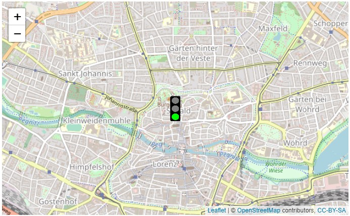

```{r setup, include=FALSE}
library(tidyverse)
library(learnr)
library(leaflet)
library(gapminder)
library(plotly) 
```


## Willkommen

Dieses Tutorial ergänzt die Inhalte des Buches [_Data Science und Statistik mit R_](https://www.amazon.de/Data-Science-Statistik-mit-Anwendungsl%C3%B6sungen/dp/3658348240/ref=sr_1_1?__mk_de_DE=%C3%85M%C3%85%C5%BD%C3%95%C3%91&dchild=1&keywords=Data+Science+und+Statistik+mit+R&qid=1627898747&sr=8-1).

Die Kapitel 3.6.3-3.6.4 behandeln Interaktive Landkarten und Dynamische Abbildungen. Nachfolgend wird vorgestellt, wie dies von R unterstützt wird.

## 1. Barchart mit KPIs je Niederlassung

Neben den klassischen Visualisierungen, die bisher vorgestellt wurden, erlaubt R auch die Darstellung von interaktiven Karten, in denen eigene Markierungen und Hyperlinks eingefügt werden können.

Vorbereitend kann zunächst die Performanz der Niederlassungen einer Organisation in einem Bar-Chart visualisiert werden.

```{r 1_0, exercise=FALSE}
# Funktion zur Zuordnung der Farbe in Abhängigkeit von der Note (KPI)
getColor <- function(hsansbach) {
  sapply(hsansbach$kpi, function(kpi) {
    if(kpi <= 2) {
      "green"
    } else if(kpi <= 4) {
      "orange"
    } else {
      "red"
    } 
  })
}
lat<- c(49.306001,49.24599487764718,49.378980820532924,49.179810158920844,
        49.0237848288953)
long<-c(10.566538,10.495426827478,10.185865583299957,10.335907160021717,
        10.958599398635167)
text1 <- paste(sep = "<br/>",
"<b><a href='http://www.hs-ansbach.de'>Hochschule Ansbach</a></b>",
"Residenzstr. 8", "91522 Ansbach", 
"<a href='http://www.prescient.pro/RDemo/hsansbachkpi.png'>KPI Details</a>")
text2 <- paste(sep = "<br/>",
"<b><a href='https://www.hs-ansbach.de/hochschule/aussenstellen/herrieden/'>
Campus Herrieden</a></b>","Schernberg 34", "91567 Herrieden", 
"<a href='http://www.prescient.pro/RDemo/hsansbachkpi.png'>KPI Details</a>")
text3 <- paste(sep = "<br/>",
"<b><a href='https://www.hs-ansbach.de/hochschule/aussenstellen/rothenburg/'>
Campus Rothenburg o.d.T</a></b>","Hornburgweg 26","91541 Rothenburg o.d.T",
"<a href=http://www.prescient.pro/RDemo/hsansbachkpi.png'>KPI Details</a>")
text4 <- paste(sep = "<br/>",
"<b><a href='https://www.hs-ansbach.de/hochschule/aussenstellen/feuchtwangen/'>
Campus Feuchtwangen</a></b>","An der Hochschule 1", "91555 Feuchtwangen",
"<a href='http://www.prescient.pro/RDemo/hsansbachkpi.png'>KPI Details</a>")
text5 <- paste(sep = "<br/>", 
"<b><a href='https://www.hs-ansbach.de/hochschule/aussenstellen/weissenburg/'>
Campus Weißenburg</a></b>","Richard-Stücklen-Straße 3", "91781 Weißenburg i.Bay.",
"<a href='http://www.prescient.pro/RDemo/hsansbachkpi.png'>KPI Details</a>")
text<-c(text1,text2,text3,text4,text5)
name<-c("Hochschule Ansbach","Campus Herrieden","Campus Rothenburg o.d.T.","Campus Feuchtwangen","Campus Weißenburg")
ort<-c("Ansbach","Herrieden","Rothenburg","Feuchtwangen","Weißenburg")
kpi<-c(1,4,2,5,3)
hsansbach<-tibble(ort,name,lat,long,kpi,text)
hsansbach$farben<-getColor(hsansbach)             # Farben abhängig von KPI zuordnen
hsansbach<-arrange(hsansbach,ort)
p0 <- ggplot(hsansbach,                           # Barchart mit KPI 
      aes(x=ort,y=kpi,group=kpi,fill=ort))+
      geom_bar(stat="identity",position = "dodge")+                   
      scale_fill_manual(values=hsansbach$farben)+
      ggtitle("Performanz")+
      labs(x="Campus",y="KPI=Note")+
      guides(fill=guide_legend(title="Campus"))
p0
```

## 2. Interaktive Landkarte

Die Darstellung von interaktiven Karten, in denen eigene Markierungen und Hyperlinks eingefügt werden können, wird durch die Funktion leaflet() aus dem Paket leaflet unterstützt, welche die OpenStreetMaps als Datengrundlage nutzt. 

Die nachfolgende Karte zeigt, wie Organisationen mit mehreren Niederlassungen ihre Performanz visualisieren und über das Klicken auf Icons zusätzliche Informationen zu den Markierungen anzeigen lassen können.

In der Karte wird die Markierung in Abhängigkeit von der Performanz automatisch in unterschiedlichen Farben dargestellt. Beim Klick auf eine Markierung können u.a. Details wie die Adresse, URLs mit Link zur Webseite oder auch eine URL mit Link zu detaillierteren Analysen angezeigt werden.

Karte mit dynamisch eingefügten Markierungen:

```{r 2_0-setup, exercise=FALSE, echo=FALSE, include=FALSE}
getColor <- function(hsansbach) {
  sapply(hsansbach$kpi, function(kpi) {
    if(kpi <= 2) {
      "green"
    } else if(kpi <= 4) {
      "orange"
    } else {
      "red"
    } 
  })
}
lat<- c(49.306001,49.24599487764718,49.378980820532924,49.179810158920844,
        49.0237848288953)
long<-c(10.566538,10.495426827478,10.185865583299957,10.335907160021717,
        10.958599398635167)
text1 <- paste(sep = "<br/>",
"<b><a href='http://www.hs-ansbach.de'>Hochschule Ansbach</a></b>",
"Residenzstr. 8", "91522 Ansbach", 
"<a href='http://www.prescient.pro/RDemo/hsansbachkpi.png'>KPI Details</a>")
text2 <- paste(sep = "<br/>",
"<b><a href='https://www.hs-ansbach.de/hochschule/aussenstellen/herrieden/'>
Campus Herrieden</a></b>","Schernberg 34", "91567 Herrieden", 
"<a href='http://www.prescient.pro/RDemo/hsansbachkpi.png'>KPI Details</a>")
text3 <- paste(sep = "<br/>",
"<b><a href='https://www.hs-ansbach.de/hochschule/aussenstellen/rothenburg/'>
Campus Rothenburg o.d.T</a></b>","Hornburgweg 26","91541 Rothenburg o.d.T",
"<a href=http://www.prescient.pro/RDemo/hsansbachkpi.png'>KPI Details</a>")
text4 <- paste(sep = "<br/>",
"<b><a href='https://www.hs-ansbach.de/hochschule/aussenstellen/feuchtwangen/'>
Campus Feuchtwangen</a></b>","An der Hochschule 1", "91555 Feuchtwangen",
"<a href='http://www.prescient.pro/RDemo/hsansbachkpi.png'>KPI Details</a>")
text5 <- paste(sep = "<br/>", 
"<b><a href='https://www.hs-ansbach.de/hochschule/aussenstellen/weissenburg/'>
Campus Weißenburg</a></b>","Richard-Stücklen-Straße 3", "91781 Weißenburg i.Bay.",
"<a href='http://www.prescient.pro/RDemo/hsansbachkpi.png'>KPI Details</a>")
text<-c(text1,text2,text3,text4,text5)
name<-c("Hochschule Ansbach","Campus Herrieden","Campus Rothenburg o.d.T.","Campus Feuchtwangen","Campus Weißenburg")
ort<-c("Ansbach","Herrieden","Rothenburg","Feuchtwangen","Weißenburg")
kpi<-c(1,4,2,5,3)
hsansbach<-tibble(ort,name,lat,long,kpi,text)
hsansbach$farben<-getColor(hsansbach)
hsansbach<-arrange(hsansbach,ort)
```

```{r 2_0, exercise=FALSE, exercise.setup="2_0-setup"}
# Farbe der Icons je nach Performanz 
icons <- awesomeIcons(                              
  icon = 'ios-close',
  iconColor = 'black',
  library = 'ion',
  markerColor = hsansbach$farben
)
# Leaflet mit unterschiedlich gefärbten Icons
l1<-leaflet(hsansbach) %>% addTiles() %>%
    addAwesomeMarkers(~long, ~lat, icon=icons, popup = ~text, label = ~ort)
l1
```

### 2.1 Dynamische eingefügte Icons

Die Icons für die Markierungen können beliebige Bilder sein, z.B. eine grüne Ampel bei guter, gelb bei mittlerer und rot bei schlechter Performanz.

Karte mit dynamisch eingefügten Icons:

```{r 2_1-setup, exercise=FALSE, echo=FALSE, include=FALSE}
getColor <- function(hsansbach) {
  sapply(hsansbach$kpi, function(kpi) {
    if(kpi <= 2) {
      "green"
    } else if(kpi <= 4) {
      "orange"
    } else {
      "red"
    } 
  })
}
lat<- c(49.306001,49.24599487764718,49.378980820532924,49.179810158920844,
        49.0237848288953)
long<-c(10.566538,10.495426827478,10.185865583299957,10.335907160021717,
        10.958599398635167)
text1 <- paste(sep = "<br/>",
"<b><a href='http://www.hs-ansbach.de'>Hochschule Ansbach</a></b>",
"Residenzstr. 8", "91522 Ansbach", 
"<a href='http://www.prescient.pro/RDemo/hsansbachkpi.png'>KPI Details</a>")
text2 <- paste(sep = "<br/>",
"<b><a href='https://www.hs-ansbach.de/hochschule/aussenstellen/herrieden/'>
Campus Herrieden</a></b>","Schernberg 34", "91567 Herrieden", 
"<a href='http://www.prescient.pro/RDemo/hsansbachkpi.png'>KPI Details</a>")
text3 <- paste(sep = "<br/>",
"<b><a href='https://www.hs-ansbach.de/hochschule/aussenstellen/rothenburg/'>
Campus Rothenburg o.d.T</a></b>","Hornburgweg 26","91541 Rothenburg o.d.T",
"<a href=http://www.prescient.pro/RDemo/hsansbachkpi.png'>KPI Details</a>")
text4 <- paste(sep = "<br/>",
"<b><a href='https://www.hs-ansbach.de/hochschule/aussenstellen/feuchtwangen/'>
Campus Feuchtwangen</a></b>","An der Hochschule 1", "91555 Feuchtwangen",
"<a href='http://www.prescient.pro/RDemo/hsansbachkpi.png'>KPI Details</a>")
text5 <- paste(sep = "<br/>", 
"<b><a href='https://www.hs-ansbach.de/hochschule/aussenstellen/weissenburg/'>
Campus Weißenburg</a></b>","Richard-Stücklen-Straße 3", "91781 Weißenburg i.Bay.",
"<a href='http://www.prescient.pro/RDemo/hsansbachkpi.png'>KPI Details</a>")
text<-c(text1,text2,text3,text4,text5)
name<-c("Hochschule Ansbach","Campus Herrieden","Campus Rothenburg o.d.T.","Campus Feuchtwangen","Campus Weißenburg")
ort<-c("Ansbach","Herrieden","Rothenburg","Feuchtwangen","Weißenburg")
kpi<-c(1,4,2,5,3)
hsansbach<-tibble(ort,name,lat,long,kpi,text)
hsansbach$farben<-getColor(hsansbach)
hsansbach<-arrange(hsansbach,ort)
```

```{r 2_1, exercise=FALSE, exercise.setup="2_1-setup"}
ampelgruen<- makeIcon(                          # Icon jpg.Datei für Ampel
  iconUrl = "images/ampelgruen.jpg",
  iconWidth = 18, iconHeight = 45)
l2<-leaflet() %>%                               # Zeigt interaktive Karte an
    addTiles() %>%                              # Zeigt OpenStreetMap map Tiles an
    addMarkers(lng=10.566538,lat=49.306001,     # Fügt Markierung ein
               popup=hsansbach$text[1],icon = ampelgruen,label = hsansbach$ort[1])
l2
```

### 2.2 Übung

Erzeugen Sie mit der Funktion leaflet() eine Karte und fügen Sie eine grüne Ampel an Ihrem Wohnort ein. Dazu sollten Sie die Längen- und Breitengrad mit der Funktion addMarkers angeben und als Text mit dem Parameter popup="" die Adresse inkl. Strasse, Postleitzahl und Stadt. Legen Sie für den Parameter label="" den Namen der Stadt fest.

Das Ergebnis sollte für "Untere Schmiedgasse 8, 90403 Nürnberg" wie folgt aussehen 

```{r 2_2, exercise=TRUE}

```

```{r 2_2-hint-1}
ampelgruen<- makeIcon(                          # Icon jpg.Datei für Ampel
  iconUrl = "images/ampelgruen.jpg",
  iconWidth = 18, iconHeight = 45)
```
```{r 2_2-hint-2}
karte<-leaflet() %>%                            # Zeigt interaktive Karte an
       addTiles() %>%                           # Zeigt OpenStreetMap map Tiles an
       addMarkers(lng=11.0763782,lat=49.4570004,# Fügt Markierung ein
                 popup="Untere Schmiedgasse 8, 90403 Nürnberg",icon=ampelgruen,label="Nürnberg")
karte                                           # Gibt Karte aus
```

## 3. Dynamische Abbildungen

Das Paket shiny erlaubt dynamische Abbildungen, die auch auf Webseiten eingebunden werden können. Dies kann hilfreich sein, um die Entwicklung von Kennzahlen im Zeitverlauf darzustellen oder interaktive Dashboards zu erstellen. 

Ein weiteres interessantes Paket mit Funktionen für dynamische Abbildungen ist das Paket plotly. Die in der nachfolgenden Abbildung gezeigte Visualisierung ist dynamisch und zeigt die Entwicklung der Lebenserwartung in Abhängigkeit vom Bruttosozialprodukt pro Kopf im Zeitverlauf. Die Größe der Kreise reflektiert die Bevölkerungsanzahl (Daten stammen aus dem Paket gapminder).

```{r 3_1, exercise=TRUE}
data(gapminder, package = "gapminder")
gg <- ggplot(gapminder, aes(gdpPercap,lifeExp,color=continent,frame=year,ids=country)) +
  geom_point(aes(size=pop)) +
  scale_x_log10()+
  labs(x="Bruttosozialprodukt pro Kopf",y="Lebenserwartung")
ggplotly(gg)
```

## 4. Quiz

```{r 4_1, echo = FALSE}
quiz(
  question("Welche der folgenden Aussagen sind korrekt?", allow_retry = TRUE, random_answer_order = TRUE,
    answer('Das R-Paket "OpenStreetMaps" erlaubt die Darstellung von interaktiven Landkarten.', message = 'Nein, das Paket "leaflet" unterstützt die Darstellung interaktiver Landkarten und basiert auf den OpenStreetMaps.'),
    answer('Icons können zur Laufzeit in Abhängigkeit von den aktuellsten Performanzdaten z.B. grün, gelb und rot auf der interaktiven Landkarte zu einer Position mit Längen- und Breitengrad eingefügt werden.', correct = TRUE),
    answer('Es ist nicht möglich bei Klick auf ein Icon weitere Details zu einem Standort zu erhalten.', message = 'Doch, beliebige Details mit Text oder Hyperlinks können weitere Informationen anzeigen.'),
    type = "multiple"
  ),
  question("Welche der folgenden Aussagen sind korrekt?", allow_retry = TRUE, random_answer_order = TRUE,
    answer('Das Paket "shiny" unterstützt dynamische Abbildungen, die einen Zeitverlauf abbilden.', correct = TRUE),
    answer('Das Paket "plotly" unterstützt dynamische Abbildungen, die einen Zeitverlauf abbilden.', correct = TRUE),
    answer('Die Funktion "ggplotly" zeigt Daten an, erlaubt aber die Details zu einzelnen Datenpunkten anzuzeigen, wenn der Cursor auf die Datenpunkte positioniert wird.', correct = TRUE),
    type = "multiple"
  )
)
```

## Ende 

Gratulation!

Sie haben dieses Tutorial erfolgreich ausgeführt und einen Einblick in die Erstellung von interaktiven Landkarten und dynamischen Abbildungen erhalten.