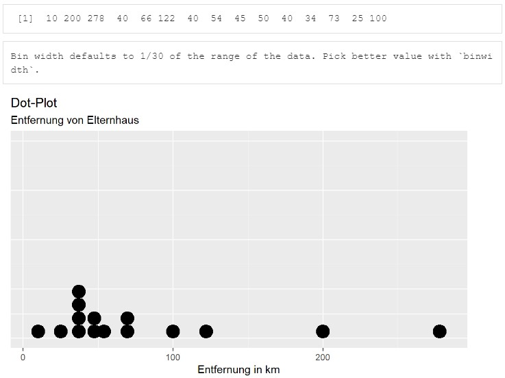
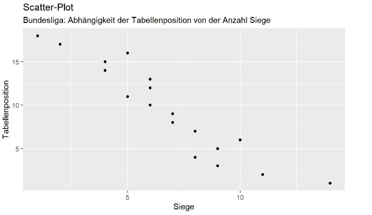

```{r setup, include=FALSE}
library(datascience)
colnames(studierende)[5]<-"Größe"
colnames(studierende)[10]<-"Fußball"
colnames(studierende)[13]<-"Attraktivität"
library(tidyverse)
library(learnr)
library(datasauRus) 
library(gridExtra)
```

## Willkommen

Dieses Tutorial ergänzt die Inhalte des Buches [_Data Science und Statistik mit R_](https://www.amazon.de/Data-Science-Statistik-mit-Anwendungsl%C3%B6sungen/dp/3658348240/ref=sr_1_1?__mk_de_DE=%C3%85M%C3%85%C5%BD%C3%95%C3%91&dchild=1&keywords=Data+Science+und+Statistik+mit+R&qid=1627898747&sr=8-1).

Das Kapitel 4.1.5 behandelt die Visualisierung in der Deskriptiven Statistik und wie dies von R unterstützt wird.

## 1. Visualisierung

Kennzahlen alleine sind nicht ausreichend, um ein Verständnis für Daten zu erlangen. Die graphische Darstellung ergänzt die Kenntnis der Kennzahlen, um die Zusammenhänge deutlich besser zu verstehen. Auch die nachfolgenden Beispiele aus dem Paket datasauRus zeigen 12 Datasets, die den gleichen Mittelwert, die gleiche Standardabweichung und den gleichen Pearson-Korrelationskoeffizienten haben und trotzdem ganz unterschiedlich Anordnungen besitzen. 

Ebenfalls werden 12 weitere Datasets mit gleichem Median, IQR und Spearman’s Rang vorgestellt, die sehr unterschiedlich aussehen.

Diese Beispiele demonstrieren, dass man sich nicht alleine auf die Kennzahlen verlassen kann, wenn man die Daten verstehen und interpretieren möchte. Die Visualisierung trägt essenziell dazu bei, die Daten korrekt zu interpretieren.

```{r 1_0, exercise=FALSE}
# 12 Datasets mit gleichem Mittelwert, gleicher Standardabweichung und gleichem
# Pearson Korrelationskoeffizienten 
ggplot(datasaurus_dozen, aes(x=x, y=y, colour=dataset))+
  geom_point()+
  theme_void()+
  theme(legend.position = "none")+
  facet_wrap(~dataset, ncol=3)
# 12 Datasets mit gleichem Median, IQR und Spearman’s Rang
ggplot(twelve_from_slant_long, aes(x=x, y=y, colour=dataset))+
  geom_point()+
  theme_void()+
  theme(legend.position = "none")+
  facet_wrap(~dataset, ncol=3)
```

Daten zu visualisieren ist sehr wertvoll. Zu den häufig verwendeten Diagrammen der Statistik gehören u.a. der Dot-Plot (Punktediagramm), das Histogramm, das Bar-Chart (Balkendiagramm), der Scatter-Plot (Streudia-gramm) und der Box-Plot (Kastengrafik), die nachfolgend vorgestellt werden.

## 2. Dot-Plot

Eine der einfachsten Darstellungsarten ist der Dot-Plot (Punktediagramm), in dem auf der x-Achse alle Datensätze nebeneinander abgebildet werden. 

In R wird das Geom geom_dotplot() in der Funktion ggplot() für die Darstellung von Dot-Plots verwendet. In dem nachfolgenden Dot-Plot wird die Körpergröße von 10 Erstsemesterstudierenden dargestellt.

```{r 2_0-setup, exercise=FALSE, echo=FALSE, include=FALSE}
studierende.gruppe<-studierende[1:10,]            # Dataframe mit 10 Studierenden
```

```{r 2_0, exercise=FALSE, exercise.setup="2_0-setup"}
studierende.gruppe$Größe                          # Größe der 10 Studierenden
ggplot(studierende.gruppe,aes(x=Größe)) +         # Dataframe
  geom_dotplot(fill="White",stackdir="center",    # Dot-Plot
               binwidth=0.5) +  
  labs(title="Dot-Plot",ylab="",
       subtitle="Körpergröße der Studierenden", 
       y="Studierende/r",x="Körpergröße in cm") +
  theme(axis.title.y=element_blank(),             # y-Achse ohne Beschriftung
        axis.text.y=element_blank(),
        axis.ticks.y=element_blank())
```

### 2.1 Übung

```{r 2_1-setup, exercise=FALSE, echo=FALSE, include=FALSE}
studierende.gruppe<-studierende[1:15,]            # Dataframe mit 10 Studierenden
```

Der Dataframe studierende.gruppe enthält Information zu 15 Studierenden. Lassen Sie sich die Variable DistanzEltern für die Studierenden anzeigen. Anschließend erstellen Sie einen Dot-Plot für die Distanz zum Elternhaus. Als Titel sollten Sie "Dot-Plot", als Untertitel "Entfernung von Elternhaus" und als Beschriftung der x-Achse "Entfernung in km" verwenden. Die y-Achse sollte nicht angezeigt werden.

Die Anzeige sollte hinterher wie folgt aussehen: 

```{r 2_1, exercise=TRUE, exercise.setup="2_1-setup"}
studierende.gruppe$DistanzEltern
```

```{r 2_1-hint-1}
ggplot(studierende.gruppe,aes(x=DistanzEltern))+  # Dataframe
  geom_dotplot() +  
  labs(title="Dot-Plot",ylab="",
       subtitle="Entfernung von Elternhaus", 
       x="Entfernung in km")+ 
  theme(axis.title.y=element_blank(),             # y-Achse ohne Beschriftung
        axis.text.y=element_blank(),
        axis.ticks.y=element_blank())
```

## 3. Histogramm

Neben der Streuung interessiert einen Analysten oft auch die Form der Verteilung.

Die Verteilung lässt sich gut in einem Histogramm darstellen. Histogramme können entweder normalverteilt (nicht schief) sein oder aber eine linke oder rechte Schiefe besitzen, wenn die Daten mehr zu hohen oder niedrigen Werten neigen. Die Schiefe einer Verteilung beschreibt die Art und Stärke der Asymmetrie. Sie zeigt an, ob und wie stark die Verteilung nach rechts (rechtssteil, linksschief, negative Schiefe) oder nach links (linkssteil, rechtsschief, positive Schiefe) geneigt ist. 

Bei negativer Schiefe (Schiefe < 0) spricht man von einer linksschiefen oder rechtssteilen Verteilung; sie fällt in typischen Fällen auf der linken Seite flacher ab als auf der rechten. Die Mehrheit der Werte liegt dann rechts vom Mittelwert. Daher ist bei negativer Schiefe der Mittelwert (rote Linie) kleiner (weiter links) als der Median (blaue Linie). 
Bei positiver Schiefe (Schiefe > 0) spricht man von einer rechtsschiefen oder linkssteilen Verteilung; sie fällt auf der rechten Seite flacher ab als auf der linken. Die Mehrheit der Werte liegt dann links vom Mittelwert. Daher ist bei positiver Schiefe der Mittelwert (rote Linie) größer (weiter rechts) als der Median (blaue Linie).
Eine Verteilung ohne Schiefe bezeichnet man als ungefähr normalverteilt, da die Werte sich in etwa symmetrisch auf beiden Seiten verteilen. In diesem Fall sind Mittelwert (rote Linie) und Median (blaue Linie) in etwa identisch. In dieser Abbildung ist eventuell nur eine Linie sichtbar, da die beiden Linien sich überlagern.

In R wird das Geom geom_histogram() in der Funktion ggplot() für die Darstellung von Histogrammen verwendet.

```{r 3_0, exercise=FALSE}
#- Eigene Funktionen zur Erleichterung--------------------------------------------
modus <- function(daten){                         # Funktion: Berechnung von Modus
  werte<-data.frame(daten)
  var<-as.data.frame(table(werte$daten))
  var.maxanzahl<-max(var$Freq)
  var.suche<-filter(var,var$Freq==var.maxanzahl)
  modus<-as.numeric(as.character(var.suche$Var1))
  return(modus)
}
abbildung.hist <- function(daten,untertitel=""){  # Funktion: Histogramm ausgeben
  median<-median(daten)
  mean<-mean(daten)
  modus<-modus(daten)
  linien=data.frame(name=c("Median","Mittelwert","Modus"),
                    wert=c(median,mean,modus),
                    farbe=c("blue","green","red"),
                    linie=c(2,1,3),
                    gross=c(1,2,2))
  werte<-data.frame(daten)
  p0<-ggplot(werte)+                        
    aes(x=daten)+
    labs(title="Histogramm",subtitle=untertitel,x="Wert", y="Häufigkeit")+
    geom_histogram(binwidth=0.3)+
    scale_color_manual(name="Kennzahl",labels=linien$name,values=linien$farbe)+
    geom_vline(data=linien,aes(xintercept=wert,colour=farbe,alpha=0.5),linetype=linien$linie,size=linien$gross,show.legend=F)
  return(p0)
}
# Histogramm----------------------------------------------------------------------
#   mit Mittelwert:Linie grün, Median:Gestrichelt blau, Modus:Punkte rot
set.seed(1008)                                    # Reproduzierbare Zufallszahlen
zahlen<- 1-abs(round(rnorm(1000),1))
p1<-abbildung.hist(zahlen,"Linke Schiefe")          
zahlen<- round(rnorm(1000),1)
p2<-abbildung.hist(zahlen,"Normalverteilt")
zahlen<- -1+abs(round(rnorm(1000),1))
p3<-abbildung.hist(zahlen,"Rechte Schiefe")
grid.arrange(p1,p2,p3,ncol=3)                     # Ausgabe
```

### 3.1 Übung

```{r 3_1-setup, exercise=FALSE, echo=FALSE, include=FALSE}
studierende.gruppe<-studierende[1:15,]            # Dataframe mit 10 Studierenden
```

Der Dataframe studierende.gruppe enthält Information zu 15 Studierenden. Lassen Sie sich die Variable Distanz (Distanz Wohnung zur Hochschule) für die Studierenden anzeigen. Anschließend erstellen Sie ein Histogramm für die Distanz. Als Titel sollten Sie "Histogramm", als Untertitel "Distanz Wohnung zu Hochschule" und als Beschriftung der x-Achse "Entfernung in km" verwenden. Die y-Achse sollte die Beschriftung "Häufigkeit" ausweisen.

Die Anzeige sollte hinterher wie folgt aussehen: 

```{r 3_1, exercise=TRUE, exercise.setup="3_1-setup"}
studierende.gruppe$Distanz
```

```{r 3_1-hint-1}
ggplot(studierende.gruppe)+                        
  aes(x=Distanz)+
  labs(title="Histogramm",subtitle="Distanz Wohnung zu Hochschule",x="Entfernung in km", y="Häufigkeit")+
  geom_histogram()
```

## 4. Bar-Chart

Eine weitere einfache Darstellungsart ist das Bar-Chart (Balkendiagramm), in dem auf der x-Achse alle Datensätze nacheinander abgebildet werden, während die y-Achse den Wert der Variablen anzeigt.

In R wird das Geom geom_bar() in der Funktion ggplot() für die Darstellung von Bar-Charts verwendet. In dem nachfolgenden Balkendiagramm wird die Entfernung der Wohnung von der Hochschule für 10 Erstsemester dargestellt.
.

```{r 4_0-setup, exercise=FALSE, echo=FALSE, include=FALSE}
studierende.gruppe<-studierende[1:10,]            # Dataframe mit 10 Studierenden
```

```{r 4_0, exercise=FALSE, exercise.setup="4_0-setup"}
studierende.gruppe$Distanz                        # Distanz der 10 Studierenden
ggplot(studierende.gruppe,aes(x=1:10,y=Distanz))+ # Bar-Chart
  geom_bar(stat="identity",width=1,color="white",fill=c("gray","gray","gray",
           "gray","gray","blue","gray","gray","gray","gray"))+
  labs(title="Bar-Chart",
       subtitle="Distanz eigene Wohnung zur Hochschule", 
       x="Studierende/r",y="Entfernung in km") +
  scale_x_continuous(breaks=c(1:10))
```

### 4.1 Übung

```{r 4_1-setup, exercise=FALSE, echo=FALSE, include=FALSE}
studierende.gruppe<-studierende[1:15,] 
```

Der Dataframe studierende.gruppe enthält Information zu 15 Studierenden. Lassen Sie sich die Variable Größe für die Studierenden anzeigen. Anschließend erstellen Sie ein Bar-Chart, welches nebeneinander die Körpergröße der Studierenden anzeigt. Als Titel sollten Sie "Bar-Chart", als Untertitel "Körpergröße" und als Beschriftung der x-Achse "Studierende(r)" verwenden. Die y-Achse sollte die Beschriftung "Größe in cm" ausweisen.

Die Anzeige sollte hinterher wie folgt aussehen: 

```{r 4_1, exercise=TRUE, exercise.setup="4_1-setup"}
studierende.gruppe$Größe
```

```{r 4_1-hint-1}
ggplot(studierende.gruppe)+
  aes(x=(1:15),y=Größe)+ 
  geom_bar(stat="identity")+
  labs(title="Bar-Chart",
       subtitle="Körpergröße", 
       x="Studierende(r)",y="Größe in cm")
```

## 5. Scatter-Plot

Die bisher in diesem Kapitel vorgestellten Abbildungstypen haben nur eine Variable dargestellt. Ein Scatter-Plot (Streudiagramm) kann jedoch zwei numerische Variablen abbilden. Der Vorteil ist, dass so sichtbar wird, wie die eine Variable ggfs. von einer anderen Variablen abhängt.

In R wird das Geom geom_point() in der Funktion ggplot() für die Darstellung von Scatter-Plots verwendet. Nachfolgend wird die Entfernung der Wohnung der Studierenden vom Elternhaus anzeigt. Offensichtlich wohnen sehr wenige der Studierenden im Elternhaus.

```{r 5_0, exercise=FALSE}
ggplot(studierende,                                              # Dataframe
  mapping = aes(x=DistanzElternhaus,y=2020-Geburtsjahr))  +      # x+y-Achsen
  labs(title="Scatter-Plot",
       subtitle="Entfernung eigene Wohnung vom Elternhaus",
       x="Entfernung in km", y="Alter")+
  geom_point(size=1.5)                                           # Scatter-Plot
```

### 5.1 Übung

Der Dataframe bundesliga beinhaltet in der Variablen "R." die Tabellenposition und in der Variablen "S." die Anzahl der Siege. Lassen Sie sich einen Scatterplot ausgeben, der in der x-Achse die Siege und in der y-Achse die Tabellenposition anzeigt.

Die Anzeige sollte hinterher wie folgt aussehen: 

```{r 5_1, exercise=TRUE}

```

```{r 5_1-hint-1}
ggplot(bundesliga,                                               # Dataframe
  mapping = aes(x=as.numeric(S.),y=as.numeric(R.))) +            # x+y-Achsen
  labs(title="Scatter-Plot",
       subtitle="Bundesliga: Abhängigkeit der Tabellenposition von der Anzahl Siege",
       x="Siege", y="Tabellenposition")+
  geom_point()                                                   # Scatter-Plot
```

## 6. Box-Plot

Ein Box-Plot oder auch Box-Whisker-Plot (Kastendiagramm) ist ein Diagramm, das zur grafischen Darstellung der Verteilung einer metrischen Variablen verwendet wird. Es fasst verschiedene Lage- und Streuungsmaße in einer Darstellung zusammen und vermittelt so schnell einen Eindruck darüber, in welchem Bereich die Daten liegen und wie sie sich über diesen Bereich verteilen. 

Die Box oder der Kasten wird beschrieben durch drei Linien. Die obere Grenze der Box beschreibt das 0.75-Quantil bzw. das 3. Quartil, die Linie in der Mitte der Box beschreibt das 0.5.-Quantil, 2. Quartil bzw. den Mittelwert und die untere Grenze der Box beschreibt das 0.25-Quantil bzw. das 1. Quartil. Auf diese Art wird dargestellt, in welchem Bereich 50% der in der Mitte liegenden Werte verteilt sind. Ergänzt wird die Box noch um Antennen oder Whisker, die in der Regel nicht weiter nach oben bzw. unten rei-chen als 1,5 mal der IQR (Interquartilsabstand = 3. Quartil – 1. Quartil). Die Antennen werden so angezeigt, dass sie bis zu dem letzten realen Datenpunkt reichen, der aber nicht weiter als 1,5 mal den IQR von dem oberen oder unteren Rand der Box entfernt sind. Datenpunkte, die noch weiter entfernt sind, werden als Punkte dargestellt und beschreiben Ausreißer, also extreme Werte.

In R wird das Geom geom_boxplot() in der Funktion ggplot() für die Darstellung von Box-Plots verwendet. Nachfolgend wird die Größe der Studierenden in einem Boxplot anzeigt. Bevor die Ausgabe des Box-Plots erfolgt, werden mit Hilfe der Funktionen mean() und quantile() die Quartile, der IQR und die maximalen Endpunkte der Whisker berechnet, welche sich auch visuell aus der Abbildung ablesen lassen. In einem zweiten Box-Plot wird gezeigt, dass es auch möglich ist mehrere Box-Plots getrennt nach Gruppierung, hier nach Geschlecht getrennt, anzuzeigen.

```{r 6_0, exercise=FALSE}
boxpl<-data.frame(Name=as.character(),Wert=as.numeric())
boxpl[1,]<-c("1. Quartil",round(quantile(studierende$Größe,0.25),0))
boxpl[2,]<-c("2. Quartil, Median",round(quantile(studierende$Größe,0.50),0))
boxpl[3,]<-c("3. Quartil",round(quantile(studierende$Größe,0.75),0))
boxpl[4,]<-c("IQR",as.numeric(boxpl[3,2])-as.numeric(boxpl[1,2]))
boxpl[5,]<-c("Min",round(min(studierende$Größe),0))
boxpl[6,]<-c("Whisker Min",as.numeric(boxpl[1,2])-1.5*as.numeric(boxpl[4,2]))
boxpl[7,]<-c("Whisker Max",as.numeric(boxpl[3,2])+1.5*as.numeric(boxpl[4,2]))
boxpl                                                            # Anzeige
# Boxplot Studierende
ggplot(studierende)+                                             # Dataframe
  aes(y=Größe)+                                                  # y-Achse
  labs(title="Box-Plot",
       subtitle="Größe der Studierenden",y="Körpergröße") +
  geom_boxplot() +                                               # Box-Plot
  theme(axis.title.x=element_blank(),                            # x-Achse ohne
        axis.text.x=element_blank(),                             # Beschriftung
        axis.ticks.x=element_blank())
# Boxplot Studierende getrennt nach Geschlecht
ggplot(studierende)+                                             # Dataframe
  aes(y=Größe,x=Geschlecht,color=Geschlecht)+                    # x+y-Achsen    
  labs(title="Box-Plot",
       subtitle="Größe der Studierenden nach Geschlecht",
       x="Geschlecht", y="Körpergröße")+
  geom_boxplot()                                                 # Box-Plot
```

### 6.1 Übung

```{r 6_1-setup, exercise=FALSE, echo=FALSE, include=FALSE}
bundesliga$Gruppe <-                              # Zusätzliche Variable in df 
  case_when(as.numeric(bundesliga$R.) <= 6 ~ "Beste",
    between(as.numeric(bundesliga$R.), 7, 12) ~ "Mittlere",
            as.numeric(bundesliga$R.) >= 12 ~ "Schlechteste")
```

Der Dataframe bundesliga beinhaltet in der Variablen "TD." die Tordifferenz. Lassen Sie sich einen Boxplot für die Variable Tordifferenz ausgeben.

Die Mannschaften sind basierend auf der Tabellenposition in der Variable "Gruppe" als Beste, Mittlere und Schlechteste kategorisiert. Lassen Sie sich für jede der Gruppen einen Box-Plot für die Tordifferenz ausgeben.

Die Anzeige sollte hinterher wie folgt aussehen: 

```{r 6_1, exercise=TRUE, exercise.setup="6_1-setup"}

```

```{r 6_1-hint-1}
ggplot(bundesliga)+                                              # Dataframe
  aes(y=as.numeric(TD.))+                                        # y-Achse    
  labs(title="Box-Plot",
       subtitle="Bundesliga: Tordifferenz",
       y="Tordifferenz")+
  geom_boxplot()+                                                # Box-Plot
  theme(axis.title.x=element_blank(),                            # x-Achse ohne
        axis.text.x=element_blank(),                             # Beschriftung
        axis.ticks.x=element_blank())
```
```{r 6_1-hint-2}
ggplot(bundesliga)+                                              # Dataframe
  aes(y=as.numeric(TD.),x=Gruppe,color=Gruppe)+                  # x und y-Achse    
  labs(title="Box-Plot",
       subtitle="Bundesliga: Tordifferenz",
       y="Tordifferenz")+
  geom_boxplot()                                                 # Box-Plot
```
## 7. Quiz

```{r 7_1, echo = FALSE}
quiz(
  question("Welche der folgenden Aussagen sind korrekt?", allow_retry = TRUE, random_answer_order = TRUE,
    answer('Histogramme eigenen sich zur Abbildung der Häufigkeiten beliebiger Variablentypen.', correct = TRUE),
    answer('Ein Dot-Plot zeigt Datenpunkte für zwei Variablen auf den beiden Achsen x und y an.', message = 'Nein, der Dot-Plot stellt nur Datenpunkte einer einzelnen Variable dar.'),
    answer('Aus einem Scatter-Plot lässt sich nicht ablesen, ob eine Verbindung zwischen zwei Variablen besteht.', message = 'Doch, die Existenz einer Korrelation lässt sich oft bereits aus dem Scatter-Plot erahnen.'),
    type = "multiple"
  )
)
```

## Ende 

Gratulation!

Sie haben dieses Tutorial erfolgreich ausgeführt und einen Einblick in die Erstellung von Visualisierungen der Deskriptiven Statistik erhalten.