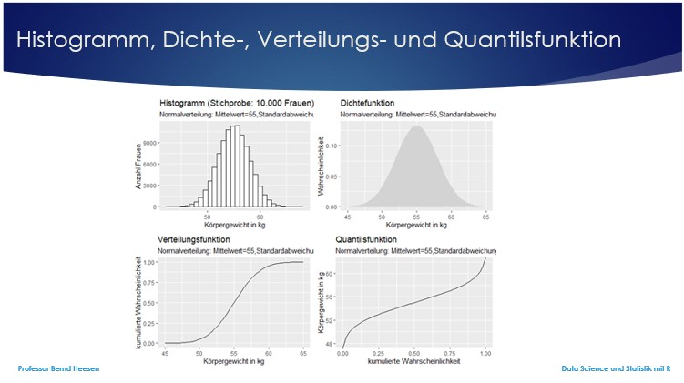
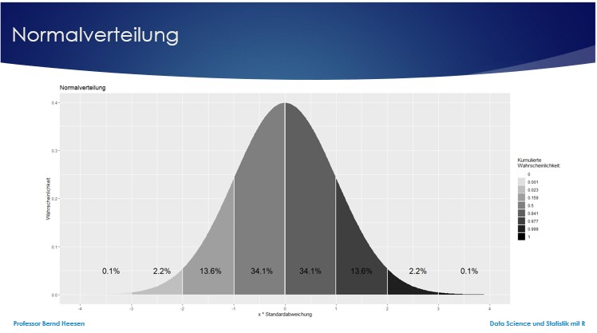
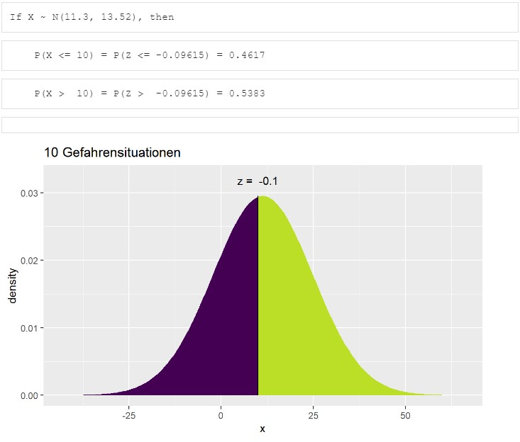
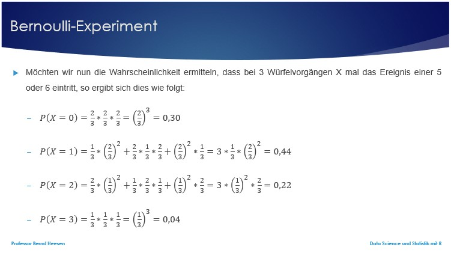
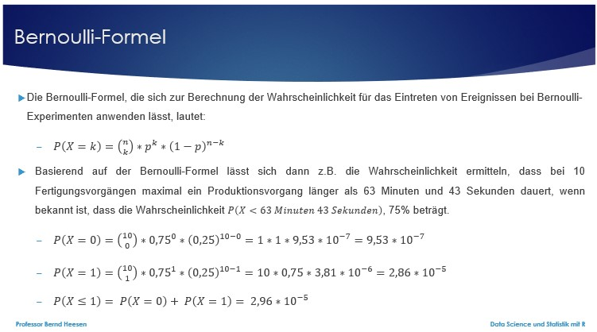

```{r setup, include=FALSE}
library(datascience)
library(tidyverse)
library(learnr)
library(mosaic)
library(fivethirtyeight)
#library(manipulate)
```


## Willkommen

Dieses Tutorial ergänzt die Inhalte des Buches [_Data Science und Statistik mit R_](https://www.amazon.de/Data-Science-Statistik-mit-Anwendungsl%C3%B6sungen/dp/3658348240/ref=sr_1_1?__mk_de_DE=%C3%85M%C3%85%C5%BD%C3%95%C3%91&dchild=1&keywords=Data+Science+und+Statistik+mit+R&qid=1627898747&sr=8-1).

Das Kapitel 4.2.4, 4.2.5 und 4.2.7 behandeln die Wahrscheinlichkeitsverteilungen, z-Standardisierung und Bernoulli-Experimente. Im Folgenden wird Ihnen erklärt wie dies von R unterstützt wird.

## 1. Funktionen

Für viele bekannte Wahrscheinlichkeitsverteilungen wie u.a. die Normalverteilung, die Binomialverteilung oder die Chi-Quadrat-Verteilung gibt es vier grundlegende Funktionen in R, nämlich die Dichtefunktion (Zähldichte für diskrete Zufallsvariablen bzw. Wahrscheinlichkeitsdichte für stetige Zufallsvariablen), die Verteilungsfunktion, die Quantilsfunktion und die Funktion für die Erzeugung von Zufallswerten (Zufallswerte für diskrete Zufallsvariablen bzw. Zufallszahlen für stetige Zufallsvariablen). 

Die Verteilungsfunktion bestimmt für eine Zufallsvariable X die Wahrscheinlichkeit, dass ein Wert kleiner oder gleich x ist: F(x)=P(X≤x). 

Die Quantilsfunktion stellt die Inverse der Verteilungsfunktion dar und bestimmt für jede Wahrscheinlichkeit zwischen 0 und 1 (die Gesamtwahrscheinlichkeit ist immer 1) den Quantilswert für den Wert x, so dass p=P(X≤x) gilt. 

Funktionen zu der normalverteilten Variable "Körpergröße von Frauen": 

Aus den Abbildungen lassen sich Informationen ablesen. Aus der Verteilungsfunktion ist z.B. ablesbar, dass für x = 57,5kg gilt, dass etwa 80% aller Frauen weniger wiegen, weil die Schnittstelle der Verteilungsfunktion für 57,5 bei etwa 0,8 liegt. Aus der Quantilsfunktion ist  ablesbar, dass etwa 25% aller Frauen weniger als 53kg wiegen, weil die Schnittstelle der Quantilsfunktion für 0,25 bei etwa 53kg liegt. 

### 1.1 Funktionen für Normalverteilte Variablen

#### 1.1.1 Berechnung der Wahrscheinlichkeit und des Quantilwertes

Aus den Abbildungen lässt sich zu einem x-Wert der y-Wert in etwa ablesen. Exakt lässt sich die Schnittstelle bzw. der zugehörige Wert für einen gegebenen Wert jedoch mit den Funktionen pnorm() und qnorm() aus dem Paket mosaic durch folgende Anweisungen berechnen: prozent<-pnorm(57.5,mean=55,sd=3) und quantil<-qnorm(0.25,mean=55,sd=3).

```{r 1_11, exercise=FALSE}
prozent<-pnorm(57.5,mean=55,sd=3)
prozent
quantil<-qnorm(0.25,mean=55,sd=3)
quantil
```

#### 1.1.2 Berechnung der Wahrscheinlichkeit und des Quantilwertes inklusive standardisiertem z-Wert

Alternativ lässt sich der Wert für das 0,8-Quantil auch durch die Funktion xqnorm(0.8, mean = 55, sd = 3) ermitteln, welche gleichzeitig eine Abbildung erstellt und auch den standardisierten z-Wert angibt. Der z-Wert gibt jeweils an, wie viele Standardabweichungen der Wert vom Mittelwert divergiert.

```{r 1_12, exercise=FALSE}
xqnorm(0.8, mean = 55, sd = 3, return="plot") +
    labs(title = "Dichtefunktion: 0,8-Quantil",
         subtitle="Normalverteilung: Mittelwert=55,Standardabweichung=3",
         x="Körpergewicht in kg",y="Wahrscheinlichkeit") 
```

Die Funktion xpnorm(57.5, mean = 55, sd = 3) erlaubt als Gegenstück zu der Funktion xqnorm() nach Angabe eines Wertes dessen Quantil zu bestimmen. Im Fall von 57,5 kg ist dies das 0,7977-Quantil. Der z-Wert gibt jeweils an, wie viele Standardabweichungen der Wert vom Mittelwert divergiert.

```{r 1_13, exercise=FALSE}
xpnorm(57.5, mean = 55, sd = 3, return="plot")+
    labs(title = "Dichtefunktion, Quantil für Wert 57.5 kg",
         subtitle="Normalverteilung: Mittelwert=55,Standardabweichung=3",
         x="Körpergewicht in kg",y="Wahrscheinlichkeit") 
```

Eine dynamische Ermittlung des Quantils kann darüber hinaus mit der Funktion manipulate(xpnorm(score, 55, 3, verbose=verbose), score = slider(45, 65), verbose = checkbox(TRUE, label="Quantilsberechnung")) aus dem Paket manipulate erfolgen. Ob die Quantilsberechnung mit zusätzlicher Angabe der Wahrscheinlichkeiten für beide Seiten bzw. farbig differenzierten Flächen ermittelt werden soll, kann über eine Checkbox bestimmt werden. Mehr dazu findet sich in Kapitel 4.2.4 im Buch.

### 1.2 Funktionen für verschiedene Verteilungen

Die Namen der zuvor angesprochenen Funktionen für die Dichtefunktion, die Verteilungsfunktion, die Quantilsfunktion und die Funktion zur Erzeugung von Zufallswerten beginnen jeweils mit den Buchstaben d (density function) für die Dichtefunktion, p (probability distribution) für die Verteilungsfunktion, q (quantile function) für die Quantilsfunktion und r (random number) für die Funktion zur Generierung von Zufallszahlen. 

Die Namen werden dann ergänzt um die Bezeichnung der Verteilungsart, z.B. norm für die Normalverteilung, binom für die Binomialverteilung oder chisq für die Chi-Quadrat-Verteilung. Für die Normalverteilung gibt es daher die Funktionen dnorm() für die Dichtefunktion, pnorm() für die Verteilungsfunktion, qnorm() für die Quantilsfunktion und rnorm() für die Erzeugung von Zufallszahlen. Für die anderen Verteilungen gilt diese Namenskonvention äquivalent.

#### 1.2.1 Parameter der Funktionen

Die Funktionen für die Normalverteilung verwenden gemeinsam den Parameter mean für den Mittelwert und sd für die Standardabweichung. Darüber hinaus verwenden die Funktionen folgende unterschiedliche Parameter:

- Die Dichtefunktion (d) verwendet den Parameter x für einen Vektor von Zahlen, bei diskreten Verteilungen ganze Zahlen und bei stetigen Verteilungen reelle Zahlen. Für jede Zahl x_i berechnet die Funktion den entsprechenden Wert der Wahrscheinlichkeitsfunktion (also P(X=x_i)) bzw. den entsprechenden Wert der Wahrscheinlichkeitsdichte und gibt einen Vektor der Ergebnisse zurück.

- Die Verteilungsfunktion (p) verwendet den Parameter q als einen Vektor von Werten (in diesem Zusammenhang heißen die Werte Quantile) x_i aus der Verteilung und die Funktion berechnet die entsprechenden Wahrscheinlichkeiten gemäß dem Wert von lower.tail und gibt einen Vektor der Ergebnisse zurück. Der optionale Parameter lower.tail bestimmt, dass bei dem Wert TRUE oder bei Weglassung des Parameters das P(X≤x_i) (also die Wahrscheinlichkeiten am unteren Ende der Verteilung), oder bei dem Wert FALSE das P(X>x_i) (also die Wahrscheinlichkeiten am oberen Ende der Verteilung) berechnet werden.

- Die Quantilsfunktion (q) verwendet den Parameter p als einen Vektor von Wahrscheinlichkeiten p_i und die Funktion berechnet die entsprechenden Quantile gemäß dem Wert von lower.tail und gibt einen Vektor der Ergebnisse zurück.

- Für die Erzeugung der Zufallszahlen bzw. Zufallswerte (r) gibt der Parameter n die Anzahl der simulierten Zufallswerte bzw. die Anzahl der Zufallszahlen an. Die Funktion erzeugt diese Zufallswerte und gibt sie in einem Vektor zurück.

Die Funktionen für die Binomialverteilung verwenden gemeinsam den Parameter size für die Anzahl der Stufen des Zufallsexperiments und prob für die Wahrscheinlichkeit des Erfolgs. Darüber hinaus verwenden die Funktionen folgende weiteren Parameter:

-   Die Dichtefunktion (d) verwendet den Parameter x für einen Vektor von Zahlen. Für jede Zahl x_i berechnet die Funktion den entsprechenden Wert der Wahrscheinlichkeitsfunktion (also P(X=x_i)) bzw. der entsprechende Wert der Wahrscheinlichkeitsdichte und gibt einen Vektor der Ergebnisse zurück. Insbesondere steht bei dbinom() jede Zahl x_i für die Anzahl der „Erfolge“ in einem Zufallsexperiment und der Rückgabewert ist die entsprechende Wahrscheinlichkeit.

#### 1.2.2 Normalverteilung

Die Normal- oder Gauß-Verteilung ist in der Stochastik ein wichtiger Typ stetiger Wahrscheinlichkeitsverteilungen. Ihre Wahrscheinlichkeitsdichtefunktion wird auch Gauß-Funktion, Gaußsche Normalverteilung, Gaußsche Verteilungskurve, Gauß-Glocke oder Glockenkurve genannt.

Die besondere Bedeutung der Normalverteilung beruht unter anderem auf dem zentralen Grenzwertsatz, dem zufolge Verteilungen, die durch additive Überlagerung einer großen Zahl von unabhängigen Einflüssen entstehen annähernd normalverteilt sind. Eine Besonderheit der Wahrscheinlichkeitsverteilung im Falle einer Normalverteilung wird in der Dichtefunktion in der nachfolgenden Abbildung deutlich. 

Die Konstruktion von Wahrscheinlichkeitsverteilungen über Wahrscheinlichkeitsdichtefunktionen beruht auf der Idee, dass die Fläche zwischen der Wahrscheinlichkeitsdichtefunktion und der x-Achse von einem Punkt a bis zu einem Punkt b der Wahrscheinlichkeit entspricht, einen Wert zwischen a und b zu erhalten. Nicht der Funktionswert der Wahrscheinlichkeitsdichtefunktion ist somit relevant, sondern die Fläche unter ihrem Funktionsgraph, also das Integral. So beträgt bei einer normalverteilten Variablen die Wahrscheinlichkeit, dass ein Wert zwischen dem Wert a = Mittelwert und dem Wert b = Mittelwert + eine Standardabweichung liegt, exakt 34,1 Prozent. Die meisten Werte liegen nahe an dem Mittelwert und 68,2 % aller Werte liegen weniger als eine Standardabweichung entfernt vom Mittelwert. Immerhin 95,4 % aller Werte liegen weniger als zwei Standardabweichungen entfernt vom Mittelwert und 99,8 % aller Werte liegen weniger als drei Standardabweichungen entfernt vom Mittelwert. Dieses Wissen wird sich noch vielfach als wertvoll erweisen.



Die Standardabweichung vom Mittelwert beschreibt die Breite der Normalverteilung. Es gilt näherungsweise:

-   Im Intervall bis 1 Standardabweichung vom Mittelwert befinden sich 68,2 % (100-2*15,9) aller Messwerte.
-   Im Intervall bis 2 Standardabweichungen vom Mittelwert befinden sich 95,4 % (100-2*2,3) aller Messwerte.
-   Im Intervall bis 3 Standardabweichungen vom Mittelwert befinden sich 99,8 % (100-2*0,1) aller Messwerte.

Und umgekehrt lassen sich für gegebene Wahrscheinlichkeiten die maximalen Abweichungen vom Mittelwert finden:

-   50 % aller Messwerte haben eine Abweichung von höchstens 0,675 Standardabweichungen vom Mittelwert.
-   90 % aller Messwerte haben eine Abweichung von höchstens 1,645 Standardabweichungen vom Mittelwert.
-   95 % aller Messwerte haben eine Abweichung von höchstens 1,960 Standardabweichungen vom Mittelwert.
-   99 % aller Messwerte haben eine Abweichung von höchstens 2,576 Standardabweichungen vom Mittelwert.

Die folgenden Anweisungen in R erlauben eine Dichte-, Verteilungs- und Quantilsfunktion für eine Variable (hier normalverteilte Werte für die Variable x) anzuzeigen.

```{r 1_2_2, exercise=FALSE}
x<-seq(-3,3,by=0.005)  # Zahlenreihe von -3 bis 3 mit Abstand 0.005 erzeugen
p1<-ggplot(NULL, aes(c(-3,3))) +
  labs(title = "Dichtefunktion",subtitle="Normalverteilung") +
  geom_area(stat="function",fun=dnorm,fill="lightgrey",xlim=c(-3,3))
p2<-ggplot(NULL, aes(c(-3,3))) +
  labs(title = "Verteilungsfunktion",subtitle="Normalverteilung") +
  geom_line(stat="function",fun=pnorm,color="black",xlim=c(-3,3))
p3<-ggplot(NULL, aes(c(0,1))) +
  labs(title = "Quantilsfunktion",subtitle="Normalverteilung") +
  geom_line(stat="function",fun=qnorm,color="black")
gridExtra::grid.arrange(p1,p2,p3,ncol=3)
```

#### 1.2.3 Binomialverteilung

Die Binomialverteilung ist eine der wichtigsten diskreten Wahrscheinlichkeitsverteilungen. Sie beschreibt die Anzahl der Erfolge in einer Serie von gleichartigen und unabhängigen Versuchen, die jeweils genau zwei mögliche Ergebnisse haben, nämlich Erfolg oder Misserfolg. Derartige Versuchsserien werden auch Bernoulli-Experiment bezeichnet.

Der durch die Binomialverteilung beschriebene Prozess kann an einem Urnenmodell erklärt werden. Wenn in einer Urne 4 Kugeln sind, 2 davon schwarz, die anderen weiß. Angenommen man greift 8-mal in die Urne, greift eine Kugel, notiert deren Farbe und legt sie dann wieder in die Urne zurück. Wenn man nun das Ziehen einer weißen Kugel als Erfolg mit der Wahrscheinlichkeit p versteht (hier 0,5) und das Ziehen einer nicht-weißen Kugel als Misserfolg mit der Wahrscheinlichkeit 1-p (hier 0,5), dann bestimmt die Binomialverteilung die Häufigkeit und Wahrscheinlichkeit der Erfolge. Bei 8 Wiederholungen ist es am wahrscheinlichsten, dass man 4-mal eine weiße Kugel zieht, wie aus der Dichtefunktion ablesbar ist.

```{r 1_2_31, exercise=FALSE}
rep<-8     # Anzahl Wiederholungen
prob<-0.5  # Wahrscheinlichkeit für Ereignis 50%
ereignis<-seq(0,rep)
wahrsch<-dbinom(ereignis,size=rep,prob=prob)
binom1<-data.frame(ereignis1<-ereignis,wahrsch1<-wahrsch)
p1<-ggplot(binom1) + aes(x=ereignis1,y=wahrsch1) +
  labs(title = "Dichtefunktion",subtitle="Binomialverteilung",
       x="Ereignis",y="Wahrscheinlichkeit") +
  geom_bar(stat="identity")
wahrsch.kum<-pbinom(ereignis,size=rep,prob=prob)
binom2<-data.frame(ereignis2<-ereignis,wahrsch2<-wahrsch.kum)
p2<-ggplot(binom2) + aes(x=ereignis2,y=wahrsch2) +
  labs(title = "Verteilungsfunktion",subtitle="Binomialverteilung",
       x="Ereignis",y="Wahrscheinlichkeit") +
  geom_point(stat="identity")
quantile<-seq(0,1,by=1/1000)
ereignis<-qbinom(quantile,size=rep,prob=prob)
binom3<-data.frame(quantile3<-quantile,ereignis3<-ereignis)
p3<-ggplot(binom3) + aes(x=quantile3,y=ereignis3) +
  labs(title = "Quantilsfunktion",subtitle="Binomialverteilung",
       x="Wahrscheinlichkeit",y="Ereignis") +
  geom_point(stat="identity",size=0.5)
gridExtra::grid.arrange(p1,p2,p3,ncol=3)
data<-0:8   # Wie oft der Erfolg eintritt
data
# Wahrscheinlichkeit
prozent<-round(dbinom(data,size=rep,prob=prob)*100,2)
prozent
# Kumulierte Wahrscheinlichkeit
kumprozent<-round(pbinom(data,size=rep,prob=prob)*100,2)
kumprozent
# Quantilswert für 30%
quantil<-qbinom(0.3,size=rep,prob=prob)
quantil
```

Interpretation der eben ausgeführten Anweisungen:

-   Die Wahrscheinlichkeiten lassen sich als absolute Werte der Dichtefunktion entnehmen oder mit der Funktion dbinom() konkret berechnen. Die Wahrscheinlichkeit, dass der Erfolg 0-mal eintritt (weiße Kugel) ist 0,39%, 1-mal 3,13%. 2-mal 10,94% ....

-   Die kumulierten Wahrscheinlichkeiten lassen sich der Verteilungsfunktion entnehmen oder mit der Funktion pbinom() konkret berechnent. Die kumulierte Wahrscheinlichkeit, dass der Erfolg 0-mal eintritt (weiße Kugel) ist 0,39%, 1-mal 3,52%. 2-mal 14,45% ....

-   Ein Quantilswert lässt sich der Quantilsfunktion entnehmen oder mit der Funktion qbinom() konkret berechnen. Der Quantilswert für 30% beträgt 3 Erfolge (weiße Kugel).

Der durch die Binomialverteilung beschriebene Prozess kann für unterschiedliche Konstellationen und Wahrscheinlichkeiten von Erfolg und Misserfolg angewendet werden.

Angenommen in einer Urne befinden sich erneut 4 Kugeln, 1 davon schwarz, die anderen weiß. Angenommen man greift 8-mal in die Urne, greift eine Kugel, notiert deren Farbe und legt sie dann wieder in die Urne zurück. Wenn man nun das Ziehen einer weißen Kugel als Erfolg mit der Wahrscheinlichkeit p versteht (hier 0,75) und das Ziehen einer nicht-weißen Kugel als Misserfolg mit der Wahrscheinlichkeit 1-p (hier 0,25), dann bestimmt die Binomialverteilung die Häufigkeit und Wahrscheinlichkeit der Erfolge.

```{r 1_2_32, exercise=FALSE}
rep<-8     # Anzahl Wiederholungen
prob<-0.75 # Wahrscheinlichkeit für Ereignis 75%
ereignis<-seq(0,rep)
wahrsch<-dbinom(ereignis,size=rep,prob=prob)
binom1<-data.frame(ereignis1<-ereignis,wahrsch1<-wahrsch)
p1<-ggplot(binom1) + aes(x=ereignis1,y=wahrsch1) +
  labs(title = "Dichtefunktion",subtitle="Binomialverteilung",
       x="Ereignis",y="Wahrscheinlichkeit") +
  geom_bar(stat="identity")
wahrsch.kum<-pbinom(ereignis,size=rep,prob=prob)
binom2<-data.frame(ereignis2<-ereignis,wahrsch2<-wahrsch.kum)
p2<-ggplot(binom2) + aes(x=ereignis2,y=wahrsch2) +
  labs(title = "Verteilungsfunktion",subtitle="Binomialverteilung",
       x="Ereignis",y="Wahrscheinlichkeit") +
  geom_point(stat="identity")
quantile<-seq(0,1,by=1/1000)
ereignis<-qbinom(quantile,size=rep,prob=prob)
binom3<-data.frame(quantile3<-quantile,ereignis3<-ereignis)
p3<-ggplot(binom3) + aes(x=quantile3,y=ereignis3) +
  labs(title = "Quantilsfunktion",subtitle="Binomialverteilung",
       x="Wahrscheinlichkeit",y="Ereignis") +
  geom_point(stat="identity",size=0.5)
gridExtra::grid.arrange(p1,p2,p3,ncol=3)
```

### 1.3 Übung

Berechnen Sie den Wert für das 0,2-Quantil einer normalverteilten Variablen mit einem Mittelwert von 84 und einer Standardabweichung von 6. Lassen Sie sich auch eine Abbildung erstellen und den standardisierten z-Wert ausgeben. Der z-Wert sollte -0,84 sein. Dies bedeutet, dass der Wert 0,84 Standardabweichungen nach unten vom Mittelwert divergiert.

```{r 1_3_11, exercise=TRUE}

```

```{r 1_3_11-hint-1}
xqnorm(0.2, mean = 84, sd = 6, return="plot") +
    labs(title = "Dichtefunktion: 0,2-Quantil",
         subtitle="Normalverteilung: Mittelwert=84,Standardabweichung=6",
         x="Körpergewicht in kg",y="Wahrscheinlichkeit") 
```

Berechnen Sie das Quantil für ein Gewicht von 102 bei einer normalverteilten Variablen mit einem Mittelwert von 84 und einer Standardabweichung von 6. Lassen Sie sich auch eine Abbildung erstellen und den standardisierten z-Wert ausgeben. Der z-Wert sollte 3 sein. Dies bedeutet, dass der Wert um 3 Standardabweichungen nach oben vom Mittelwert divergiert.Es handelt sich offensichtlich um einen sehr seltenen, nach oben abweichenden Wert.

```{r 1_3_12, exercise=TRUE}

```

```{r 1_3_12-hint-1}
xpnorm(102, mean = 84, sd = 6, return="plot") +
    labs(title = "Dichtefunktion: Quantil für Wert 102 kg",
         subtitle="Normalverteilung: Mittelwert=84,Standardabweichung=6",
         x="Körpergewicht in kg",y="Wahrscheinlichkeit") 
```

## 2. z-Standardisierung

Wenn man einschätzen möchte, ob ein spezifischer Wert im Vergleich zu den Werten einer anderen Variablen hoch oder niedrig ist, dann ist dies oft schwer, u.a. weil unterschiedliche Maßeinheiten und Skalierungen einen Vergleich von Variablen erschweren können.

Bei einer z-standardisierten Variable dagegen ist dies anders. Wenn man einen Wert und den zugehörigen z-Wert kennt, kann man einschätzen, ob dieser eher groß oder klein ist. Ein positiver Wert z-Wert spricht für einen überdurchschnittlich großen Wert und ein negativer Wert für einen unterdurchschnittlichen Wert. Der z-Wert gibt jeweils an, wie viele Standardabweichungen der Wert vom Mittelwert divergiert. So bedeutet z.B. ein z-Wert von 1,45, dass der Wert ein 1,45-Vielfaches der Standardabweichung nach oben von dem Mittelwert abweicht und ein z-Wert von -0,31, dass der Wert ein 0,31-Vielfaches der Standardabweichung nach unten vom Mittelwert abweicht.

Um die Skalierung von Variablen zu vereinheitlichen, kann man die Variablen z-standardisieren, was bedeutet, dass die Daten so transformiert werden, dass der Mittelwert bei 0 liegt und die Standardabweichung 1 beträgt. In R kann die Funktion scale() verwendet werden, um eine Variable in eine z-standardisierte Variable umzuwandeln. Die Funktion berechnet automatisch mit dem Attribut center auch den Mittelwert und mit dem Attribut scale die Standardabweichung für die Variable.

In dem Paket mosaic existiert die Funktion xpnorm(), welche zu dem Wert einer normalverteilten Variable den z-Wert angibt und auch eine Abbildung erzeugt. Alternativ lässt sich der z-Wert aber auch über die Standardnormalverteilungstabelle ermitteln, wenn man die Wahrscheinlichkeit für den Wert einer normalverteilten Variable kennt. Dafür würde man die normalverteilte Variable zuerst z-transformieren, so dass man anschließend eine sogenannte Standardnormalverteilung erzeugt hat. Aus der [_Standardnormalverteilungstabelle_](http://www.prescient.pro/images/stories/Standardnormalverteilungstabelle.pdf) lässt sich dann über die Wahrscheinlichkeit der passende z-Wert finden. Ist die Wahrscheinlichkeit für Werte von z im Intervall von 0 bis 4,09 gesucht (Werte, die bis zu 4,09-mal den Wert der Standardabweichung vom Mittelwert entfernt sind), so steht der z-Wert bis zum Zehntel in der linken Randzeile der Tabelle der Standardnormalverteilung und das Hundertstel findet sich in der Kopfzeile. Wo sich die zugehörige Zeile und Spalte kreuzen steht die zu dem z-Wert zugehörige Wahrscheinlichkeit. Angenommen die Wahrscheinlichkeit ist mit 0,90670 bekannt, so wird in der Tabelle der Wert 0,90658 (entspricht einem z von 1,32) gewählt, weil dieser weniger weit entfernt ist als der nächste mögliche Wert von 0,90824. So ergibt sich der z-Wert von 1,32.

In statistischen Anwendungen, z. B. im Rahmen von Hypothesentests zum Auffinden kritischer Werte, stellt sich oft die Frage: Welchen Wert hat ein gewisses Quantil? Sucht man z. B. das 97,5 %-Quantil, dann findet man in der Standardnormalverteilungstabelle den Wert 1,96 für z. Für das 95 %-Quantil ergibt sich 1,64 für z und für das 99 %-Quantil der Wert 2,33 und für das 99,5 %-Quantil der Wert 2,58. Möchte man z.B. wissen, dass maximal 1% der Werte größer sind als der gesuchte Wert x (z.B. Menge des produzierten Ausschusses einer Maschine), so würde man den Wert x suchen, der einen z-Wert von 2,33 besitzt. 

### 2.1 Beispiel Flugsicherheit

In dem Paket fivethirtyeight ist das Dataset airline_safety enthalten, welches Gefahrensituationen der Jahre 1985 bis 2014 im Flugverkehr, sogenannte incidents, je Fluggesellschaft beschreibt. Diese Gefahrensitutationen haben in einzelnen Fällen auch tödlich geendet. Wie sicher ist aber nun eine Fluggesellschaft mit 5 bzw. 25 Gefahrensituation in diesem Zeitraum? Das lässt sich auf Anhieb nicht beantworten. Auch wenn man hört, dass eine Fluggesellschaft in diesen 30 Jahren 100 Tote auf ihren Flügen hatte kann man nicht auf Anhieb beantworten, ob es sich um eine der sichereren Fluggesellschaften handelt. Was jetzt hilft ist die z-Standardisierung! 

Unter der Annahme, dass eine Variable normalverteilt sind, kann man den z-Wert über die Wahrscheinlichkeiten aus der Standardnormalverteilungstabelle ermitteln.

#### 2.1.1 Berechnung von Mittelwert und Standardabweichung inkl. z-Standardisierung

Nachfolgend wird zunächst der Mittelwert und die Standardabweichung für die beiden Variablen Gefahrensituationen und Tote ermittelt. Um einen Eindruck über die Daten zu erhalten wird auch die Häufigkeitsverteilung in einem Histogramm angezeigt und auch die z-Standardisierung durchgeführt und angezeigt.

```{r 2_2_11-setup, exercise=FALSE, echo=FALSE, include=FALSE}
airsafety<-airline_safety[,c(1,4,6:7,9)]      # Erforderliche Variablen auswählen
airsafety$Gefahrensituationen<-airsafety$incidents_85_99+airsafety$incidents_00_14
airsafety$Tote<-airsafety$fatalities_85_99+airsafety$fatalities_00_14
airsafety<-airsafety[,-c(2:5)]                # Unnötige Variablen entfernen
```

```{r 2_1_11, exercise=FALSE}
mw.Gefahr<-mean(airsafety$Gefahrensituationen)# Mittelwert
mw.Gefahr
sd.Gefahr<-sd(airsafety$Gefahrensituationen)  # Standardabweichung
sd.Gefahr
scale(airsafety$Gefahrensituationen)          # z-Standardisieren
airsafety$Z.Gefahrensituationen<-scale(airsafety$Gefahrensituationen)
p1<-ggplot(airsafety)+                                      # Histogramm
  aes(x=Gefahrensituationen)+
  labs(title="Histogramm",subtitle="Gefahrensituationen",x="Wert", y="Häufigkeit")+
  geom_histogram(binwidth=0.5)
p2<-ggplot(airsafety)+                                      # Histogramm
  aes(x=Z.Gefahrensituationen)+
  labs(title="Histogramm",subtitle="Gefahrensituationen",x="z-Wert", y="Häufigkeit")+
  geom_histogram(binwidth=0.1)
gridExtra::grid.arrange(p1,p2,ncol=2)
mw.Tote<-mean(airsafety$Tote)                 # Mittelwert Tote
mw.Tote
sd.Tote<-sd(airsafety$Tote)                   # Standardabweichung 
sd.Tote
scale(airsafety$Tote)                         # z-Standardisieren
airsafety$Z.Tote<-scale(airsafety$Tote)      
p1<-ggplot(airsafety)+                                      # Histogramm
  aes(x=Tote)+
  labs(title="Histogramm",subtitle="Tote",x="Wert", y="Häufigkeit")+
  geom_histogram(binwidth=0.5)
p2<-ggplot(airsafety)+                                      # Histogramm
  aes(x=Z.Tote)+
  labs(title="Histogramm",subtitle="Tote",x="z-Wert", y="Häufigkeit")+
  geom_histogram(binwidth=0.1)
gridExtra::grid.arrange(p1,p2,ncol=2)
```

#### 2.1.2 Berechnung der Wahrscheinlichkeiten

Basierend auf dem errechneten Mittelwert und der Standardabweichung lässt sich nun auch die Wahrscheinlichkeit mit Hilfe der Funktion pnorm() berechnen. Nachfolgend werden die Wahrscheinlichkeiten berechnet, dass eine Fluggesellschaft 5 oder weniger Gefahrensituationen hatte, 25 oder weniger Gefahrensituationen hatte und 100 Tote oder weniger hatte.

```{r 2_2_12-setup, exercise=FALSE, echo=FALSE, include=FALSE}
airsafety<-airline_safety[,c(1,4,6:7,9)]      # Erforderliche Variablen auswählen
airsafety$Gefahrensituationen<-airsafety$incidents_85_99+airsafety$incidents_00_14
airsafety$Tote<-airsafety$fatalities_85_99+airsafety$fatalities_00_14
airsafety<-airsafety[,-c(2:5)]                # Unnötige Variablen entfernen
mw.Gefahr<-mean(airsafety$Gefahrensituationen)# Mittelwert
sd.Gefahr<-sd(airsafety$Gefahrensituationen)  # Standardabweichung
mw.Tote<-mean(airsafety$Tote)                 # Mittelwert Tote
sd.Tote<-sd(airsafety$Tote)                   # Standardabweichung 
```

```{r 2_1_12, exercise=FALSE}
pnorm(5, mean = mw.Gefahr, sd = sd.Gefahr)
pnorm(25, mean = mw.Gefahr, sd = sd.Gefahr)
pnorm(100, mean = mw.Tote, sd = sd.Tote)
```

Die Wahrscheinlichkeit zufällig eine Fluggesellschaft mit 5 oder weniger Gefahrensituationen unter den Fluggesellschaften des Datasets auszuwählen ist geringer als 32 Prozent und eine mit 25 Gefahrensituationen oder weniger zu wählen geringer als 84,44 Prozent. Die Wahrscheinlichkeit zufällig eine Fluggesellschaft mit 100 Toten oder weniger auszuwählen beträgt 36 Prozent. Basierend auf diesen Prozentsätzen lässt sich in der [_Standardnormalverteilungstabelle_](http://www.prescient.pro/images/stories/Standardnormalverteilungstabelle.pdf) der zugehörige z-Wert nachschlagen. Die Standardnormalverteilungstabelle stellt Wahrscheinlichkeiten zwischen 50 und 100 Prozent dar (rechte Hälfte der Normalverteilung für Werte größer und gleich dem Mittelwert). Die Werte können jedoch gespiegelt werden, so dass für Werte kleiner als 50 Prozent der Eintrag zu der Zahl 100 - Prozentwert gesucht wird. Für 32 Prozent sucht man daher den z-Wert für 100-32=68. Immer wenn der Wahrscheinlichkeitswert kleiner als 50 ist, handelt es sich daher um eine Abweichung nach unten und es gilt dem gefundenen z-Wert ein Minuszeichen voranzustellen.
Wendet man dies so an, so lässt sich für 32 Prozent ein z-Wert von -0,47, für 84,44 Prozent ein z-Wert von 1,01 und für 36 Prozent ein z-Wert von -0,36 ermitteln. 

#### 2.1.3 Berechnung der Wahrscheinlichkeiten inkl. z-Wert und Abbildung

Natürlich geht das auch noch einfacher, wenn man die Funktion xpnorm() verwendet. Die Funktion xpnorm() berechnet die Wahrscheinlichkeit, ermittelt aber gleichzeitig auch noch den z-Wert und kann über den Parameter return="plot" zusätzlich die passende Abbildung darstellen.

```{r 2_2_13-setup, exercise=FALSE, echo=FALSE, include=FALSE}
airsafety<-airline_safety[,c(1,4,6:7,9)]      # Erforderliche Variablen auswählen
airsafety$Gefahrensituationen<-airsafety$incidents_85_99+airsafety$incidents_00_14
airsafety$Tote<-airsafety$fatalities_85_99+airsafety$fatalities_00_14
airsafety<-airsafety[,-c(2:5)]                # Unnötige Variablen entfernen
mw.Gefahr<-mean(airsafety$Gefahrensituationen)# Mittelwert
sd.Gefahr<-sd(airsafety$Gefahrensituationen)  # Standardabweichung
mw.Tote<-mean(airsafety$Tote)                 # Mittelwert Tote
sd.Tote<-sd(airsafety$Tote)                   # Standardabweichung 
```

```{r 2_2_13, exercise=FALSE}
p1<-xpnorm(5, mean = mw.Gefahr, sd = sd.Gefahr, return="plot") +
    labs(title="5 Gefahrensituationen",subtitle="32 % links, 68 % rechts")
p2<-xpnorm(25, mean = mw.Gefahr, sd = sd.Gefahr, return="plot") +
    labs(title="25 Gefahrensituationen",subtitle="84 % links, 16 % rechts")
p3<-xpnorm(100, mean = mw.Tote, sd = sd.Tote, return="plot") +
    labs(title="100 Tote",subtitle="36 % links, 64 % rechts")
gridExtra::grid.arrange(p1,p2,p3,ncol=2,nrow=2)
```

Mit Hilfe der Funktion xqnorm() lässt sich auch ein z-Wert für ein Quantil ermitteln. Im folgenden Beispiel liegt der z-Wert für das 95 % Quantil bei 1,64. Das bedeutet, dass die Wahrscheinlichkeit geringer als 5 Prozent liegt, dass zufällig eine Fluggesellschaft gewählt wird, die mehr als 34 Tote hatte bzw. dass die Wahrscheinlichkeit höher als 95 Prozent liegt, dass zufällig eine Fluggesellschaft gewählt wird, die weniger als 34 Tote hatte.

Diese Prozentwerte lassen sich auch der Standardverteilungstabelle entnehmen.

```{r 2_2_14-setup, exercise=FALSE, echo=FALSE, include=FALSE}
airsafety<-airline_safety[,c(1,4,6:7,9)]      # Erforderliche Variablen auswählen
airsafety$Gefahrensituationen<-airsafety$incidents_85_99+airsafety$incidents_00_14
airsafety$Tote<-airsafety$fatalities_85_99+airsafety$fatalities_00_14
airsafety<-airsafety[,-c(2:5)]                # Unnötige Variablen entfernen
mw.Gefahr<-mean(airsafety$Gefahrensituationen)# Mittelwert
sd.Gefahr<-sd(airsafety$Gefahrensituationen)  # Standardabweichung
mw.Tote<-mean(airsafety$Tote)                 # Mittelwert Tote
sd.Tote<-sd(airsafety$Tote)                   # Standardabweichung 
```

```{r 2_2_14, exercise=FALSE}
xqnorm(0.95, mean = mw.Gefahr, sd = sd.Gefahr, return="plot") +
       labs(title="95 % Quantil",subtitle="95 % links, 5 % rechts")
```

#### 2.1.4 Dynamische Berechnung der Wahrscheinlichkeiten

Eine dynamische Ermittlung des z-Werts kann darüber hinaus mit der Funktion manipulate(xpnorm(score, mw.Gefahr, sd.Gefahr, verbose = verbose), score = slider(25, 60), verbose = checkbox(TRUE, label = "Wahrscheinlichkeiten") aus dem Paket manipulate erfolgen. Durch Klicken auf das Zahnrad oben links in der Abbildung öffnet sich ein Fenster zur Veränderung des Wertes mit Hilfe eines Sliders. Ob die Quantilsberechnung mit zusätzlicher Angabe der Wahrscheinlichkeiten für beide Seiten bzw. farbig differenzierten Flächen ermittelt werden soll, kann über eine Checkbox bestimmt werden.

### 2.2 Übung

Ermitteln Sie die Wahrscheinlichkeit, dass eine beliebig gewählte Fluggesellschaft mehr als 10 Gefahrensituationen hatte, wenn der Mittelwert 11,30 und die Standardabweichung 13,52 beträgt.

Das Ergebnis sollte wie folgt aussehen und ergeben, dass die Wahrscheinlichkeit bei 54 Prozent liegt bei einem z-Wert von -0,1. 

```{r 2_3, exercise=TRUE}

```

```{r 2_3-hint-1}
xpnorm(10, mean = 11.30, sd = 13.52, return="plot") +
  labs(title="10 Gefahrensituationen")
```


## 3. Bernoulli-Experiment

Auf Basis der Kenntnis von Wahrscheinlichkeiten können auch Experimente durchgeführt werden, um z.B. für den Ausgang eines Experiments eine Wahrscheinlichkeit zu berechnen. Ein sogenanntes Bernoulli-Experiment liegt vor, wenn man nur zwei Versuchsausgänge differenziert, z.B. Niete oder Gewinn bei einem Los, rot oder schwarz bei Roulette, Covid-Infektion oder nicht oder auch eine Fertigungszeit unterhalb von 63 Minuten oder darüber. Im Rahmen der bereits behandelten Binomialverteilung wurde bereits von Bernoulli-Experimenten gesprochen.

Die Wahrscheinlichkeit für das Eintreten des Ereignisses wird mit p beschrieben und daher ist die Wahrscheinlichkeit des Nichteintretens 1-p.

Wenn man das Ereignis mehrfach ausführt und die Bedingungen identisch sind wie z.B. beim Wurf eines Würfels oder beim Ziehen eines Loses mit Zurücklegen des Loses, dann verbleiben die Wahrscheinlichkeiten unverändert bei p und 1-p. Wenn jedoch beim Ziehen eines Loses das Los anschließend nicht zurückgelegt wird und sich damit die Wahrscheinlichkeiten verändert haben, gilt dies nicht mehr als ein Bernoulli-Experiment!

Wenn wir einen Würfel 3x werfen und das Ereignis prüfen wollen, dass entweder die Zahl 5 oder 6 gewürfelt wird, dann betrachten wir zunächst die Wahrscheinlichkeit bei einmaliger Ausführung. Es gilt die Wahrscheinlichkeit für das Eintreten des Ereignisses als 1/6 für den Wurf einer 5 und 1/6 für den Wurf einer 6 und somit die Wahrscheinlichkeit p=2/6 bzw. 1/3 für das Eintreten des Ereignisses, dass entweder eine 5 oder 6 gewürfelt wird. Demnach ergibt sich die Wahrscheinlichkeit 1-p oder 2/3 für das Nichteintreten des Ereignisses, dass entweder eine 5 oder 6 gewürfelt wird.


Der Faktor von 3 auf der rechten Seite der obigen Formeln für X=1 und X=2 ergibt sich, da es bei einer Abbildung der Permutationen in einem Baum drei Äste gibt, bei denen X diesen Wert erreicht. Verallgemeinert gilt, dass die Anzahl der Permutationen für ein X davon abhängt, wie viele Wiederholungen es gibt und wie häufig das Ereignis eintreten soll. Dieser Faktor wird auch als Binomialkoeffizient bezeichnet und gibt an, auf wie viele verschiedene Arten man k bestimmte Objekte aus einer Menge von n verschiedenen Objekten auswählen kann (ohne Zurücklegen und ohne Beachtung der Reihenfolge). In R lässt sich der Binomialkoeffizient mit der Funktion choose(n,k) berechnen. Die Binomialkoeffizienten lassen sich auch im Pascalschen Dreieck anzeigen (siehe nachfolgenden Code).

```{r 3_1, exercise=FALSE}
#Funktionen
pascaldreieck <- function(n) { sapply(0:n, function(i) choose(0:n, i)) }
bernoulli <- function (n,p) { # n=Anzahl Wiederholungen, p=Wahrscheinlichkeit
  binomial<- data.frame(Ereignis=as.integer(character()),
                        Koeffizient=as.integer(character()),
                        Wahrscheinlichkeit=as.numeric(character()))
  for (i in 0:n) {
    binomial[nrow(binomial) + 1,] = c(i, choose(n,i), choose(n,i)*p^i*(1-p)^(n-i))
  }
  return(binomial)
}
#Bernoulli-Experiment-1 Würfeln von 5 oder 6
n<-3    # Wiederholungen des Experiments
binomialkoeffizienten<-pascaldreieck(n)
for (i in 1:n+1) { print(binomialkoeffizienten[i,1:i]) }
p<-1/3  # Wahrscheinlichkeit, dass entweder 5 oder 6 gewürfelt wird
binomial<-bernoulli(n,p)  # Für n von 3 Wiederholungen des Experiments 
binomial
```

Die Bernoulli-Formel, die sich zur Berechnung der Wahrscheinlichkeit für das Eintreten von Ereignissen bei Bernoulli-Experimenten anwenden lässt, lautet:


```{r 3_2-setup, exercise=FALSE, echo=FALSE, include=FALSE}
#Funktionen
pascaldreieck <- function(n) { sapply(0:n, function(i) choose(0:n, i)) }
bernoulli <- function (n,p) { # n=Anzahl Wiederholungen, p=Wahrscheinlichkeit
  binomial<- data.frame(Ereignis=as.integer(character()),
                        Koeffizient=as.integer(character()),
                        Wahrscheinlichkeit=as.numeric(character()))
  for (i in 0:n) {
    binomial[nrow(binomial) + 1,] = c(i, choose(n,i), choose(n,i)*p^i*(1-p)^(n-i))
  }
  return(binomial)
}
```

```{r 3_2, exercise=FALSE}
#Bernoulli-Experiment-2 Fertigungszeit
n<-10   # Wiederholungen des Experiments
binomialkoeffizienten<-pascaldreieck(n)
for (i in 1:n+1) { print(binomialkoeffizienten[i,1:i]) }
p<-0.75 # Wahrscheinlichkeit, dass Fertigungszeit kürzer als 63:43 Minuten
binomial<-bernoulli(n,p) # Für n von 10 Wiederholungen des Experiments
binomial
## Berechnung der Wahrscheinlichkeit, dass die Fertigungszeit 
## bei 10 Wiederholungen 0 oder 1x > 63:43 Minuten
# Wahrscheinlichkeit, dass 0x > 63:43 Minuten
filter(binomial,Ereignis==9)$Wahrscheinlichkeit 
# Wahrscheinlichkeit, dass 1x > 63:43 Minuten
filter(binomial,Ereignis==10)$Wahrscheinlichkeit
# Wahrscheinlichkeit, dass 0x oder 1x > 63:43 Minuten
ergebnis<- filter(binomial,Ereignis==9)$Wahrscheinlichkeit +       
           filter(binomial,Ereignis==10)$Wahrscheinlichkeit
ergebnis
```

Die Wahrscheinlichkeit, dass maximal ein Produktionsvorgang von den zehn Produktionsvorgängen länger als 63 Minuten und 43 Sekunden dauert, beträgt daher 0,0000296 oder 0,00296%. Umgekehrt ist die Wahrscheinlichkeit bei 0,9999704 oder 99,997%, dass mehr als einer der zehn Produktionsvorgänge länger als 63 Minuten und 43 Sekunden dauert. Diese Kalkulation lässt sich auf viele Situationen vergleichbar anwenden.

Deutlich einfacher kann man dieses Ergebnis jedoch mit Hilfe der Funktionen dbinom(), pbinom() und qbinom() ermitteln, die zuvor bei den Verteilungen bereits behandelt wurden.

```{r 3_3, exercise=FALSE}
rep<-10     # Anzahl Wiederholungen
prob<-0.75  # Wahrscheinlichkeit, dass Fertigungszeit länger als 63:43 Minuten
ereignis<-seq(0,rep)
wahrsch<-dbinom(ereignis,size=rep,prob=prob)
binom1<-data.frame(ereignis1<-ereignis,wahrsch1<-wahrsch)
p1<-ggplot(binom1) + aes(x=ereignis1,y=wahrsch1) +
  labs(title = "Dichtefunktion",subtitle="Binomialverteilung",
       x="Ereignis",y="Wahrscheinlichkeit") +
  geom_bar(stat="identity")
wahrsch.kum<-pbinom(ereignis,size=rep,prob=prob)
binom2<-data.frame(ereignis2<-ereignis,wahrsch2<-wahrsch.kum)
p2<-ggplot(binom2) + aes(x=ereignis2,y=wahrsch2) +
  labs(title = "Verteilungsfunktion",subtitle="Binomialverteilung",
       x="Ereignis",y="Wahrscheinlichkeit") +
  geom_point(stat="identity")
quantile<-seq(0,1,by=1/1000)
ereignis<-qbinom(quantile,size=rep,prob=prob)
binom3<-data.frame(quantile3<-quantile,ereignis3<-ereignis)
p3<-ggplot(binom3) + aes(x=quantile3,y=ereignis3) +
  labs(title = "Quantilsfunktion",subtitle="Binomialverteilung",
       x="Wahrscheinlichkeit",y="Ereignis") +
  geom_point(stat="identity",size=0.5)
gridExtra::grid.arrange(p1,p2,p3,ncol=3)
ergebnis<-pbinom(1,size=rep,prob=prob)
ergebnis
```

Auch hier wird die kumulierte Wahrscheinlichkeit, dass maximmal 1 Produktionsvorgang von den zehn Produktionsvorgängen länger als 63 Minuten und 43 Sekunden dauert mit der Anweisung pbinom(1,size=10,prob=0.75) mit 0,0000296 oder 0,00296% angegeben.

## 4. Quiz

```{r 4_1, echo = FALSE}
quiz(
  question("Welche der folgenden Aussagen sind korrekt?", allow_retry = TRUE, random_answer_order = TRUE,
    answer('Die Dichtefunktion bestimmt für eine Zufallsvariable X die Wahrscheinlichkeit, dass ein Wert kleiner oder gleich x ist: F(x)=P(X≤x).', message = 'Nein, Die Verteilungsfunktion bestimmt für eine Zufallsvariable X die Wahrscheinlichkeit, dass ein Wert kleiner oder gleich x ist: F(x)=P(X≤x).'),
    answer('Die Funktion qnorm(57.5,mean=55,sd=3) berechnet die Wahrscheinlichkeit, dass bei einer normalverteilten Variablen mit Mittelwert 55 und Standardabweichung 3 ein Wert geringer oder gleich 57,5 ist.', message = 'Nein, dies wird bei diesen Parametern von der Funktion pnorm() berechnet.'),
    answer('Die vier grundlegende Funktionen für die Normalverteilung, Binomialverteilung und andere in R sind die Dichtefunktion, die Verteilungsfunktion, die Quantilsfunktion und die Funktion für die Erzeugung von Zufallswerten.', correct = TRUE),
    type = "multiple"
  ),
  question("Welche der folgenden Aussagen sind korrekt?", allow_retry = TRUE, random_answer_order = TRUE,
    answer('Die Funktion qnorm(0.25,mean=55,sd=3) berechnet den Wert bei einer normalverteilten Variablen mit Mittelwert 55 und Standardabweichung 3 für den gilt, dass 25% aller Werte kleiner sind.', correct = TRUE),
    answer('Der z-Wert gibt jeweils an, wie viele Standardabweichungen der Wert vom Mittelwert divergiert.', correct = TRUE),
    answer('Die Quantilsfunktion stellt die Inverse der Verteilungsfunktion dar und bestimmt für jede Wahrscheinlichkeit zwischen 0 und 1 den Quantilswert für den Wert x, so dass p=P(X≤x) gilt.', correct = TRUE),
    type = "multiple"
  ),
  question("Welche der folgenden Aussagen sind korrekt?", allow_retry = TRUE, random_answer_order = TRUE,
    answer('Die Funktion xqnorm(0.8, 55, 3) ermittelt das 0,8-Quantil für eine normalverteilte Variable mit Mittelwert von 55 und Standardabweichung von 3 und gibt auch den z-Wert an.', correct = TRUE),
    answer('Die Binomialverteilung wird auch als Gaußsche Verteilungskurve, Gauß-Glocke oder Glockenkurve genannt.', message = 'Nein, die Normalverteilung wird oft auch als Gaußsche Verteilungskurve, Gauß-Glocke oder Glockenkurve bezeichnet.'),
    answer('Die Dichtefunktion stellt die Zähldichte für diskrete Zufallsvariablen bzw. Wahrscheinlichkeitsdichte für stetige Zufallsvariablen dar.', correct = TRUE),
    type = "multiple"
  ),
  question("Welche der folgenden Aussagen sind korrekt?", allow_retry = TRUE, random_answer_order = TRUE,
    answer('Bei einer normalverteilten Variablen beträgt die Wahrscheinlichkeit, dass ein Wert zwischen dem Mittelwert und dem Wert b = Mittelwert + eine Standardabweichung liegt, exakt 69,2 Prozent.', message = 'Nein, es sind 34,1 Prozent.'),
    answer('Im Intervall bis 2 Standardabweichungen vom Mittelwert entfernt befinden sich bei einer normalverteilten Variable 95,4 % (100-2*2,3) aller Messwerte.', correct = TRUE),
    answer('Die Konstruktion von Wahrscheinlichkeitsverteilungen über Wahrscheinlichkeitsdichtefunktionen beruht auf der Idee, dass die Fläche zwischen der Wahrscheinlichkeitsdichtefunktion und der x-Achse von einem Punkt a bis zu einem Punkt b der Wahrscheinlichkeit entspricht, einen Wert zwischen a und b zu erhalten. Nicht der Funktionswert der Wahrscheinlichkeitsdichtefunktion ist somit relevant, sondern die Fläche unter ihrem Funktionsgraph, also das Integral.', correct = TRUE),
    type = "multiple"
  ),
  question("Welche der folgenden Aussagen sind korrekt?", allow_retry = TRUE, random_answer_order = TRUE,
    answer('Für binomialverteilte Variablen gilt, dass sich die kumulierten Wahrscheinlichkeiten der Verteilungsfunktion entnehmen lassen oder mit der Funktion qbinom() konkret berechnent werden können.', message = 'Nein, die Berechnung erfolgt mit der Funktion pbinom(). Die Funktion qbinom() dient der Berechnung von Quantilswerten.'),
    answer('Für binomialverteilte Variablen gilt, dass die Wahrscheinlichkeiten für die Häufigkeit des Eintretens von Erfolg sich als absolute Werte der Dichtefunktion entnehmen lassen oder mit der Funktion dbinom() konkret berechnet werden können.', correct = TRUE),
    answer('Die Binomialverteilung beschreibt die Anzahl der Erfolge in einer Serie von gleichartigen und unabhängigen Versuchen, die jeweils genau zwei mögliche Ergebnisse haben, nämlich Erfolg oder Misserfolg.', correct = TRUE),
    type = "multiple"
  ),
  question("Welche der folgenden Aussagen sind korrekt?", allow_retry = TRUE, random_answer_order = TRUE,
    answer('Ein positiver z-Wert spricht für einen Wert kleiner als der Mittelwert und ein negativer Wert für einen Wert größer als der Mittelwert.', message = 'Nein, Ein positiver z-Wert spricht für einen überdurchschnittlich großen Wert und ein negativer Wert für einen unterdurchschnittlichen Wert.'),
    answer('In R kann die Funktion scale() verwendet werden, um eine Variable in eine z-standardisierte Variable umzuwandeln.', correct = TRUE),
    answer('Wenn für eine z-standardisierte Variable die Wahrscheinlichkeit für einen Wert mit 32 Prozent bekannt ist, so kann man in der Standardnormalverteilungstabelle den zugehörigen z-Wert finden, indem man den Eintrag für 68 sucht und diesem ein Minuszeichen voranstellt.', correct = TRUE),
    type = "multiple"
  ),
  question("Welche der folgenden Aussagen sind korrekt?", allow_retry = TRUE, random_answer_order = TRUE,
    answer('Eine z-standardisierte Variable besitzt einen Mittelwert von 1 und eine Standardabweichung von 1', message = 'Nein, eine z-standardisierte Variable besitzt einen Mittelwert von 0 und eine Standardabweichung von 1.'),
    answer('Ein z-Wert von -0,31 bedeutet, dass der Wert um ein 0,31-Vielfaches der Standardabweichung nach unten vom Mittelwert abweicht.', correct = TRUE),
    answer('Der Binomialkoeffizient, auf wie viele verschiedene Arten man k bestimmte Objekte aus einer Menge von n verschiedenen Objekten auswählen kann, lässt sich mit der Funktion choose(n,k) berechnen.', correct = TRUE),
    type = "multiple"
  ),
  question("Welche der folgenden Aussagen sind korrekt?", allow_retry = TRUE, random_answer_order = TRUE,
    answer('Ein sogenanntes Bernoulli-Experiment liegt vor, wenn man nur zwei Versuchsausgänge differenziert, z.B. Niete oder Gewinn beim Ziehen eines Loses. Dies gilt auch unter der Bedingung, dass man das gezogene Los nicht zurücklegt.', message = 'Nein, wenn beim Ziehen eines Loses das Los anschließend nicht zurückgelegt wird und sich damit die Wahrscheinlichkeiten verändert haben, gilt dies nicht mehr als ein Bernoulli-Experiment.'),
    answer('Die Binomialkoeffizienten lassen sich auch im Pascalschen Dreieck anzeigen.', correct = TRUE),
    answer('Die Anweisung pbinom(1,size=10,prob=0.75) berechnet die kumulierte Wahrscheinlichkeit, dass ein Erfolg des Bernoulli-Experiments maximmal 1-mal eintritt, wenn das Experiment 10-mal ausgeführt wird und die Wahrscheinlichkeit für einen Erfolg bei jeder wiederholten Ausführung des Experiments 75 Prozent beträgt.', correct = TRUE),
    type = "multiple"
  )
)
```

## Ende 

Gratulation!

Sie haben dieses Tutorial erfolgreich ausgeführt und einen Einblick in das Thema Wahrscheinlichkeitsverteilungen, z-Standardisierung und Bernoulli-Experimente mit R erhalten.