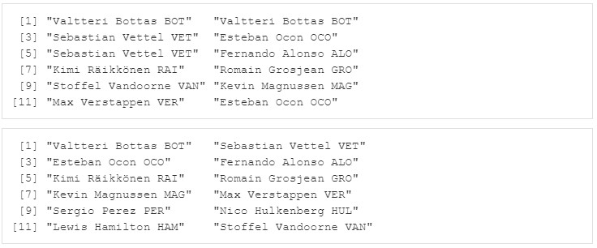

```{r setup, include=FALSE}
library(datascience)
library(tidyverse)
library(learnr)
```


## Willkommen

Dieses Tutorial ergänzt die Inhalte des Buches [_Data Science und Statistik mit R_](https://www.amazon.de/Data-Science-Statistik-mit-Anwendungsl%C3%B6sungen/dp/3658348240/ref=sr_1_1?__mk_de_DE=%C3%85M%C3%85%C5%BD%C3%95%C3%91&dchild=1&keywords=Data+Science+und+Statistik+mit+R&qid=1627898747&sr=8-1).

Das Kapitel 4.2 bis 4.2.3 behandelt die Wahrscheinlichkeitsrechnung, Zufallsvariablen und Kombinationen und wie dies von R unterstützt wird.

## 1. Wahrscheinlichkeitsrechnung

Eine Wahrscheinlichkeit kann berechnet werden, indem man die relativen Häufigkeiten eines Ereignisses beobachtet, welches in der Vergangenheit aufgetreten ist. Diese Beobachtung der Vergangenheit kann uns dabei helfen die Wahrscheinlichkeiten für die Zukunft zu schätzen, obwohl dies immer mit einer gewissen Ungenauigkeit verbunden ist, denn die Rahmenbedingungen könnten sich geändert haben. Derartige Schätzungen und Voraussagen für die Zukunft sind Bestandteil der induktiven Statistik.

Folgende Schreibweise bzw. Notation ist in der Wahrscheinlichkeitsrechnung üblich und beschreibt die zugehörigen Berechnungsformeln: 


### 1.1 Gesetz der Großen Zahl und Formeln

Betrachtet man den Wurf einer Münze, so erwartet man bei einer nicht gezinkten Münze eine Wahrscheinlichkeit von jeweils 50% für Kopf und Zahl. Diese Wahrscheinlichkeit wird aber nicht identisch sein mit dem Ergebnis, wenn wir die Münze werfen. Nehmen wir an, dass die Münze einmal geworfen wird, so wird es entweder Kopf oder Zahl sein. Fällt die Münze so, dass Kopf angezeigt wird, so ergibt sich die relative Häufigkeit konkret mit 1 für Kopf und 0 für Zahl bzw. in Prozent ausgedrückt als 100% für Kopf und 0% für Zahl. Wird die Münze 3x geworfen, so ergibt sich bei 2x Kopf und 1x Zahl als relative Häufigkeit 66% für Kopf und 33% für Zahl. In all diesen Fällen unterscheidet sich also die Wahrscheinlichkeit von der relativen Häufigkeit.

Wiederholt man den Münzwurf 100x oder sogar 1000x, so nähert sich die relative Häufigkeit immer mehr der Wahrscheinlichkeit für Kopf und Zahl von jeweils 50% an. Dies gilt für eine unendliche Wiederholung des Zufallsexperiments erst recht. Das Gesetz der großen Zahl besagt, dass die beobachteten relativen Häufigkeiten mit zunehmender Anzahl an Beobachtungen in Richtung der Wahrscheinlichkeiten konvergieren. In den noch folgenden Beispielen wird deutlich werden, dass die Größe einer Stichprobe Einfluss auf die Verteilung hat.

Dies ist auch bei dem nachfolgenden Beispiel erkennbar, wo zunächst ein Würfel 15x und dann 10000x gewürfelt wird und sich die Wahrscheinlichkeiten bei großer Anzahl an Wiederholungen dem Wert von 0,16 je Zahl annähert.

15 Mal würfeln:


10000 Mal würfeln:


## 2. Zufallsvariablen

Die Wahrscheinlichkeitsrechnung verwendet Zufallsvariablen als Basis der Berechnung von Wahrscheinlichkeiten. Hierbei werden diskrete und stetige Zufallsvariablen unterschieden.

### 2.1 Diskrete Zufallsvariablen

Diskrete Zufallsvariablen zeichnen sich wie diskrete Variablen dadurch aus, dass sie diskrete Werte annehmen. Ein Würfel kann z.B. die konkreten Werte von 1 bis 6 annehmen und insofern ist das Würfelergebnis eine diskrete Zufallsvariable. Im Fall eines Würfels ist die Wahrscheinlichkeit für jeden der Werte 1/6.

Wahrscheinlichkeit beim Würfeln:


Nachfolgend wird die Funktion seq(x,y) verwendet, die einen Vektor mit Zahlen von x bis y erzeugt. Die Wahrscheinlichkeit jeder der Zahlen in dem Vektor mit den Zahlen von 1 bis 6 ist demnach 1/6. 

```{r 2_0, exercise=FALSE}
zahl <- seq(1,6)
wahrscheinlichkeit <- as.data.frame(table(zahl))$Freq/length(zahl) 
wahrscheinlichkeit
```

Erzeugen Sie sich einen numerischen Vektor mit dem Namen "position" und den Inhalten von 1 bis 18 für die Tabellenposition der 1. Bundesliga. Wenn alle Mannschaften gleich gut sind, was ist dann die Wahrscheinlichkeit, dass Ihr Lieblingsclub von den 18 Mannschaften nach dem 3. Spieltag auf einer der ersten 6 Tabellenpositionen steht? Ermitteln Sie die Wahrscheinlichkeiten für jede der ersten 6 Tabellenpositionen und lassen Sie sich diese anzeigen.
Lassen Sie sich auch anzeigen, wie hoch die Wahrscheinlichkeit ist, dass Ihr Lieblingsclub auf einer der ersten 4 Plätze ist.

Die Anzeige sollte hinterher wie folgt aussehen:


```{r 2_1, exercise=TRUE}

```

```{r 2_1-hint-1}
position <- seq(1,18)
```
```{r 2_1-hint-2}
position.tabelle<-as.data.frame(table(position))
position.tabelle$prozentwahrscheinlichkeit <- 100*prop.table(position.tabelle$Freq)
head(position.tabelle,6)
```
```{r 2_1-hint-3}

sum(position.tabelle$prozentwahrscheinlichkeit[1:4])
```

### 2.2. Stetige Zufallsvariablen

Stetige Zufallsvariablen können beliebige numerische Werte annehmen und sind nicht wie im Falle eines Würfels beschränkt auf eine Liste diskreter Werte. Ein Beispiel für eine stetige Zufallsvariable wäre z.B. die Zeit zur Fertigung eines Produkts. Beobachtet man 10000 Produktionsvorgänge, so ergibt sich als schnellste Zeit eventuell 45 Minuten 55 Sekunden und als längste Zeit 80 Minuten 13 Sekunden. Betrachtet man die aufsteigend sortierten Fertigungszeiten und betrachtet den Wert 7501, der 64 Minuten 43 Sekunden beträgt, so kann man sagen, dass mit einer Wahrscheinlichkeit von 75% (75%-Quantil) zu erwarten ist, dass die Fertigungszeit geringer als 64 Minuten 43 Sekunden sein wird. Die kumulierte Verteilungsfunktion einer stetigen Zufallsvariablen ist eine stetige, nicht fallende Funktion, die sich von 0 bis 1 bzw. 0% bis 100% auf der Y-Achse abbilden lässt. Bei Kenntnis von deren Formel lässt sich mit Hilfe der Integralrechnung die kumulierte Verteilung berechnen.

15 Fertigungsdurchführungen:


10000 Fertigungsdurchführungen:


In R kann die Funktion rnorm(x, Mittelwert, Standardabweichung) verwendet werden, um einen Vektor mit x Zahlen (hier: Fertigungszeit in Minuten) erzeugt, welche normalverteilt mit dem Mittelwert und der Standardabweichung sind. Die Häufigkeit jeder Fertigungszeit lässt sich dem Histogramm entnehmen. 

```{r 2_2, exercise=FALSE}
fertigungszeit=round(rnorm(15,mean=60,sd=4))
fertigungszeit
fertigungszeit<-as.data.frame(fertigungszeit)
ggplot(fertigungszeit, aes(x=fertigungszeit)) + 
    geom_histogram(color="black", fill="white",bins = 30) +
    labs(title="Histogramm",subtitle="Fertigungszeit",x="Minuten",y="Anzahl") +
    geom_vline(aes(xintercept=mean(fertigungszeit)),color="red",
               linetype="dashed",size=1)
```

Lassen Sie sich einen Vektor mit dem Namen temp erzeugen, der 8 Temperaturen als stetige Zufallszahl enthält, wobei die Temperatur im Mittel 28 Grad und die Standardabweichung 2 Grad beträgt. Lassen Sie sich die Temperaturen ausgeben und stellen Sie diese auch in einem Histogramm dar.

Die Anzeige sollte hinterher so ähnlich wie nachfolgende aussehen:


```{r 2_21, exercise=TRUE}

```

```{r 2_21-hint-1}
temp=round(rnorm(8,mean=28,sd=2))
temp
```
```{r 2_21-hint-2}
temp<-as.data.frame(temp)
ggplot(temp, aes(x=temp)) + 
    geom_histogram(color="black", fill="white",bins = 30) +
    labs(title="Histogramm",subtitle="Temperatur",x="Grad",y="Anzahl")
```

Die Werte müssen nicht mit der Abbildung oberhalb der Aufgabe übereinstimmen! Weshalb? Die Funktion rnorm() erzeugt jedesmal neue Zufallszahlen. Lassen Sie Ihren Code immer wieder ausführen und beobachten Sie die veränderten Werte!

Wenn wir jedoch reproduzierbare Zufallszahlen erzeugen wollen, die immer wieder gleich und auch für andere Personen identisch sind, unabhängig von Ort und Zeit, dann kann die Funktion set.seed() verwendet werden. 

Fügen Sie oberhalb der Funktion rnorm() in Ihrem Code die folgende Zeile ein: set.seed(8735). Wenn Sie  Ihren Code jetzt erneut ausführen, dann sollte das Ergebnis tatsächlich mit dem folgenden übereinstimmen:


Mehr Details zu der Funktion set.seed() finden Sie im Kapitel 4.2.3 im Buch.

### 2.3. Erzeugung von Zufallszahlen

Zufallszahlen sind bei der Simulation von Wahrscheinlichkeitsberechnungen oft hilfreich. In R können gleichverteilte Zufallszahlen (jede Zahl hat die gleiche Wahrscheinlichkeit) mit der Funktion runif() erzeugt werden, wobei als Parameter u.a. die Anzahl der Zufallszahlen und mit den Parametern min und max auch die Unter- und Obergrenzen der generierten Zahlen angegeben werden können.

Eine weitere Funktion zum Erzeugen von Zufallszahlen ist die Funktion rnorm(), welche normalverteilte Zahlen generiert (Zahlen um den Mittelwert haben eine deutlich höhere Wahrscheinlichkeit als Zahlen, die mehrere Standardabweichungen vom Mittelwert entfernt sind). Über den Parameter mean kann man den Mittelwert und über den Parameter sd die Standardabweichung festlegen, z.B. erzeugt rnorm(1000,mean=2,sd=4) 1000 normalverteilte Zufallszahlen mit dem Mittelwert 2 und der Standardabweichung 4.

Weitere Funktionen, um Zufallszahlen zu erzeugen, sind u.a. die Funktionen rpois() für poissionverteilte Zahlen, rbinom() für binomialverteilte Zahlen, rchisq() für Chi-Square-verteilte Zahlen und rt() für Student-t-verteilte Zahlen.

Wenn man immer wieder verlässlich mit den identischen Zufallszahlen arbeiten möchte, so kann man eine Folge von Zufallszahlen erzeugen, die auf einem sogenannten Startwert, der als Seed bezeichnet wird, basieren. Dies führt dazu, dass unabhängig von der ausführenden Person, dem zur Ausführung verwendeten Rechner, der Version der Software und dem Zeitpunkt der Ausführung immer die identischen Zufallszahlen generiert werden, wenn vor der Ausführung der Funktion runif() oder einer anderen Funktion zur Erzeugung von Zufallswerten die Funktion set.seed() verwendet wird und die Version des in R verwendeten Zufallszahlengenerators identisch ist. Es ist daher empfehlenswert die Funktion RNGversion() zu verwenden, um die Version des Zufallszahlengenerators einzustellen. Mit dem Parameter vstr lässt sich bei der Funktion RNGversion() die Version des Zufallszahlengenerators von R festlegen. Dies ist im wissenschaftlichen Bereich bedeutsam, um simulierte Ergebnisse immer wieder rekonstruieren zu können.

```{r 2_3, exercise=FALSE}
x<-runif(5,min=-1,max=1)    # 5 gleichverteilt zwischen -1 und 1
x
x<-runif(5,min=-1,max=1)    
x
RNGversion(vstr = "4.0.5")
set.seed(123)
x<-runif(5,min=-1,max=1)    # 5 gleichverteilt zwischen -1 und 1 nach set.seed
x
set.seed(123)
x<-runif(5,min=-1,max=1)    
x
x<-rnorm(5,mean=2,sd=4)     # 5 normalverteilt Mittelwert 2, Standardabweichung 4
rpois(5,lambda=2)           # 5 exponentialverteilt Mittelwert 2
rbinom(5,size=3,prob=0.75)  # 5 binomialverteilt mit 3 Wiederholungen mit p=0.75
rchisq(5,df=1)              # 5 Chi-Square verteilt mit degree of freedom 1
rt(5, df=1)                 # 5 Student T verteilt mit degree of freedom 1
```

### 2.4. Erzeugung von Zufallswerten

Wenn jedoch nicht Werte für eine stetige, sondern diskrete Zufallsvariable generiert werden sollen, dann bietet sich die Funktion sample() an. So können auch Zufallswerte erzeugt werden, die nicht notwendigerweise Zahlenwerte sein müssen. 

Die Funktion sample() dient dem Ziehen von Stichproben aus einer Menge von Werten. Der Parameter size gibt die Anzahl der erzeugten Werte an, der Parameter replace bestimmt, ob die gezogenen Werte wieder zurückgelegt werden (replace=TRUE) oder nicht (replace=FALSE). Ohne Angabe des Parameters replace wird dieser mit FALSE vorbestimmt. Für die Erzeugung von 5 Würfelergebnissen kann z.B. die Funktion sample(1:6,size=5,replace=TRUE) ausgeführt werden. Auch für die Funktion sample() gilt, dass bei vorheriger Ausführung der Funktion set.seed() sichergestellt werden kann, dass die erzeugten Werte reproduzierbar sind. 

#### 2.4.1 Würfeln

Die Funktion sample() erzeugt Stichproben aus einer Menge von Werten. Der Parameter size gibt die Anzahl der erzeugten Werte an, der Parameter replace bestimmt, ob die gezogenen Werte wieder zurückgelegt werden. Beim Würfeln bleibt die Auswahl immer identisch, nämlich eine Zahl zwischen 1 und 6. Das gewürfelte Ergebnis wird in dem Sinne der Funktion sample() immer wieder "zurückgelegt", kann also erneut gewürfelt werden. Für die Erzeugung von 20 Würfelergebnissen kann z.B. die Funktion sample(1:6,size=20,replace=TRUE) ausgeführt werden.

```{r 2_4_1, exercise=FALSE}
wuerfel <- sample(1:6,size=20,replace=TRUE)
wahrscheinlichkeit<-as.data.frame(table(wuerfel))
wahrscheinlichkeit$prozent <- 100*prop.table(wahrscheinlichkeit$Freq)
wahrscheinlichkeit
ggplot(wahrscheinlichkeit,aes(x=wuerfel,y=Freq))+
    geom_bar(stat="identity",width=1,color="white")+
    labs(title="Bar-Chart",subtitle="Würfelergebnis",x="Zahl",y="Anzahl")
ggplot(wahrscheinlichkeit,aes(x=wuerfel,y=prozent))+
    geom_bar(stat="identity",width=1,color="white")+
    labs(title="Bar-Chart",subtitle="Würfelergebnis",x="Zahl",y="Wahrscheinlichkeit in %")
```
Erzeugen Sie jetzt mit der Funktion sample() 300 Werte, die dem zufälligen Ergebnis beim Würfeln entsprechen. Zeigen Sie anschließend die ersten 5 Werte an und geben Sie zusätzlich die Häufigkeit des Vorkommens mit einem Bar-Chart aus.

Die Anzeige sollte hinterher so ähnlich wie folgt aussehen:


```{r 2_4_11, exercise=TRUE}

```

```{r 2_4_11-hint-1}
wuerfel <- sample(1:6,size=300,replace=TRUE)
head(wuerfel,5)
```
```{r 2_4_11-hint-2}
ergebnis<-as.data.frame(table(wuerfel))
ggplot(ergebnis,aes(x=wuerfel,y=Freq))+
    geom_bar(stat="identity",width=1,color="white")+
    labs(title="Bar-Chart",subtitle="Würfelergebnis",x="Zahl",y="Anzahl")
```

Die Werte müssen nicht mit der Abbildung oberhalb der Aufgabe übereinstimmen! Weshalb? Die Funktion sample() erzeugt jedesmal neue Zufallswerte. Lassen Sie Ihren Code immer wieder ausführen und beobachten Sie die veränderten Werte!

Wenn wir jedoch reproduzierbare Zufallswerte erzeugen wollen, die immer wieder gleich und auch für andere Personen identisch sind, unabhängig von Ort und Zeit, dann kann die Funktion set.seed() auch hier verwendet werden. 

Fügen Sie oberhalb der Funktion sample() in Ihrem Code die folgende Zeile ein: set.seed(8735). Wenn Sie  Ihren Code jetzt erneut ausführen, dann sollte das Ergebnis tatsächlich mit dem folgenden übereinstimmen:


Das Gesetz der Großen Zahlen gilt übrigens auch für diskrete Zufallsvariablen. Das nachfolgende Beispiel zeigt, dass sich die Verteilung der Würfelergebnisse für 15, 100, 10.000 und 100.000 Wiederholungen mit größerer Zahl der Wiederholungen dem Erwartungswert von 1/6 je Zahl immer mehr annähert (Details dazu in Kapitel 4.2.1 im Buch).

```{r 2_4_12-setup, exercise=FALSE, echo=FALSE, include=FALSE}
experiment.diskret <- function (anzahl) {
  set.seed(1008)
  wuerfel <- sample(1:6,size=anzahl,replace=TRUE)
  wahrscheinlichkeit<-as.data.frame(table(wuerfel))
  wahrscheinlichkeit$prozent <- 100*prop.table(wahrscheinlichkeit$Freq)
  titel<-paste("Relative Wahrscheinlichkeit",anzahl,"Würfe")
  ggplot(wahrscheinlichkeit,aes(x=wuerfel,y=prozent))+
    geom_bar(stat="identity",width=1,color="white")+
    labs(title=titel, x="Zahl",y="Wahrscheinlichkeit in %")
}
```

```{r 2_4_12, exercise=TRUE, exercise.setup="2_4_12-setup"}
experiment.diskret(15)
experiment.diskret(100)
experiment.diskret(10000)
experiment.diskret(100000)
```


#### 2.4.2 Münzwurf

Sollen spezifische Werte erzeugt werden, z.B. Kopf und Zahl für einen Münzwurf, so ist dies mit folgendem Kommando möglich, bei dem auch der Parameter prob verwendet werden kann, um die jeweiligen zugrundeliegenden Wahrscheinlichkeiten für Kopf und Zahl anzugeben: sample(c("Kopf","Zahl"),size=8,replace=TRUE,prob=c(3,5)). In diesem Fall handelt es sich um eine nicht faire Münze, denn die Wahrscheinlichkeit von Kopf und Zahl wird im Verhältnis von 3 zu 5 angegeben. Der Parameter replace muss hier angegeben werden, da der Defaultwert FALSE wäre.

```{r 2_4_2, exercise=FALSE}
sample(c("Kopf","Zahl"),size=8,replace=TRUE)             # Münzwurf: Gleiche Wahrsch.
sample(c("Kopf","Zahl"),size=8,replace=TRUE,prob=c(3,5)) # Münzwurf: Ungleiche Wahrsch.
```

#### 2.4.3 Kartenspiel Skat

Beim Austeilen eines Sets mit 32 Karten ist es jedoch so, dass eine einmal ausgeteilte Karte nicht erneut ausgeteilt werden kann, daher also nicht "zurückgelegt" wird. Der Parameter replace muss nicht angegeben werden, da er als Defaultwert bereits FALSE ist. So kann die Funktion sample() auch genutzt werden, um 3x10 Skatkarten aus einem Kartensatz auszuwählen, ohne dass eine Karte mehrfach ausgegeben wird (replace=FALSE).

```{r 2_4_3, exercise=FALSE}
werte <- c(as.character(2:10),"Junge","Dame","König","Ass") # Karten
farbe <- c("Karo","Herz","Schippe","Kreuz")
karten <- sapply(werte, function(werte)paste(farbe,werte,sep=":")) # Kartensatz
karten
# Funktion austeilen 
austeilen <- function(x, n, kartenset){ # x=Anzahl Spieler, n=Anzahl Karten
  return(matrix(sample(kartenset,x*n,replace=FALSE), n, x))
}
skat<-austeilen(3,10,karten)# Karten austeilen für 3 Spieler mit jeweils 10 Karten
skat
```

### 2.5 Übung

Beginnen Sie damit der Variablen n die Zahl 1000 zuzuweisen. Um die gleichen Ergebnisse immer wieder zu reproduzieren, fügen Sie die Anweisung set.seed(123) vor jeder Erzeugung von Zufallszahlen ein.

Erzeugen Sie anschließend einen Vektor mit dem Namen gleich, der n gleichverteilte Zufallszahlen zwischen 1 und 99 enthält und sortieren Sie diesen Vektor aufsteigend. Lassen Sie sich den Inhalt des Vektors in einem Scatter-Plot anzeigen, wobei die x-Achse die Position des Wertes im Vektor von 1 bis n anzeigt und die y-Achse den Wert. Stellen Sie sicher, dass die y-Achse von 1 bis 99 skaliert ist und die x-Achse nicht angezeigt wird.

Erzeugen Sie auch noch einen Vektor mit dem Namen normal, der n normalverteilte Zufallszahlen mit dem Mittelwert 50 und einer Standardabweichung von 10 enthält und sortieren Sie diesen Vektor aufsteigend. Lassen Sie sich den Inhalt des Vektors in einem Scatter-Plot anzeigen, wobei die x-Achse die Position des Wertes im Vektor von 1 bis n anzeigt und die y-Achse den Wert. Stellen Sie sicher, dass die y-Achse von 1 bis 99 skaliert ist und die x-Achse nicht angezeigt wird.

Die Anzeige sollte hinterher wie folgt aussehen:


Offensichtlich kommen bei der Normalverteilung nur sehr wenige extrem hohe und niedrige Werte vor und die Mehrzahl der Werte liegt zwischen 35 und 65, während bei der Gleichverteilung  extrem hohe und niedrige Werte ebenso häufig vorkommen wie alle anderen Werte.

```{r 2_5, exercise=TRUE}

```

```{r 2_5-hint-1}
n<-1000
set.seed(123)
gleich<-runif(n,min=1,max=99)
ergebnis<-sort(gleich)
ergebnis<-as.data.frame(ergebnis)
ggplot(ergebnis)+
  aes(x=1:n,y=ergebnis)+
  labs(title="Scatter-Plot",
       subtitle="Gleichverteilte Zufallszahlen zwischen 1 und 99",
       x="", y="Zahl")+
  geom_point()+
  theme(axis.title.x=element_blank(),
        axis.text.x=element_blank(),
        axis.ticks.x=element_blank())+
  ylim(1,99)
```
```{r 2_5-hint-2}
set.seed(123)
normal<-rnorm(n,mean=50,sd=10)
ergebnis<-sort(normal)
ergebnis<-as.data.frame(ergebnis)
ggplot(ergebnis)+
  aes(x=1:n,y=ergebnis)+
  labs(title="Scatter-Plot",
       subtitle="Normalverteilte Zufallszahlen mit Mittelwert 50 und Standardabweichung 10",
       x="", y="Zahl")+
  geom_point()+
  theme(axis.title.x=element_blank(),
        axis.text.x=element_blank(),
        axis.ticks.x=element_blank())+
  ylim(1,99)
```

### 2.6 Übung

In dem Vektor fahrer befinden sich die Namen von 15 Fahrern der Formel1. Jeden Monat soll der aus Sicht der Fans beliebteste Fahrer eine Auszeichnung erhalten, was durch ein Online-Voting entschieden wird. Simulieren Sie dieses Voting durch die Erzeugung von Zufallswerte, wobei Sie die Anweisung set.seed(123) vor jeder Erzeugung von Zufallswerten verwenden, so dass die Ergebnisse reproduzierbar sind.

Simulieren Sie die Wahl des Fahrers für jeden der Monate, indem Sie einen Zufallswert generieren. Erlauben Sie dabei, dass alle Fahrer jeden Monat erneut ausgewählt werden können. Lassen Sie sich die Liste der Fahrer ausgeben.

Simulieren Sie anschließend die Wahl des Fahrers für jeden der Monate, indem Sie einen Zufallswert generieren und dabei nicht erlauben, dass ein Fahrer mehrmals im Jahr Fahrer des Monats werden kann. Lassen Sie sich die Liste der Fahrer ausgeben.

Die Anzeige sollte hinterher wie folgt aussehen:


Offensichtlich werden in der zweiten Simulation Valtteri Bottas und Sebastian Vettel mehrfach zum Fahrer des Monats gewählt.

```{r 2_6-setup, exercise=FALSE, echo=FALSE, include=FALSE}
fahrer<-unique(formel1$Fahrer)[1:15]
```

```{r 2_6, exercise=TRUE, exercise.setup="2_6-setup"}

```

```{r 2_6-hint-1}
n<-12
set.seed(123)
fahrerdesmonats<-sample(fahrer,n,replace = TRUE)
fahrerdesmonats
```
```{r 2_6-hint-2}
set.seed(123)
fahrerdesmonats<-sample(fahrer,n,replace = FALSE)
fahrerdesmonats
```

## 3. Kombinationen

Wahrscheinlichkeiten können auch von der Anzahl an Kombinationsmöglichkeiten abhängen, so z.B. beim Glücksspiel oder bei der Berücksichtigung mehrerer Ereignisse. Um die Anzahl der Kombinationsmöglichkeiten zu berechnen, werden für die Wahrscheinlichkeitsrechnung oft Mengen von Objekten betrachtet, die in einer spezifischen Art kombiniert werden können, z.B. die Auswahl von 6 aus 49 Lottozahlen oder von 3 aus 10 Bewerbern. Dabei hängt die Wahrscheinlichkeit für das Eintreten einer spezifischen Kombination in der Regel davon ab, wie viele Kombinationen möglich sind.

Die Anzahl der Kombinationen kann in Abhängigkeit davon berechnet werden, ob ein Objekt der Menge wiederholt (mit Zurücklegen) ausge-wählt werden kann (z.B. beim Würfeln) oder nicht (z.B. beim Ziehen der Lottozahlen) und ob die Reihenfolge, in welcher die Objekte ausgewählt werden, eine Rolle spielt (z.B. Buchstaben in einem Passwort) oder nicht (z.B. Fußballspieler in einer Mannschaftsaufstellung).

Die nachfolgenden Formeln verwenden die Berechnungsmethoden der Fakultät und des Binomialkoeffizienten, deren Berechnung daher kurz vorgestellt werden soll: 

Die Formeln zur Berechnung der Kombinationsmöglichkeiten sind für Modell A+B: 

```{r 3_0, exercise=FALSE}
# Modell A: Grundgesamtheit 10, 8 Auswahl mit Zurücklegen, Reihenfolge wichtig
10^8                           # Kombinationsmöglichkeiten
1/10^8                         # Wahrscheinlichkeit einer bestimmten Kombination
# Modell B: Grundgesamtheit 8, 2 Auswahl ohne Zurücklegen, Reihenfolge wichtig
factorial(8)/factorial(6)      # Kombinationsmöglichkeiten
1/(factorial(8)/factorial(6))  # Wahrscheinlichkeit einer bestimmten Kombination
```

Die Formeln zur Berechnung der Kombinationsmöglichkeiten sind für Modell C+D: 

```{r 3_1, exercise=FALSE}
# Modell C: Gundgesamtheit 3, 2 Auswahl mit Zurücklegen ohne Reihenfolge
choose(4,2)                    # Kombinationsmöglichkeiten
# Modell D: Grundgesamtheit 49, 6 Auswahl ohne Zurücklegen ohne Reihenfolge
choose(49,6)                   # Kombinationsmöglichkeiten
1/choose(49,6)                 # Wahrscheinlichkeit einer bestimmten Kombination
```

Berechnen Sie die folgende Wahrscheinlichkeit: Aus einer Gruppe von 30 Schülern wählt ein Lehrer heute 3 aus, die ihre Hausaufgabenhefte zeigen sollen. Wie hoch ist die Wahrscheinlichkeit, dass ausgerechnet Hans und seine beiden besten Freunde die Auserwählten sind?

Das Ergebnis sollte 0.0002463054 sein.

```{r 3_2, exercise=TRUE}

```

```{r 3_2-hint-1}
1/choose(30,3)                    # Modell D
```

Berechnen Sie die folgende Wahrscheinlichkeit: An einem Koffer ist ein Zahlenschloss mit 3 Ziffern von 0 bis 9 angebracht. Wie hoch ist die Wahrscheinlichkeit, dass man beim ersten Versuch zufällig die drei richtigen Ziffern wählt und sich der Koffer öffnen lässt, wenn bekannt ist, dass die Ziffer 6 nicht in der Zahl vorkommt?

Das Ergebnis sollte 0.001371742 sein.

```{r 3_3, exercise=TRUE}

```

```{r 3_3-hint-1}
1/9^3                   # Modell A
```

## 4. Quiz

```{r 4_1, echo = FALSE}
quiz(
  question("Welche der folgenden Aussagen sind korrekt?", allow_retry = TRUE, random_answer_order = TRUE,
    answer('Die Anzahl der Kombinationsmöglichkeiten bei einer Grundgesamtheit mit N Objekten, aus denen k Objekte ausgewählt werden berechnet sich als N hoch k.', message = 'Nein, die Berechnungsformel hängt davon ab, ob Ojekte zurückgelegt werden und ob die Reihenfolge von Bedeutung ist.'),
    answer('Wenn die Reihenfolge keine Rolle spielt und k aus N Objekten mit Zurücklegen ausgewählt werden berechnet sich als N hoch k.', message = 'Nein, die Formel N hoch k wird verwendet, wenn die Reihenfolge entscheidend ist.'),
    answer('Wenn die Reihenfolge keine Rolle spielt und k aus N Objekten ohne Zurücklegen ausgewählt werden berechnet sich als N über k.', correct = TRUE),
    type = "multiple"
  ),
  question("Welche der folgenden Aussagen sind korrekt?", allow_retry = TRUE, random_answer_order = TRUE,
    answer('Diskrete Zufallsvariablen können beliebige Werte annehmen.', message = 'Nein, Diskrete Zufallsvariablen zeichnen sich wie diskrete Variablen dadurch aus, dass sie diskrete Werte aus einer definierten Wertemenge annehmen.'),
    answer('Die Funktion normal(x, Mittelwert, Standardabweichung) erzeugt einen Vektor mit x Zahlen, welche normalverteilt um den Mittelwert und mit der Standardabweichung sind.', message = 'Nein, die Funktion rnorm(x, Mittelwert, Standardabweichung) erzeugt einen Vektor mit x Zahlen, welche normalverteilt um den Mittelwert und mit der Standardabweichung sind.'),
    answer('Das Gesetz der großen Zahl besagt, dass die beobachteten relativen Häufigkeiten mit zunehmender Anzahl an Beobachtungen in Richtung der Wahrscheinlichkeiten konvergieren.', correct = TRUE),
    type = "multiple"
  ),
  question("Welche der folgenden Aussagen sind korrekt?", allow_retry = TRUE, random_answer_order = TRUE,
    answer('Die Funktion runif() erzeugt normalverteilte Zufallszahlen.', message = 'Nein, die Funktion runif() erzeugt gleichverteilte Zufallszahlen.'),
    answer('Die Funktion rnorm() liefert reproduzierbare Zufallszahlen.', message = 'Nein, nur wenn im Vorfeld die Funktion set.seed() aufgerufen wurde liefert die Funktion rnorm() reproduzierbare Zufallszahlen.'),
    answer('Stetige Zufallsvariablen können beliebige numerische Werte annehmen.', correct = TRUE),
    type = "multiple"
  ),
  question("Welche der folgenden Aussagen sind korrekt?", allow_retry = TRUE, random_answer_order = TRUE,
    answer('Die Funktion sample(1:3,size=5,replace=TRUE) erzeugt einen Vektor mit 3 Zahlen von 1 bis 5.', message = 'Nein, Die Funktion sample(1:3,size=5,replace=TRUE) erzeugt einen Vektor mit 5 Zahlen von 1 bis 3.'),
    answer('Die folgende Funktion simuliert das Ergebnis von 6-maligem Würfeln: sample(1:6,size=6,replace=FALSE).', message = 'Nein, der Parameter replace muss bei der Simulation eines Würfelns TRUE sein.'),
    answer('Die Funktionen runif(n,1,99) und rnorm(n,1,99) erzeugen unterschiedliche Zufallszahlen.', correct = TRUE),
    type = "multiple"
  )
)
```

## Ende 

Gratulation!

Sie haben dieses Tutorial erfolgreich ausgeführt und einen Einblick in die Wahrscheinlichkeitsrechnung, den Umgang mit Zufallsvariablen und Kombinationen in R erhalten.